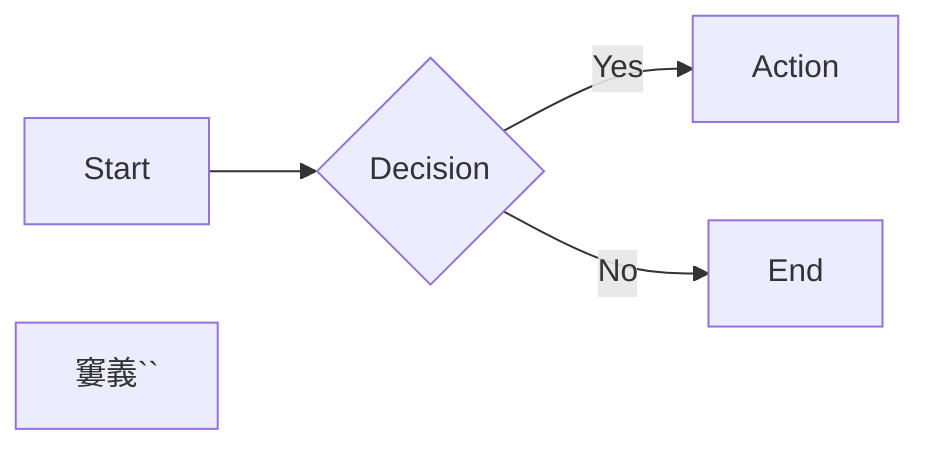

# Documentation Conventions

Standards and patterns for writing documentation on docs.cloudposse.com.

## MDX Frontmatter

Every MDX file requires frontmatter:

```mdx
---
title: "Human-Readable Title"
sidebar_label: "Short Label"
sidebar_class_name: hidden          # Optional: hide from sidebar
description: Brief description for SEO and previews
---
```

## Available React Components

Import components from `@site/src/components/`:

### Steps and Step

For numbered step-by-step instructions:

```mdx
import Steps from '@site/src/components/Steps';
import Step from '@site/src/components/Step';
import StepNumber from '@site/src/components/StepNumber';

<Steps>
  <Step>
    ### <StepNumber/> First Step Title
    Step content here.
  </Step>
  <Step>
    ### <StepNumber/> Second Step Title
    More content.
  </Step>
</Steps>
```

### ActionCard with CTAs

For callout boxes with action buttons:

```mdx
import ActionCard from '@site/src/components/ActionCard';
import PrimaryCTA from '@site/src/components/PrimaryCTA';
import SecondaryCTA from '@site/src/components/SecondaryCTA';

<ActionCard title="What's Next?">
  Description of the next action.
  <div>
    <PrimaryCTA to="/path/to/next/">Primary Action</PrimaryCTA>
    <SecondaryCTA to="/path/to/alt/">Alternative</SecondaryCTA>
  </div>
</ActionCard>
```

### Other Components

| Component | Use Case |
|-----------|----------|
| `Card` / `CardGroup` | Grid of linked cards |
| `Note` | Highlighted notes |
| `Terminal` | Terminal output display |
| `File` | File content display |
| `CollapsibleText` | Expandable sections |
| `AtmosWorkflow` | Atmos workflow display |
| `TaskList` | Checkbox task lists |
| `KeyPoints` | Key takeaways |
| `PillBox` | Tag/label pills |

## Docusaurus Admonitions

Use built-in admonitions for callouts:

```mdx
:::note
Informational note.
:::

:::tip
Helpful tip.
:::

:::info
General information.
:::

:::warning
Warning about potential issues.
:::

:::danger
Critical warning - data loss, security, etc.
:::
```

## Deprecation Pattern

When deprecating content, add admonition at the top (do NOT move files):

```mdx
:::warning Deprecated
This documentation describes the legacy approach using `[old thing]`.

**The recommended approach now uses:**
- [New Thing A](/path/to/new-a) for X
- [New Thing B](/path/to/new-b) for Y

This content is preserved for users with existing deployments.
:::
```

## Code Blocks

### Basic

```mdx
```bash
atmos terraform apply vpc -s plat-ue1-dev
窶義``
```

### With Title

```mdx
```hcl title="components/terraform/vpc/main.tf"
module "vpc" {
  source = "..."
}
窶義``
```

### With Line Highlighting

```mdx
```hcl {2-4}
variable "enabled" {
  type        = bool
  default     = true
  description = "Whether to create resources"
}
窶義``
```

## Mermaid Diagrams

Mermaid is enabled for diagrams:

```mdx


## Video Embeds

```mdx
import ReactPlayer from "react-player";

<figure>
  <ReactPlayer controls url="https://docs.cloudposse.com/assets/..." />
  <figcaption>Video caption</figcaption>
</figure>
```

## Internal Links

Use absolute paths from site root:

```mdx
[Link Text](/layers/identity/how-to-log-into-aws/)
```

## TODO Comments for Tracking

Track documentation updates with structured comments:

```mdx
{/* TODO:PROJECT-NAME - ACTION - Status: Not Started|In Progress|Done */}
{/*
## Required Updates:
- Update item 1
- Update item 2
*/}
```

## Writing Style

- **Be concise**: Short sentences, clear language
- **Use active voice**: "Deploy the component" not "The component should be deployed"
- **Lead with the action**: Put commands and code first, explanations after
- **Use consistent terminology**: Follow Cloud Posse naming conventions
- **Avoid jargon**: Define terms on first use or link to glossary

## File Naming

- Use kebab-case: `how-to-deploy-vpc.mdx`
- Layer pages: `{layer-name}.mdx` (e.g., `identity.mdx`)
- Tutorials: `how-to-*.mdx`
- Design decisions: `design-decisions/*.mdx`
