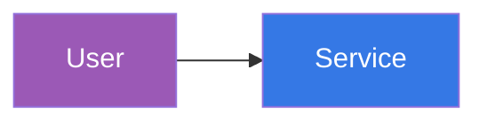

# Documentation Styles

CSS styles and color conventions for docs.cloudposse.com.

## Color Palette

### Site Primary Colors

Defined in `src/css/custom.css`:

| Variable | Light | Dark | Usage |
|----------|-------|------|-------|
| `--ifm-color-primary` | `#3578e5` | `#3578e5` | Primary blue, links, buttons |
| `--ifm-color-primary-dark` | `#306cce` | `#306cce` | Hover states |
| `--ifm-color-primary-darkest` | `#2554a0` | `#2554a0` | Active states |
| `--ifm-background-color` | default | `#030711` | Page background |

### Mermaid Diagram Colors

Defined in `src/css/mermaid.css`:

| Variable | Hex | Usage |
|----------|-----|-------|
| `--mermaid-primary` | `#3578e5` | Primary elements, read-only access |
| `--mermaid-primary-dark` | `#2554a0` | Darker blue variant |
| `--mermaid-secondary` | `#6c757d` | Gray, neutral elements |
| `--mermaid-success` | `#28a745` | Green, write/apply access |
| `--mermaid-danger` | `#dc3545` | Red, destructive/admin |
| `--mermaid-warning` | `#e67e22` | Orange, caution/IdP |
| `--mermaid-info` | `#17a2b8` | Teal, informational |
| `--mermaid-user` | `#9b59b6` | Purple, user/identity |
| `--mermaid-account` | `#2c3e50` | Dark slate, AWS accounts |

### Using Colors in Mermaid Diagrams

Mermaid doesn't support CSS variables directly. Use hex values with `style`:



### Semantic Color Meanings

| Color | Meaning | Example Usage |
|-------|---------|---------------|
| Blue (`#3578e5`) | Read-only, plan, info | TerraformPlanAccess |
| Green (`#28a745`) | Write, apply, success | TerraformApplyAccess |
| Orange (`#e67e22`) | Identity, IdP, warning | Identity Center |
| Purple (`#9b59b6`) | User, human identity | User nodes |
| Dark slate (`#2c3e50`) | AWS accounts, infrastructure | Account nodes |
| Red (`#dc3545`) | Destructive, admin, danger | RootAccess |

## CSS File Locations

| File | Purpose |
|------|---------|
| `src/css/custom.css` | Global styles, Infima overrides |
| `src/css/mermaid.css` | Mermaid diagram styling |
| `src/css/admonitions.css` | Admonition/callout styling |
| `src/css/sidebar.css` | Navigation sidebar |
| `src/css/navbar.css` | Top navigation |
| `src/css/footer.css` | Footer styling |

## Dark Mode

Use `[data-theme='dark']` or `html[data-theme='dark']` selectors:

```css
[data-theme='dark'] .my-element {
    background: #21262d;
    color: #fff;
}
```

## Component Styling

React components have co-located CSS modules:

```
src/components/
├── Steps/
│   ├── index.js
│   └── index.module.css
├── ActionCard/
│   ├── index.js
│   └── index.module.css
```

Use `clsx` for conditional class names:

```jsx
import clsx from 'clsx';
import styles from './index.module.css';

<div className={clsx(styles.container, isActive && styles.active)} />
```
