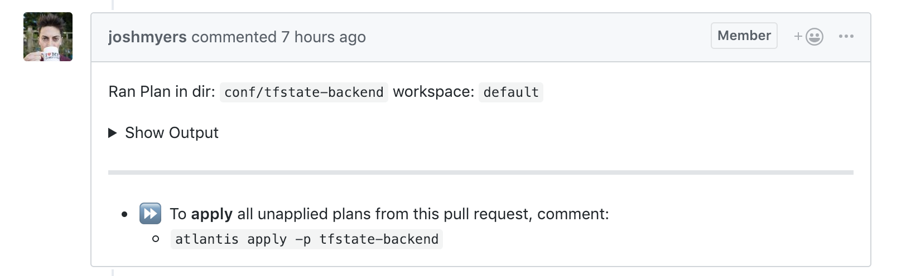

# Component: `aws-ecs-atlantis`

A Terraform module for deploying [Atlantis](https://runatlantis.io) to an AWS ECS cluster.


## Screenshots



*Example of a Pull Request comment from running `terraform plan` using `atlantis`*


## Introduction


Atlantis enables GitOps workflows so that teams can collaborate on operations using Pull Requests.

Under the hood, it's a small self-hosted daemon (`#golang`) that listens for Pull Request webhook events from GitHub.

With Atlantis, engineers can run `terraform plan` and `terraform apply` using "chat ops" type comments on the Pull Request.

### Features

This module provisions the following resources:

- ECS Atlantis web application, which includes:
    - ECR Docker registry
    - ALB target group, listener rule and alarms
    - ECS container definition (using a default backend)
    - ECS task definition and IAM role
    - ECS service and IAM role
    - ECS task autoscaling
    - ECS SNS based alarms
    - ECS Codepipeline to build our Atlantis image on GitHub release
    - ECS Codedeploy to deploy our ECS Atlantis web app
- SSH key pair for Atlantis to pull private Github repositories, which are written to SSM for reading with [chamber](https://github.com/segmentio/chamber)
- Route53 alias for Atlantis
- GitHub webhook to trigger Atlantis for a given repository

What this module does not provision:

  - ECS Cluster (BYOC)
  - ALB
  - ACM certificate
  - VPC
  - Subnets

## Caveats

- This project assumes that the repo being deployed defines a `Dockerfile` which runs `atlantis`. It might not work with the official version of atlantis. We use [`geodesic`](https://github.com/cloudposse/geodesic) as our docker base image.
- This project defines parameters which are not available in the *official version* of `atlantis`. Our [fork](https://github.com/cloudposse/atlantis) implements the ability to restrict `plan` and `apply` to GitHub teams.


### GitHub Repo Scopes

This module accepts two GitHub OAuth tokens:

1. `github_oauth_token` with permissions to pull private repos. Used by CodePipeline to clone repos before the build, and by the atlantis server to clone repos and comment on Pull Requests.

    The token needs the following OAuth scopes:

    - `repo`
      * `repo:status`
      * `repo_deployment`
      * `public_repo`
      * `repo:invite`

2. `github_webhooks_token` with permissions to create GitHub webhooks.
    Only used by [Terraform GitHub Provider](https://www.terraform.io/docs/providers/github/index.html) when provisioning the module.

    The token needs the following OAuth scopes:

      - `admin:repo_hook`
        * `write:repo_hook`
        * `read:repo_hook`

We suggest the following steps when creating the tokens and provisioning the module:

1. Create a GitHub bot user
2. Create the two Personal Access Tokens and add them to the bot
3. In `github.com/<org>/<repo>/settings/collaboration`, create a Team for the bot and add the bot user to it
4. Give `Admin` permissions to the Team (select it from the dropdown). We need it temporalily to provision GitHub webhooks on the repo
5. Provision the module with Terraform.
  [Terraform GitHub Provider](https://www.terraform.io/docs/providers/github/index.html) will use the `github_webhooks_token` to create webhooks on the repo
6. Go to `github.com/<org>/<repo>/settings/hooks` and make sure that two webhooks have been created: one for the CodePipeline with `Releases` events,
  the other is for the `atlantis` server with `Issue comments`, `Pull request reviews`, `Pull requests`, `Pull request review comments` and `Pushes` events
7. **IMPORTANT:** Remove the `Admin` permissions and add `Read` permissions for the bot Team.
  The CodePipeline and `atlantis` server will use the `github_oauth_token` to clone repos, which does not require escalated privileges

**IMPORTANT:** Do not commit the tokens to source control (_e.g._ via `terraform.tvfars`).

**NOTE:** If the two tokens are not provided (left empty), they will be looked up from SSM Parameter Store.
You can write `atlantis atlantis_gh` and `github_webhooks_token` to SSM Parameter Store before provisioning the module.
For example, by using [chamber](https://github.com/segmentio/chamber):

```sh
  chamber write atlantis atlantis_gh_token "....."
  chamber write atlantis github_webhooks_token "....."
```


## Usage


For a complete example, see [examples/complete](examples/complete).

For automated tests of the complete example using [bats](https://github.com/bats-core/bats-core) and [Terratest](https://github.com/gruntwork-io/terratest) (which tests and deploys the example on AWS), see [test](test).

Other examples:

- [without authentication](examples/without_authentication) - example without authentication
- [with Google OIDC authentication](examples/with_google_oidc_authentication) - example with Google OIDC authentication
- [with Cognito authentication](examples/with_cognito_authentication) - example with Cognito authentication


**NOTE:**

  If no `github_oauth_token` is set, the module attempts to look one up from SSM.

  If no `github_webhooks_token` is set, [Terraform GitHub Provider](https://www.terraform.io/docs/providers/github/index.html) attempts to look one up in the `GITHUB_TOKEN` environment variable.

```hcl
  provider "aws" {
    region = var.region
  }

  module "label" {
    source     = "git::https://github.com/cloudposse/terraform-null-label.git?ref=tags/0.16.0"
    namespace  = var.namespace
    name       = var.name
    stage      = var.stage
    delimiter  = var.delimiter
    attributes = var.attributes
    tags       = var.tags
  }

  module "vpc" {
    source     = "git::https://github.com/cloudposse/terraform-aws-vpc.git?ref=tags/0.8.1"
    namespace  = var.namespace
    stage      = var.stage
    name       = var.name
    delimiter  = var.delimiter
    attributes = var.attributes
    cidr_block = var.vpc_cidr_block
    tags       = var.tags
  }

  module "subnets" {
    source               = "git::https://github.com/cloudposse/terraform-aws-dynamic-subnets.git?ref=tags/0.16.1"
    availability_zones   = var.availability_zones
    namespace            = var.namespace
    stage                = var.stage
    name                 = var.name
    attributes           = var.attributes
    delimiter            = var.delimiter
    vpc_id               = module.vpc.vpc_id
    igw_id               = module.vpc.igw_id
    cidr_block           = module.vpc.vpc_cidr_block
    nat_gateway_enabled  = true
    nat_instance_enabled = false
    tags                 = var.tags
  }

  module "alb" {
    source                                  = "git::https://github.com/cloudposse/terraform-aws-alb.git?ref=tags/0.7.0"
    namespace                               = var.namespace
    stage                                   = var.stage
    name                                    = var.name
    attributes                              = var.attributes
    delimiter                               = var.delimiter
    vpc_id                                  = module.vpc.vpc_id
    security_group_ids                      = [module.vpc.vpc_default_security_group_id]
    subnet_ids                              = module.subnets.public_subnet_ids
    internal                                = false
    http_enabled                            = true
    access_logs_enabled                     = false
    alb_access_logs_s3_bucket_force_destroy = true
    access_logs_region                      = var.region
    cross_zone_load_balancing_enabled       = true
    http2_enabled                           = true
    deletion_protection_enabled             = false
    tags                                    = var.tags
  }

  resource "aws_ecs_cluster" "default" {
    name = module.label.id
    tags = module.label.tags
  }

  resource "aws_sns_topic" "sns_topic" {
    name         = module.label.id
    display_name = "Test terraform-aws-ecs-atlantis"
    tags         = module.label.tags
  }

  module "kms_key" {
    source                  = "git::https://github.com/cloudposse/terraform-aws-kms-key.git?ref=tags/0.3.0"
    enabled                 = var.enabled
    namespace               = var.namespace
    stage                   = var.stage
    name                    = var.name
    attributes              = var.attributes
    delimiter               = var.delimiter
    tags                    = var.tags
    description             = "Test terraform-aws-ecs-atlantis KMS key"
    deletion_window_in_days = 7
    enable_key_rotation     = false
  }

  module "atlantis" {
    source = "cloudposse/ecs-atlantis/aws"
    # Cloud Posse recommends pinning every module to a specific version
    # version = "x.x.x"
    enabled    = var.enabled
    namespace  = var.namespace
    stage      = var.stage
    name       = var.name
    attributes = var.attributes
    delimiter  = var.delimiter
    tags       = var.tags

    region               = var.region
    vpc_id               = module.vpc.vpc_id
    policy_arn           = var.policy_arn
    ssh_private_key_name = var.ssh_private_key_name
    ssh_public_key_name  = var.ssh_public_key_name
    kms_key_id           = module.kms_key.key_id

    atlantis_gh_user           = var.atlantis_gh_user
    atlantis_gh_team_whitelist = var.atlantis_gh_team_whitelist
    atlantis_gh_webhook_secret = var.atlantis_gh_webhook_secret
    atlantis_log_level         = var.atlantis_log_level
    atlantis_repo_config       = var.atlantis_repo_config
    atlantis_repo_whitelist    = var.atlantis_repo_whitelist
    atlantis_port              = var.atlantis_port
    atlantis_webhook_format    = var.atlantis_webhook_format
    atlantis_url_format        = var.atlantis_url_format

    default_backend_image = var.default_backend_image
    healthcheck_path      = var.healthcheck_path
    short_name            = var.short_name
    hostname              = var.hostname
    parent_zone_id        = var.parent_zone_id

    // Container
    container_cpu    = var.container_cpu
    container_memory = var.container_memory

    // Authentication
    authentication_type                           = var.authentication_type
    alb_ingress_listener_unauthenticated_priority = var.alb_ingress_listener_unauthenticated_priority
    alb_ingress_listener_authenticated_priority   = var.alb_ingress_listener_authenticated_priority
    alb_ingress_unauthenticated_hosts             = var.alb_ingress_unauthenticated_hosts
    alb_ingress_authenticated_hosts               = var.alb_ingress_authenticated_hosts
    alb_ingress_unauthenticated_paths             = var.alb_ingress_unauthenticated_paths
    alb_ingress_authenticated_paths               = var.alb_ingress_authenticated_paths
    authentication_cognito_user_pool_arn          = var.authentication_cognito_user_pool_arn
    authentication_cognito_user_pool_client_id    = var.authentication_cognito_user_pool_client_id
    authentication_cognito_user_pool_domain       = var.authentication_cognito_user_pool_domain
    authentication_oidc_client_id                 = var.authentication_oidc_client_id
    authentication_oidc_client_secret             = var.authentication_oidc_client_secret
    authentication_oidc_issuer                    = var.authentication_oidc_issuer
    authentication_oidc_authorization_endpoint    = var.authentication_oidc_authorization_endpoint
    authentication_oidc_token_endpoint            = var.authentication_oidc_token_endpoint
    authentication_oidc_user_info_endpoint        = var.authentication_oidc_user_info_endpoint

    // ECS
    private_subnet_ids = module.subnets.private_subnet_ids
    ecs_cluster_arn    = aws_ecs_cluster.default.arn
    ecs_cluster_name   = aws_ecs_cluster.default.name
    security_group_ids = var.security_group_ids
    desired_count      = var.desired_count
    launch_type        = var.launch_type

    // ALB
    alb_zone_id                                     = module.alb.alb_zone_id
    alb_arn_suffix                                  = module.alb.alb_arn_suffix
    alb_dns_name                                    = module.alb.alb_dns_name
    alb_security_group                              = module.alb.security_group_id
    alb_ingress_unauthenticated_listener_arns       = [module.alb.http_listener_arn]
    alb_ingress_unauthenticated_listener_arns_count = 1

    // CodePipeline
    codepipeline_enabled                 = var.codepipeline_enabled
    github_oauth_token                   = var.github_oauth_token
    github_webhooks_token                = var.github_webhooks_token
    repo_owner                           = var.repo_owner
    repo_name                            = var.repo_name
    branch                               = var.branch
    build_timeout                        = var.build_timeout
    webhook_enabled                      = var.webhook_enabled
    webhook_secret_length                = var.webhook_secret_length
    webhook_events                       = var.webhook_events
    codepipeline_s3_bucket_force_destroy = var.codepipeline_s3_bucket_force_destroy

    // Autoscaling
    autoscaling_enabled      = var.autoscaling_enabled
    autoscaling_min_capacity = var.autoscaling_min_capacity
    autoscaling_max_capacity = var.autoscaling_max_capacity

    // Alarms
    alb_target_group_alarms_enabled                   = var.alb_target_group_alarms_enabled
    ecs_alarms_enabled                                = var.ecs_alarms_enabled
    alb_target_group_alarms_alarm_actions             = [aws_sns_topic.sns_topic.arn]
    alb_target_group_alarms_ok_actions                = [aws_sns_topic.sns_topic.arn]
    alb_target_group_alarms_insufficient_data_actions = [aws_sns_topic.sns_topic.arn]
    ecs_alarms_cpu_utilization_high_alarm_actions     = [aws_sns_topic.sns_topic.arn]
    ecs_alarms_cpu_utilization_high_ok_actions        = [aws_sns_topic.sns_topic.arn]
    ecs_alarms_cpu_utilization_low_alarm_actions      = [aws_sns_topic.sns_topic.arn]
    ecs_alarms_cpu_utilization_low_ok_actions         = [aws_sns_topic.sns_topic.arn]
    ecs_alarms_memory_utilization_high_alarm_actions  = [aws_sns_topic.sns_topic.arn]
    ecs_alarms_memory_utilization_high_ok_actions     = [aws_sns_topic.sns_topic.arn]
    ecs_alarms_memory_utilization_low_alarm_actions   = [aws_sns_topic.sns_topic.arn]
    ecs_alarms_memory_utilization_low_ok_actions      = [aws_sns_topic.sns_topic.arn]
  }
```


<!-- markdownlint-disable -->
## Makefile Targets
```text
Available targets:

  help                                Help screen
  help/all                            Display help for all targets
  help/short                          This help short screen
  lint                                Lint terraform code

```
<!-- markdownlint-restore -->
<!-- markdownlint-disable -->
## Requirements

| Name | Version |
|------|---------|
| <a name="requirement_terraform"></a> [terraform](#requirement\_terraform) | >= 0.13.0 |
| <a name="requirement_aws"></a> [aws](#requirement\_aws) | >= 2.0 |
| <a name="requirement_random"></a> [random](#requirement\_random) | >= 2.0 |

## Providers

| Name | Version |
|------|---------|
| <a name="provider_aws"></a> [aws](#provider\_aws) | >= 2.0 |
| <a name="provider_random"></a> [random](#provider\_random) | >= 2.0 |

## Modules

| Name | Source | Version |
|------|--------|---------|
| <a name="module_ecs_web_app"></a> [ecs\_web\_app](#module\_ecs\_web\_app) | cloudposse/ecs-web-app/aws | 0.60.0 |
| <a name="module_github_webhooks"></a> [github\_webhooks](#module\_github\_webhooks) | cloudposse/repository-webhooks/github | 0.12.0 |
| <a name="module_ssh_key_pair"></a> [ssh\_key\_pair](#module\_ssh\_key\_pair) | cloudposse/ssm-tls-ssh-key-pair/aws | 0.10.0 |
| <a name="module_this"></a> [this](#module\_this) | cloudposse/label/null | 0.25.0 |

## Resources

| Name | Type |
|------|------|
| [aws_iam_role_policy_attachment.default](https://registry.terraform.io/providers/hashicorp/aws/latest/docs/resources/iam_role_policy_attachment) | resource |
| [aws_route53_record.default](https://registry.terraform.io/providers/hashicorp/aws/latest/docs/resources/route53_record) | resource |
| [aws_security_group_rule.egress_http](https://registry.terraform.io/providers/hashicorp/aws/latest/docs/resources/security_group_rule) | resource |
| [aws_security_group_rule.egress_https](https://registry.terraform.io/providers/hashicorp/aws/latest/docs/resources/security_group_rule) | resource |
| [aws_security_group_rule.egress_tcp_dns](https://registry.terraform.io/providers/hashicorp/aws/latest/docs/resources/security_group_rule) | resource |
| [aws_security_group_rule.egress_udp_dns](https://registry.terraform.io/providers/hashicorp/aws/latest/docs/resources/security_group_rule) | resource |
| [aws_ssm_parameter.atlantis_atlantis_url](https://registry.terraform.io/providers/hashicorp/aws/latest/docs/resources/ssm_parameter) | resource |
| [aws_ssm_parameter.atlantis_cognito_user_pool_arn](https://registry.terraform.io/providers/hashicorp/aws/latest/docs/resources/ssm_parameter) | resource |
| [aws_ssm_parameter.atlantis_cognito_user_pool_client_id](https://registry.terraform.io/providers/hashicorp/aws/latest/docs/resources/ssm_parameter) | resource |
| [aws_ssm_parameter.atlantis_cognito_user_pool_domain](https://registry.terraform.io/providers/hashicorp/aws/latest/docs/resources/ssm_parameter) | resource |
| [aws_ssm_parameter.atlantis_gh_team_whitelist](https://registry.terraform.io/providers/hashicorp/aws/latest/docs/resources/ssm_parameter) | resource |
| [aws_ssm_parameter.atlantis_gh_token](https://registry.terraform.io/providers/hashicorp/aws/latest/docs/resources/ssm_parameter) | resource |
| [aws_ssm_parameter.atlantis_gh_user](https://registry.terraform.io/providers/hashicorp/aws/latest/docs/resources/ssm_parameter) | resource |
| [aws_ssm_parameter.atlantis_gh_webhook_secret](https://registry.terraform.io/providers/hashicorp/aws/latest/docs/resources/ssm_parameter) | resource |
| [aws_ssm_parameter.atlantis_iam_role_arn](https://registry.terraform.io/providers/hashicorp/aws/latest/docs/resources/ssm_parameter) | resource |
| [aws_ssm_parameter.atlantis_log_level](https://registry.terraform.io/providers/hashicorp/aws/latest/docs/resources/ssm_parameter) | resource |
| [aws_ssm_parameter.atlantis_oidc_client_id](https://registry.terraform.io/providers/hashicorp/aws/latest/docs/resources/ssm_parameter) | resource |
| [aws_ssm_parameter.atlantis_oidc_client_secret](https://registry.terraform.io/providers/hashicorp/aws/latest/docs/resources/ssm_parameter) | resource |
| [aws_ssm_parameter.atlantis_port](https://registry.terraform.io/providers/hashicorp/aws/latest/docs/resources/ssm_parameter) | resource |
| [aws_ssm_parameter.atlantis_repo_config](https://registry.terraform.io/providers/hashicorp/aws/latest/docs/resources/ssm_parameter) | resource |
| [aws_ssm_parameter.atlantis_repo_whitelist](https://registry.terraform.io/providers/hashicorp/aws/latest/docs/resources/ssm_parameter) | resource |
| [aws_ssm_parameter.atlantis_wake_word](https://registry.terraform.io/providers/hashicorp/aws/latest/docs/resources/ssm_parameter) | resource |
| [aws_ssm_parameter.github_webhooks_token](https://registry.terraform.io/providers/hashicorp/aws/latest/docs/resources/ssm_parameter) | resource |
| [random_string.atlantis_gh_webhook_secret](https://registry.terraform.io/providers/hashicorp/random/latest/docs/resources/string) | resource |
| [aws_kms_key.chamber_kms_key](https://registry.terraform.io/providers/hashicorp/aws/latest/docs/data-sources/kms_key) | data source |
| [aws_ssm_parameter.atlantis_cognito_user_pool_arn](https://registry.terraform.io/providers/hashicorp/aws/latest/docs/data-sources/ssm_parameter) | data source |
| [aws_ssm_parameter.atlantis_cognito_user_pool_client_id](https://registry.terraform.io/providers/hashicorp/aws/latest/docs/data-sources/ssm_parameter) | data source |
| [aws_ssm_parameter.atlantis_cognito_user_pool_domain](https://registry.terraform.io/providers/hashicorp/aws/latest/docs/data-sources/ssm_parameter) | data source |
| [aws_ssm_parameter.atlantis_gh_token](https://registry.terraform.io/providers/hashicorp/aws/latest/docs/data-sources/ssm_parameter) | data source |
| [aws_ssm_parameter.atlantis_oidc_client_id](https://registry.terraform.io/providers/hashicorp/aws/latest/docs/data-sources/ssm_parameter) | data source |
| [aws_ssm_parameter.atlantis_oidc_client_secret](https://registry.terraform.io/providers/hashicorp/aws/latest/docs/data-sources/ssm_parameter) | data source |
| [aws_ssm_parameter.github_webhooks_token](https://registry.terraform.io/providers/hashicorp/aws/latest/docs/data-sources/ssm_parameter) | data source |

## Inputs

| Name | Description | Type | Default | Required |
|------|-------------|------|---------|:--------:|
| <a name="input_additional_tag_map"></a> [additional\_tag\_map](#input\_additional\_tag\_map) | Additional key-value pairs to add to each map in `tags_as_list_of_maps`. Not added to `tags` or `id`.<br/>This is for some rare cases where resources want additional configuration of tags<br/>and therefore take a list of maps with tag key, value, and additional configuration. | `map(string)` | `{}` | no |
| <a name="input_alb_arn_suffix"></a> [alb\_arn\_suffix](#input\_alb\_arn\_suffix) | The ARN suffix of the ALB | `string` | n/a | yes |
| <a name="input_alb_dns_name"></a> [alb\_dns\_name](#input\_alb\_dns\_name) | DNS name of ALB | `string` | n/a | yes |
| <a name="input_alb_ingress_authenticated_hosts"></a> [alb\_ingress\_authenticated\_hosts](#input\_alb\_ingress\_authenticated\_hosts) | Authenticated hosts to match in Hosts header (a maximum of 1 can be defined) | `list(string)` | `[]` | no |
| <a name="input_alb_ingress_authenticated_listener_arns"></a> [alb\_ingress\_authenticated\_listener\_arns](#input\_alb\_ingress\_authenticated\_listener\_arns) | A list of authenticated ALB listener ARNs to attach ALB listener rules to | `list(string)` | `[]` | no |
| <a name="input_alb_ingress_authenticated_listener_arns_count"></a> [alb\_ingress\_authenticated\_listener\_arns\_count](#input\_alb\_ingress\_authenticated\_listener\_arns\_count) | The number of authenticated ARNs in `alb_ingress_authenticated_listener_arns`. This is necessary to work around a limitation in Terraform where counts cannot be computed | `number` | `0` | no |
| <a name="input_alb_ingress_authenticated_paths"></a> [alb\_ingress\_authenticated\_paths](#input\_alb\_ingress\_authenticated\_paths) | Authenticated path pattern to match (a maximum of 1 can be defined) | `list(string)` | <pre>[<br/>  "/*"<br/>]</pre> | no |
| <a name="input_alb_ingress_listener_authenticated_priority"></a> [alb\_ingress\_listener\_authenticated\_priority](#input\_alb\_ingress\_listener\_authenticated\_priority) | The priority for the rules with authentication, between 1 and 50000 (1 being highest priority). Must be different from `alb_ingress_listener_unauthenticated_priority` since a listener can't have multiple rules with the same priority | `number` | `100` | no |
| <a name="input_alb_ingress_listener_unauthenticated_priority"></a> [alb\_ingress\_listener\_unauthenticated\_priority](#input\_alb\_ingress\_listener\_unauthenticated\_priority) | The priority for the rules without authentication, between 1 and 50000 (1 being highest priority). Must be different from `alb_ingress_listener_authenticated_priority` since a listener can't have multiple rules with the same priority | `number` | `50` | no |
| <a name="input_alb_ingress_unauthenticated_hosts"></a> [alb\_ingress\_unauthenticated\_hosts](#input\_alb\_ingress\_unauthenticated\_hosts) | Unauthenticated hosts to match in Hosts header (a maximum of 1 can be defined) | `list(string)` | `[]` | no |
| <a name="input_alb_ingress_unauthenticated_listener_arns"></a> [alb\_ingress\_unauthenticated\_listener\_arns](#input\_alb\_ingress\_unauthenticated\_listener\_arns) | A list of unauthenticated ALB listener ARNs to attach ALB listener rules to | `list(string)` | `[]` | no |
| <a name="input_alb_ingress_unauthenticated_listener_arns_count"></a> [alb\_ingress\_unauthenticated\_listener\_arns\_count](#input\_alb\_ingress\_unauthenticated\_listener\_arns\_count) | The number of unauthenticated ARNs in `alb_ingress_unauthenticated_listener_arns`. This is necessary to work around a limitation in Terraform where counts cannot be computed | `number` | `0` | no |
| <a name="input_alb_ingress_unauthenticated_paths"></a> [alb\_ingress\_unauthenticated\_paths](#input\_alb\_ingress\_unauthenticated\_paths) | Unauthenticated path pattern to match (a maximum of 1 can be defined) | `list(string)` | <pre>[<br/>  "/events"<br/>]</pre> | no |
| <a name="input_alb_security_group"></a> [alb\_security\_group](#input\_alb\_security\_group) | Security group of the ALB | `string` | n/a | yes |
| <a name="input_alb_target_group_alarms_alarm_actions"></a> [alb\_target\_group\_alarms\_alarm\_actions](#input\_alb\_target\_group\_alarms\_alarm\_actions) | A list of ARNs (i.e. SNS Topic ARN) to execute when ALB Target Group alarms transition into an ALARM state from any other state. | `list(string)` | `[]` | no |
| <a name="input_alb_target_group_alarms_enabled"></a> [alb\_target\_group\_alarms\_enabled](#input\_alb\_target\_group\_alarms\_enabled) | A boolean to enable/disable CloudWatch Alarms for ALB Target metrics | `bool` | `false` | no |
| <a name="input_alb_target_group_alarms_insufficient_data_actions"></a> [alb\_target\_group\_alarms\_insufficient\_data\_actions](#input\_alb\_target\_group\_alarms\_insufficient\_data\_actions) | A list of ARNs (i.e. SNS Topic ARN) to execute when ALB Target Group alarms transition into an INSUFFICIENT\_DATA state from any other state. | `list(string)` | `[]` | no |
| <a name="input_alb_target_group_alarms_ok_actions"></a> [alb\_target\_group\_alarms\_ok\_actions](#input\_alb\_target\_group\_alarms\_ok\_actions) | A list of ARNs (i.e. SNS Topic ARN) to execute when ALB Target Group alarms transition into an OK state from any other state. | `list(string)` | `[]` | no |
| <a name="input_alb_zone_id"></a> [alb\_zone\_id](#input\_alb\_zone\_id) | The ID of the zone in which ALB is provisioned | `string` | n/a | yes |
| <a name="input_atlantis_gh_team_whitelist"></a> [atlantis\_gh\_team\_whitelist](#input\_atlantis\_gh\_team\_whitelist) | Atlantis GitHub team whitelist | `string` | `""` | no |
| <a name="input_atlantis_gh_user"></a> [atlantis\_gh\_user](#input\_atlantis\_gh\_user) | Atlantis GitHub user | `string` | n/a | yes |
| <a name="input_atlantis_gh_webhook_secret"></a> [atlantis\_gh\_webhook\_secret](#input\_atlantis\_gh\_webhook\_secret) | Atlantis GitHub webhook secret | `string` | `""` | no |
| <a name="input_atlantis_log_level"></a> [atlantis\_log\_level](#input\_atlantis\_log\_level) | Atlantis log level | `string` | `"info"` | no |
| <a name="input_atlantis_port"></a> [atlantis\_port](#input\_atlantis\_port) | Atlantis container port | `number` | `4141` | no |
| <a name="input_atlantis_repo_config"></a> [atlantis\_repo\_config](#input\_atlantis\_repo\_config) | Path to atlantis server-side repo config file (https://www.runatlantis.io/docs/server-side-repo-config.html) | `string` | `"atlantis-repo-config.yaml"` | no |
| <a name="input_atlantis_repo_whitelist"></a> [atlantis\_repo\_whitelist](#input\_atlantis\_repo\_whitelist) | Whitelist of repositories Atlantis will accept webhooks from | `list(string)` | `[]` | no |
| <a name="input_atlantis_url_format"></a> [atlantis\_url\_format](#input\_atlantis\_url\_format) | Template for the Atlantis URL which is populated with the hostname | `string` | `"https://%s"` | no |
| <a name="input_atlantis_wake_word"></a> [atlantis\_wake\_word](#input\_atlantis\_wake\_word) | Wake world for atlantis | `string` | `"atlantis"` | no |
| <a name="input_atlantis_webhook_format"></a> [atlantis\_webhook\_format](#input\_atlantis\_webhook\_format) | Template for the Atlantis webhook URL which is populated with the hostname | `string` | `"https://%s/events"` | no |
| <a name="input_attributes"></a> [attributes](#input\_attributes) | ID element. Additional attributes (e.g. `workers` or `cluster`) to add to `id`,<br/>in the order they appear in the list. New attributes are appended to the<br/>end of the list. The elements of the list are joined by the `delimiter`<br/>and treated as a single ID element. | `list(string)` | `[]` | no |
| <a name="input_authentication_cognito_user_pool_arn"></a> [authentication\_cognito\_user\_pool\_arn](#input\_authentication\_cognito\_user\_pool\_arn) | Cognito User Pool ARN | `string` | `""` | no |
| <a name="input_authentication_cognito_user_pool_arn_ssm_name"></a> [authentication\_cognito\_user\_pool\_arn\_ssm\_name](#input\_authentication\_cognito\_user\_pool\_arn\_ssm\_name) | SSM param name to lookup `authentication_cognito_user_pool_arn` if not provided | `string` | `""` | no |
| <a name="input_authentication_cognito_user_pool_client_id"></a> [authentication\_cognito\_user\_pool\_client\_id](#input\_authentication\_cognito\_user\_pool\_client\_id) | Cognito User Pool Client ID | `string` | `""` | no |
| <a name="input_authentication_cognito_user_pool_client_id_ssm_name"></a> [authentication\_cognito\_user\_pool\_client\_id\_ssm\_name](#input\_authentication\_cognito\_user\_pool\_client\_id\_ssm\_name) | SSM param name to lookup `authentication_cognito_user_pool_client_id` if not provided | `string` | `""` | no |
| <a name="input_authentication_cognito_user_pool_domain"></a> [authentication\_cognito\_user\_pool\_domain](#input\_authentication\_cognito\_user\_pool\_domain) | Cognito User Pool Domain. The User Pool Domain should be set to the domain prefix (`xxx`) instead of full domain (https://xxx.auth.us-west-2.amazoncognito.com) | `string` | `""` | no |
| <a name="input_authentication_cognito_user_pool_domain_ssm_name"></a> [authentication\_cognito\_user\_pool\_domain\_ssm\_name](#input\_authentication\_cognito\_user\_pool\_domain\_ssm\_name) | SSM param name to lookup `authentication_cognito_user_pool_domain` if not provided | `string` | `""` | no |
| <a name="input_authentication_oidc_authorization_endpoint"></a> [authentication\_oidc\_authorization\_endpoint](#input\_authentication\_oidc\_authorization\_endpoint) | OIDC Authorization Endpoint | `string` | `""` | no |
| <a name="input_authentication_oidc_client_id"></a> [authentication\_oidc\_client\_id](#input\_authentication\_oidc\_client\_id) | OIDC Client ID | `string` | `""` | no |
| <a name="input_authentication_oidc_client_id_ssm_name"></a> [authentication\_oidc\_client\_id\_ssm\_name](#input\_authentication\_oidc\_client\_id\_ssm\_name) | SSM param name to lookup `authentication_oidc_client_id` if not provided | `string` | `""` | no |
| <a name="input_authentication_oidc_client_secret"></a> [authentication\_oidc\_client\_secret](#input\_authentication\_oidc\_client\_secret) | OIDC Client Secret | `string` | `""` | no |
| <a name="input_authentication_oidc_client_secret_ssm_name"></a> [authentication\_oidc\_client\_secret\_ssm\_name](#input\_authentication\_oidc\_client\_secret\_ssm\_name) | SSM param name to lookup `authentication_oidc_client_secret` if not provided | `string` | `""` | no |
| <a name="input_authentication_oidc_issuer"></a> [authentication\_oidc\_issuer](#input\_authentication\_oidc\_issuer) | OIDC Issuer | `string` | `""` | no |
| <a name="input_authentication_oidc_token_endpoint"></a> [authentication\_oidc\_token\_endpoint](#input\_authentication\_oidc\_token\_endpoint) | OIDC Token Endpoint | `string` | `""` | no |
| <a name="input_authentication_oidc_user_info_endpoint"></a> [authentication\_oidc\_user\_info\_endpoint](#input\_authentication\_oidc\_user\_info\_endpoint) | OIDC User Info Endpoint | `string` | `""` | no |
| <a name="input_authentication_type"></a> [authentication\_type](#input\_authentication\_type) | Authentication type. Supported values are `COGNITO` and `OIDC` | `string` | `""` | no |
| <a name="input_autoscaling_enabled"></a> [autoscaling\_enabled](#input\_autoscaling\_enabled) | A boolean to enable/disable Autoscaling policy for ECS Service | `bool` | `false` | no |
| <a name="input_autoscaling_max_capacity"></a> [autoscaling\_max\_capacity](#input\_autoscaling\_max\_capacity) | Atlantis maximum tasks to run | `number` | `1` | no |
| <a name="input_autoscaling_min_capacity"></a> [autoscaling\_min\_capacity](#input\_autoscaling\_min\_capacity) | Atlantis minimum tasks to run | `number` | `1` | no |
| <a name="input_branch"></a> [branch](#input\_branch) | Atlantis branch of the GitHub repository, _e.g._ `master` | `string` | `"master"` | no |
| <a name="input_build_timeout"></a> [build\_timeout](#input\_build\_timeout) | How long in minutes, from 5 to 480 (8 hours), for AWS CodeBuild to wait until timing out any related build that does not get marked as completed. | `number` | `10` | no |
| <a name="input_chamber_format"></a> [chamber\_format](#input\_chamber\_format) | Format to store parameters in SSM, for consumption with chamber | `string` | `"/%s/%s"` | no |
| <a name="input_chamber_service"></a> [chamber\_service](#input\_chamber\_service) | SSM parameter service name for use with chamber. This is used in chamber\_format where /$chamber\_service/$parameter would be the default. | `string` | `"atlantis"` | no |
| <a name="input_codepipeline_enabled"></a> [codepipeline\_enabled](#input\_codepipeline\_enabled) | A boolean to enable/disable AWS Codepipeline and ECR | `bool` | `false` | no |
| <a name="input_codepipeline_s3_bucket_force_destroy"></a> [codepipeline\_s3\_bucket\_force\_destroy](#input\_codepipeline\_s3\_bucket\_force\_destroy) | A boolean that indicates all objects should be deleted from the CodePipeline artifact store S3 bucket so that the bucket can be destroyed without error | `bool` | `false` | no |
| <a name="input_container_cpu"></a> [container\_cpu](#input\_container\_cpu) | Atlantis CPUs per task | `number` | `256` | no |
| <a name="input_container_memory"></a> [container\_memory](#input\_container\_memory) | Atlantis memory per task | `number` | `512` | no |
| <a name="input_container_repo_credentials"></a> [container\_repo\_credentials](#input\_container\_repo\_credentials) | Container repository credentials; required when using a private repo. This map currently supports a single key; "credentialsParameter", which should be the ARN of a Secrets Manager's secret holding the credentials | `map(string)` | `null` | no |
| <a name="input_context"></a> [context](#input\_context) | Single object for setting entire context at once.<br/>See description of individual variables for details.<br/>Leave string and numeric variables as `null` to use default value.<br/>Individual variable settings (non-null) override settings in context object,<br/>except for attributes, tags, and additional\_tag\_map, which are merged. | `any` | <pre>{<br/>  "additional_tag_map": {},<br/>  "attributes": [],<br/>  "delimiter": null,<br/>  "descriptor_formats": {},<br/>  "enabled": true,<br/>  "environment": null,<br/>  "id_length_limit": null,<br/>  "label_key_case": null,<br/>  "label_order": [],<br/>  "label_value_case": null,<br/>  "labels_as_tags": [<br/>    "unset"<br/>  ],<br/>  "name": null,<br/>  "namespace": null,<br/>  "regex_replace_chars": null,<br/>  "stage": null,<br/>  "tags": {},<br/>  "tenant": null<br/>}</pre> | no |
| <a name="input_default_backend_image"></a> [default\_backend\_image](#input\_default\_backend\_image) | ECS default (bootstrap) image | `string` | `"cloudposse/default-backend:0.1.2"` | no |
| <a name="input_delimiter"></a> [delimiter](#input\_delimiter) | Delimiter to be used between ID elements.<br/>Defaults to `-` (hyphen). Set to `""` to use no delimiter at all. | `string` | `null` | no |
| <a name="input_descriptor_formats"></a> [descriptor\_formats](#input\_descriptor\_formats) | Describe additional descriptors to be output in the `descriptors` output map.<br/>Map of maps. Keys are names of descriptors. Values are maps of the form<br/>`{<br/>   format = string<br/>   labels = list(string)<br/>}`<br/>(Type is `any` so the map values can later be enhanced to provide additional options.)<br/>`format` is a Terraform format string to be passed to the `format()` function.<br/>`labels` is a list of labels, in order, to pass to `format()` function.<br/>Label values will be normalized before being passed to `format()` so they will be<br/>identical to how they appear in `id`.<br/>Default is `{}` (`descriptors` output will be empty). | `any` | `{}` | no |
| <a name="input_desired_count"></a> [desired\_count](#input\_desired\_count) | Atlantis desired number of tasks | `number` | `1` | no |
| <a name="input_ecs_alarms_cpu_utilization_high_alarm_actions"></a> [ecs\_alarms\_cpu\_utilization\_high\_alarm\_actions](#input\_ecs\_alarms\_cpu\_utilization\_high\_alarm\_actions) | A list of ARNs (i.e. SNS Topic ARN) to notify on CPU Utilization High Alarm action | `list(string)` | `[]` | no |
| <a name="input_ecs_alarms_cpu_utilization_high_ok_actions"></a> [ecs\_alarms\_cpu\_utilization\_high\_ok\_actions](#input\_ecs\_alarms\_cpu\_utilization\_high\_ok\_actions) | A list of ARNs (i.e. SNS Topic ARN) to notify on CPU Utilization High OK action | `list(string)` | `[]` | no |
| <a name="input_ecs_alarms_cpu_utilization_low_alarm_actions"></a> [ecs\_alarms\_cpu\_utilization\_low\_alarm\_actions](#input\_ecs\_alarms\_cpu\_utilization\_low\_alarm\_actions) | A list of ARNs (i.e. SNS Topic ARN) to notify on CPU Utilization Low Alarm action | `list(string)` | `[]` | no |
| <a name="input_ecs_alarms_cpu_utilization_low_ok_actions"></a> [ecs\_alarms\_cpu\_utilization\_low\_ok\_actions](#input\_ecs\_alarms\_cpu\_utilization\_low\_ok\_actions) | A list of ARNs (i.e. SNS Topic ARN) to notify on CPU Utilization Low OK action | `list(string)` | `[]` | no |
| <a name="input_ecs_alarms_enabled"></a> [ecs\_alarms\_enabled](#input\_ecs\_alarms\_enabled) | A boolean to enable/disable CloudWatch Alarms for ECS Service metrics | `bool` | `false` | no |
| <a name="input_ecs_alarms_memory_utilization_high_alarm_actions"></a> [ecs\_alarms\_memory\_utilization\_high\_alarm\_actions](#input\_ecs\_alarms\_memory\_utilization\_high\_alarm\_actions) | A list of ARNs (i.e. SNS Topic ARN) to notify on Memory Utilization High Alarm action | `list(string)` | `[]` | no |
| <a name="input_ecs_alarms_memory_utilization_high_ok_actions"></a> [ecs\_alarms\_memory\_utilization\_high\_ok\_actions](#input\_ecs\_alarms\_memory\_utilization\_high\_ok\_actions) | A list of ARNs (i.e. SNS Topic ARN) to notify on Memory Utilization High OK action | `list(string)` | `[]` | no |
| <a name="input_ecs_alarms_memory_utilization_low_alarm_actions"></a> [ecs\_alarms\_memory\_utilization\_low\_alarm\_actions](#input\_ecs\_alarms\_memory\_utilization\_low\_alarm\_actions) | A list of ARNs (i.e. SNS Topic ARN) to notify on Memory Utilization Low Alarm action | `list(string)` | `[]` | no |
| <a name="input_ecs_alarms_memory_utilization_low_ok_actions"></a> [ecs\_alarms\_memory\_utilization\_low\_ok\_actions](#input\_ecs\_alarms\_memory\_utilization\_low\_ok\_actions) | A list of ARNs (i.e. SNS Topic ARN) to notify on Memory Utilization Low OK action | `list(string)` | `[]` | no |
| <a name="input_ecs_cluster_arn"></a> [ecs\_cluster\_arn](#input\_ecs\_cluster\_arn) | ARN of the ECS cluster to deploy Atlantis | `string` | n/a | yes |
| <a name="input_ecs_cluster_name"></a> [ecs\_cluster\_name](#input\_ecs\_cluster\_name) | Name of the ECS cluster to deploy Atlantis | `string` | n/a | yes |
| <a name="input_enabled"></a> [enabled](#input\_enabled) | Set to false to prevent the module from creating any resources | `bool` | `null` | no |
| <a name="input_environment"></a> [environment](#input\_environment) | ID element. Usually used for region e.g. 'uw2', 'us-west-2', OR role 'prod', 'staging', 'dev', 'UAT' | `string` | `null` | no |
| <a name="input_github_oauth_token"></a> [github\_oauth\_token](#input\_github\_oauth\_token) | GitHub OAuth token. If not provided the token is looked up from SSM | `string` | `""` | no |
| <a name="input_github_oauth_token_ssm_name"></a> [github\_oauth\_token\_ssm\_name](#input\_github\_oauth\_token\_ssm\_name) | SSM param name to lookup `github_oauth_token` if not provided | `string` | `""` | no |
| <a name="input_github_webhooks_token"></a> [github\_webhooks\_token](#input\_github\_webhooks\_token) | GitHub OAuth Token with permissions to create webhooks. If not provided the token is looked up from SSM | `string` | `""` | no |
| <a name="input_github_webhooks_token_ssm_name"></a> [github\_webhooks\_token\_ssm\_name](#input\_github\_webhooks\_token\_ssm\_name) | SSM param name to lookup `github_webhooks_token` if not provided | `string` | `""` | no |
| <a name="input_healthcheck_path"></a> [healthcheck\_path](#input\_healthcheck\_path) | Healthcheck path | `string` | `"/healthz"` | no |
| <a name="input_hostname"></a> [hostname](#input\_hostname) | Atlantis URL | `string` | `""` | no |
| <a name="input_id_length_limit"></a> [id\_length\_limit](#input\_id\_length\_limit) | Limit `id` to this many characters (minimum 6).<br/>Set to `0` for unlimited length.<br/>Set to `null` for keep the existing setting, which defaults to `0`.<br/>Does not affect `id_full`. | `number` | `null` | no |
| <a name="input_kms_key_id"></a> [kms\_key\_id](#input\_kms\_key\_id) | KMS key ID used to encrypt SSM SecureString parameters | `string` | `""` | no |
| <a name="input_label_key_case"></a> [label\_key\_case](#input\_label\_key\_case) | Controls the letter case of the `tags` keys (label names) for tags generated by this module.<br/>Does not affect keys of tags passed in via the `tags` input.<br/>Possible values: `lower`, `title`, `upper`.<br/>Default value: `title`. | `string` | `null` | no |
| <a name="input_label_order"></a> [label\_order](#input\_label\_order) | The order in which the labels (ID elements) appear in the `id`.<br/>Defaults to ["namespace", "environment", "stage", "name", "attributes"].<br/>You can omit any of the 6 labels ("tenant" is the 6th), but at least one must be present. | `list(string)` | `null` | no |
| <a name="input_label_value_case"></a> [label\_value\_case](#input\_label\_value\_case) | Controls the letter case of ID elements (labels) as included in `id`,<br/>set as tag values, and output by this module individually.<br/>Does not affect values of tags passed in via the `tags` input.<br/>Possible values: `lower`, `title`, `upper` and `none` (no transformation).<br/>Set this to `title` and set `delimiter` to `""` to yield Pascal Case IDs.<br/>Default value: `lower`. | `string` | `null` | no |
| <a name="input_labels_as_tags"></a> [labels\_as\_tags](#input\_labels\_as\_tags) | Set of labels (ID elements) to include as tags in the `tags` output.<br/>Default is to include all labels.<br/>Tags with empty values will not be included in the `tags` output.<br/>Set to `[]` to suppress all generated tags.<br/>**Notes:**<br/>  The value of the `name` tag, if included, will be the `id`, not the `name`.<br/>  Unlike other `null-label` inputs, the initial setting of `labels_as_tags` cannot be<br/>  changed in later chained modules. Attempts to change it will be silently ignored. | `set(string)` | <pre>[<br/>  "default"<br/>]</pre> | no |
| <a name="input_launch_type"></a> [launch\_type](#input\_launch\_type) | The ECS launch type (valid options: FARGATE or EC2) | `string` | `"FARGATE"` | no |
| <a name="input_name"></a> [name](#input\_name) | ID element. Usually the component or solution name, e.g. 'app' or 'jenkins'.<br/>This is the only ID element not also included as a `tag`.<br/>The "name" tag is set to the full `id` string. There is no tag with the value of the `name` input. | `string` | `null` | no |
| <a name="input_namespace"></a> [namespace](#input\_namespace) | ID element. Usually an abbreviation of your organization name, e.g. 'eg' or 'cp', to help ensure generated IDs are globally unique | `string` | `null` | no |
| <a name="input_overwrite_ssm_parameter"></a> [overwrite\_ssm\_parameter](#input\_overwrite\_ssm\_parameter) | Whether to overwrite an existing SSM parameter | `bool` | `true` | no |
| <a name="input_parent_zone_id"></a> [parent\_zone\_id](#input\_parent\_zone\_id) | The zone ID where the DNS record for the `short_name` will be written | `string` | `""` | no |
| <a name="input_policy_arn"></a> [policy\_arn](#input\_policy\_arn) | Permission to grant to atlantis server | `string` | `"arn:aws:iam::aws:policy/AdministratorAccess"` | no |
| <a name="input_private_subnet_ids"></a> [private\_subnet\_ids](#input\_private\_subnet\_ids) | The private subnet IDs | `list(string)` | `[]` | no |
| <a name="input_regex_replace_chars"></a> [regex\_replace\_chars](#input\_regex\_replace\_chars) | Terraform regular expression (regex) string.<br/>Characters matching the regex will be removed from the ID elements.<br/>If not set, `"/[^a-zA-Z0-9-]/"` is used to remove all characters other than hyphens, letters and digits. | `string` | `null` | no |
| <a name="input_region"></a> [region](#input\_region) | AWS Region for S3 bucket | `string` | n/a | yes |
| <a name="input_repo_name"></a> [repo\_name](#input\_repo\_name) | GitHub repository name of the atlantis to be built and deployed to ECS. | `string` | n/a | yes |
| <a name="input_repo_owner"></a> [repo\_owner](#input\_repo\_owner) | GitHub organization containing the Atlantis repository | `string` | n/a | yes |
| <a name="input_security_group_ids"></a> [security\_group\_ids](#input\_security\_group\_ids) | Additional Security Group IDs to allow into ECS Service. | `list(string)` | `[]` | no |
| <a name="input_short_name"></a> [short\_name](#input\_short\_name) | Alantis short DNS name (e.g. `atlantis`) | `string` | `"atlantis"` | no |
| <a name="input_ssh_private_key_name"></a> [ssh\_private\_key\_name](#input\_ssh\_private\_key\_name) | Atlantis SSH private key name | `string` | `"atlantis_ssh_private_key"` | no |
| <a name="input_ssh_public_key_name"></a> [ssh\_public\_key\_name](#input\_ssh\_public\_key\_name) | Atlantis SSH public key name | `string` | `"atlantis_ssh_public_key"` | no |
| <a name="input_stage"></a> [stage](#input\_stage) | ID element. Usually used to indicate role, e.g. 'prod', 'staging', 'source', 'build', 'test', 'deploy', 'release' | `string` | `null` | no |
| <a name="input_tags"></a> [tags](#input\_tags) | Additional tags (e.g. `{'BusinessUnit': 'XYZ'}`).<br/>Neither the tag keys nor the tag values will be modified by this module. | `map(string)` | `{}` | no |
| <a name="input_tenant"></a> [tenant](#input\_tenant) | ID element \_(Rarely used, not included by default)\_. A customer identifier, indicating who this instance of a resource is for | `string` | `null` | no |
| <a name="input_use_alb_security_group"></a> [use\_alb\_security\_group](#input\_use\_alb\_security\_group) | A flag to enable/disable adding the ingress rule to the ALB security group | `bool` | `true` | no |
| <a name="input_vpc_id"></a> [vpc\_id](#input\_vpc\_id) | VPC ID for the ECS Cluster | `string` | n/a | yes |
| <a name="input_webhook_enabled"></a> [webhook\_enabled](#input\_webhook\_enabled) | Set to false to prevent the module from creating any webhook resources | `bool` | `true` | no |
| <a name="input_webhook_events"></a> [webhook\_events](#input\_webhook\_events) | A list of events which should trigger the webhook. | `list(string)` | <pre>[<br/>  "issue_comment",<br/>  "pull_request",<br/>  "pull_request_review",<br/>  "pull_request_review_comment",<br/>  "push"<br/>]</pre> | no |
| <a name="input_webhook_secret_length"></a> [webhook\_secret\_length](#input\_webhook\_secret\_length) | GitHub webhook secret length | `number` | `32` | no |

## Outputs

| Name | Description |
|------|-------------|
| <a name="output_alb_ingress_target_group_arn"></a> [alb\_ingress\_target\_group\_arn](#output\_alb\_ingress\_target\_group\_arn) | ALB Target Group ARN |
| <a name="output_alb_ingress_target_group_arn_suffix"></a> [alb\_ingress\_target\_group\_arn\_suffix](#output\_alb\_ingress\_target\_group\_arn\_suffix) | ALB Target Group ARN suffix |
| <a name="output_alb_ingress_target_group_name"></a> [alb\_ingress\_target\_group\_name](#output\_alb\_ingress\_target\_group\_name) | ALB Target Group name |
| <a name="output_atlantis_ssh_public_key"></a> [atlantis\_ssh\_public\_key](#output\_atlantis\_ssh\_public\_key) | Atlantis SSH Public Key |
| <a name="output_atlantis_url"></a> [atlantis\_url](#output\_atlantis\_url) | The URL endpoint for the atlantis server |
| <a name="output_atlantis_webhook_url"></a> [atlantis\_webhook\_url](#output\_atlantis\_webhook\_url) | atlantis webhook URL |
| <a name="output_codebuild_badge_url"></a> [codebuild\_badge\_url](#output\_codebuild\_badge\_url) | The URL of the build badge when badge\_enabled is enabled |
| <a name="output_codebuild_cache_bucket_arn"></a> [codebuild\_cache\_bucket\_arn](#output\_codebuild\_cache\_bucket\_arn) | CodeBuild cache S3 bucket ARN |
| <a name="output_codebuild_cache_bucket_name"></a> [codebuild\_cache\_bucket\_name](#output\_codebuild\_cache\_bucket\_name) | CodeBuild cache S3 bucket name |
| <a name="output_codebuild_project_id"></a> [codebuild\_project\_id](#output\_codebuild\_project\_id) | CodeBuild project ID |
| <a name="output_codebuild_project_name"></a> [codebuild\_project\_name](#output\_codebuild\_project\_name) | CodeBuild project name |
| <a name="output_codebuild_role_arn"></a> [codebuild\_role\_arn](#output\_codebuild\_role\_arn) | CodeBuild IAM Role ARN |
| <a name="output_codebuild_role_id"></a> [codebuild\_role\_id](#output\_codebuild\_role\_id) | CodeBuild IAM Role ID |
| <a name="output_codepipeline_arn"></a> [codepipeline\_arn](#output\_codepipeline\_arn) | CodePipeline ARN |
| <a name="output_codepipeline_id"></a> [codepipeline\_id](#output\_codepipeline\_id) | CodePipeline ID |
| <a name="output_codepipeline_webhook_id"></a> [codepipeline\_webhook\_id](#output\_codepipeline\_webhook\_id) | The CodePipeline webhook's ID |
| <a name="output_codepipeline_webhook_url"></a> [codepipeline\_webhook\_url](#output\_codepipeline\_webhook\_url) | The CodePipeline webhook's URL. POST events to this endpoint to trigger the target |
| <a name="output_container_definition_json"></a> [container\_definition\_json](#output\_container\_definition\_json) | JSON encoded list of container definitions for use with other terraform resources such as aws\_ecs\_task\_definition |
| <a name="output_container_definition_json_map"></a> [container\_definition\_json\_map](#output\_container\_definition\_json\_map) | JSON encoded container definitions for use with other terraform resources such as aws\_ecs\_task\_definition |
| <a name="output_ecr_registry_id"></a> [ecr\_registry\_id](#output\_ecr\_registry\_id) | Registry ID |
| <a name="output_ecr_repository_name"></a> [ecr\_repository\_name](#output\_ecr\_repository\_name) | Repository name |
| <a name="output_ecr_repository_url"></a> [ecr\_repository\_url](#output\_ecr\_repository\_url) | Repository URL |
| <a name="output_ecs_alarms_cpu_utilization_high_cloudwatch_metric_alarm_arn"></a> [ecs\_alarms\_cpu\_utilization\_high\_cloudwatch\_metric\_alarm\_arn](#output\_ecs\_alarms\_cpu\_utilization\_high\_cloudwatch\_metric\_alarm\_arn) | ECS CPU utilization high CloudWatch metric alarm ARN |
| <a name="output_ecs_alarms_cpu_utilization_high_cloudwatch_metric_alarm_id"></a> [ecs\_alarms\_cpu\_utilization\_high\_cloudwatch\_metric\_alarm\_id](#output\_ecs\_alarms\_cpu\_utilization\_high\_cloudwatch\_metric\_alarm\_id) | ECS CPU utilization high CloudWatch metric alarm ID |
| <a name="output_ecs_alarms_cpu_utilization_low_cloudwatch_metric_alarm_arn"></a> [ecs\_alarms\_cpu\_utilization\_low\_cloudwatch\_metric\_alarm\_arn](#output\_ecs\_alarms\_cpu\_utilization\_low\_cloudwatch\_metric\_alarm\_arn) | ECS CPU utilization low CloudWatch metric alarm ARN |
| <a name="output_ecs_alarms_cpu_utilization_low_cloudwatch_metric_alarm_id"></a> [ecs\_alarms\_cpu\_utilization\_low\_cloudwatch\_metric\_alarm\_id](#output\_ecs\_alarms\_cpu\_utilization\_low\_cloudwatch\_metric\_alarm\_id) | ECS CPU utilization low CloudWatch metric alarm ID |
| <a name="output_ecs_alarms_memory_utilization_high_cloudwatch_metric_alarm_arn"></a> [ecs\_alarms\_memory\_utilization\_high\_cloudwatch\_metric\_alarm\_arn](#output\_ecs\_alarms\_memory\_utilization\_high\_cloudwatch\_metric\_alarm\_arn) | ECS Memory utilization high CloudWatch metric alarm ARN |
| <a name="output_ecs_alarms_memory_utilization_high_cloudwatch_metric_alarm_id"></a> [ecs\_alarms\_memory\_utilization\_high\_cloudwatch\_metric\_alarm\_id](#output\_ecs\_alarms\_memory\_utilization\_high\_cloudwatch\_metric\_alarm\_id) | ECS Memory utilization high CloudWatch metric alarm ID |
| <a name="output_ecs_alarms_memory_utilization_low_cloudwatch_metric_alarm_arn"></a> [ecs\_alarms\_memory\_utilization\_low\_cloudwatch\_metric\_alarm\_arn](#output\_ecs\_alarms\_memory\_utilization\_low\_cloudwatch\_metric\_alarm\_arn) | ECS Memory utilization low CloudWatch metric alarm ARN |
| <a name="output_ecs_alarms_memory_utilization_low_cloudwatch_metric_alarm_id"></a> [ecs\_alarms\_memory\_utilization\_low\_cloudwatch\_metric\_alarm\_id](#output\_ecs\_alarms\_memory\_utilization\_low\_cloudwatch\_metric\_alarm\_id) | ECS Memory utilization low CloudWatch metric alarm ID |
| <a name="output_ecs_cloudwatch_autoscaling_scale_down_policy_arn"></a> [ecs\_cloudwatch\_autoscaling\_scale\_down\_policy\_arn](#output\_ecs\_cloudwatch\_autoscaling\_scale\_down\_policy\_arn) | ARN of the scale down policy |
| <a name="output_ecs_cloudwatch_autoscaling_scale_up_policy_arn"></a> [ecs\_cloudwatch\_autoscaling\_scale\_up\_policy\_arn](#output\_ecs\_cloudwatch\_autoscaling\_scale\_up\_policy\_arn) | ARN of the scale up policy |
| <a name="output_ecs_exec_role_policy_id"></a> [ecs\_exec\_role\_policy\_id](#output\_ecs\_exec\_role\_policy\_id) | The ECS service role policy ID, in the form of `role_name:role_policy_name` |
| <a name="output_ecs_exec_role_policy_name"></a> [ecs\_exec\_role\_policy\_name](#output\_ecs\_exec\_role\_policy\_name) | ECS service role name |
| <a name="output_ecs_service_name"></a> [ecs\_service\_name](#output\_ecs\_service\_name) | ECS Service name |
| <a name="output_ecs_service_role_arn"></a> [ecs\_service\_role\_arn](#output\_ecs\_service\_role\_arn) | ECS Service role ARN |
| <a name="output_ecs_service_security_group_id"></a> [ecs\_service\_security\_group\_id](#output\_ecs\_service\_security\_group\_id) | Security Group ID of the ECS task |
| <a name="output_ecs_task_definition_family"></a> [ecs\_task\_definition\_family](#output\_ecs\_task\_definition\_family) | ECS task definition family |
| <a name="output_ecs_task_definition_revision"></a> [ecs\_task\_definition\_revision](#output\_ecs\_task\_definition\_revision) | ECS task definition revision |
| <a name="output_ecs_task_exec_role_arn"></a> [ecs\_task\_exec\_role\_arn](#output\_ecs\_task\_exec\_role\_arn) | ECS Task exec role ARN |
| <a name="output_ecs_task_exec_role_name"></a> [ecs\_task\_exec\_role\_name](#output\_ecs\_task\_exec\_role\_name) | ECS Task role name |
| <a name="output_ecs_task_role_arn"></a> [ecs\_task\_role\_arn](#output\_ecs\_task\_role\_arn) | ECS Task role ARN |
| <a name="output_ecs_task_role_id"></a> [ecs\_task\_role\_id](#output\_ecs\_task\_role\_id) | ECS Task role id |
| <a name="output_ecs_task_role_name"></a> [ecs\_task\_role\_name](#output\_ecs\_task\_role\_name) | ECS Task role name |
| <a name="output_httpcode_elb_5xx_count_cloudwatch_metric_alarm_arn"></a> [httpcode\_elb\_5xx\_count\_cloudwatch\_metric\_alarm\_arn](#output\_httpcode\_elb\_5xx\_count\_cloudwatch\_metric\_alarm\_arn) | ALB 5xx count CloudWatch metric alarm ARN |
| <a name="output_httpcode_elb_5xx_count_cloudwatch_metric_alarm_id"></a> [httpcode\_elb\_5xx\_count\_cloudwatch\_metric\_alarm\_id](#output\_httpcode\_elb\_5xx\_count\_cloudwatch\_metric\_alarm\_id) | ALB 5xx count CloudWatch metric alarm ID |
| <a name="output_httpcode_target_3xx_count_cloudwatch_metric_alarm_arn"></a> [httpcode\_target\_3xx\_count\_cloudwatch\_metric\_alarm\_arn](#output\_httpcode\_target\_3xx\_count\_cloudwatch\_metric\_alarm\_arn) | ALB Target Group 3xx count CloudWatch metric alarm ARN |
| <a name="output_httpcode_target_3xx_count_cloudwatch_metric_alarm_id"></a> [httpcode\_target\_3xx\_count\_cloudwatch\_metric\_alarm\_id](#output\_httpcode\_target\_3xx\_count\_cloudwatch\_metric\_alarm\_id) | ALB Target Group 3xx count CloudWatch metric alarm ID |
| <a name="output_httpcode_target_4xx_count_cloudwatch_metric_alarm_arn"></a> [httpcode\_target\_4xx\_count\_cloudwatch\_metric\_alarm\_arn](#output\_httpcode\_target\_4xx\_count\_cloudwatch\_metric\_alarm\_arn) | ALB Target Group 4xx count CloudWatch metric alarm ARN |
| <a name="output_httpcode_target_4xx_count_cloudwatch_metric_alarm_id"></a> [httpcode\_target\_4xx\_count\_cloudwatch\_metric\_alarm\_id](#output\_httpcode\_target\_4xx\_count\_cloudwatch\_metric\_alarm\_id) | ALB Target Group 4xx count CloudWatch metric alarm ID |
| <a name="output_httpcode_target_5xx_count_cloudwatch_metric_alarm_arn"></a> [httpcode\_target\_5xx\_count\_cloudwatch\_metric\_alarm\_arn](#output\_httpcode\_target\_5xx\_count\_cloudwatch\_metric\_alarm\_arn) | ALB Target Group 5xx count CloudWatch metric alarm ARN |
| <a name="output_httpcode_target_5xx_count_cloudwatch_metric_alarm_id"></a> [httpcode\_target\_5xx\_count\_cloudwatch\_metric\_alarm\_id](#output\_httpcode\_target\_5xx\_count\_cloudwatch\_metric\_alarm\_id) | ALB Target Group 5xx count CloudWatch metric alarm ID |
| <a name="output_target_response_time_average_cloudwatch_metric_alarm_arn"></a> [target\_response\_time\_average\_cloudwatch\_metric\_alarm\_arn](#output\_target\_response\_time\_average\_cloudwatch\_metric\_alarm\_arn) | ALB Target Group response time average CloudWatch metric alarm ARN |
| <a name="output_target_response_time_average_cloudwatch_metric_alarm_id"></a> [target\_response\_time\_average\_cloudwatch\_metric\_alarm\_id](#output\_target\_response\_time\_average\_cloudwatch\_metric\_alarm\_id) | ALB Target Group response time average CloudWatch metric alarm ID |
<!-- markdownlint-restore -->


