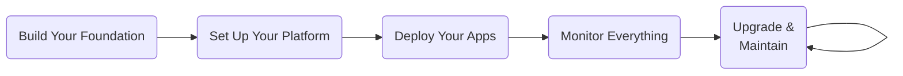

import Intro from '@site/src/components/Intro';
import KeyPoints from '@site/src/components/KeyPoints';
import ActionCard from '@site/src/components/ActionCard';
import PrimaryCTA from '@site/src/components/PrimaryCTA';
import DocCardList from '@theme/DocCardList';
import Steps from '@site/src/components/Steps';
import Step from '@site/src/components/Step';
import StepNumber from '@site/src/components/StepNumber';

<Intro>
Cloud Posse's reference architecture offers a unique, open-source approach to infrastructure, fostering a collaborative ecosystem with the industry's largest library of Terraform modules and a comprehensive framework using [Atmos](https://atmos.tools). Whether you're an experienced developer or a Terraform newbie, our tools and community are here to help you succeed without sacrificing customization.
</Intro>

Before you jump into the Cloud Posse reference architecture, let’s review what makes it tick. Cloud Posse has been helping companies—from scrappy startups to massive enterprises—win big with Terraform. But here’s the kicker: we do things differently. Everything is based on Open Source that your team owns and operates. We're not another enterprise platform you _have_ to pay for (but [we do accept sponsorships](/community/support) and [offer support](/support)). We’re a part of a community that’s here to help you succeed.

Our goal? To create a collaborative ecosystem where everyone, regardless of the company, can work together on infrastructure, so we stop reinventing the wheel.

How do we make this magic happen? First, we built the industry's largest library of Terraform modules for AWS, Datadog, and Opsgenie. Then, we crafted reusable components to give you rock-solid ways to set up your infrastructure. Finally, we wrapped it all up in a neat framework using [Atmos](https://atmos.tools) that ties everything together, fully automated with GitHub Actions.

## Documentation Structure

This documentation site breaks down SweetOps into the following sections to help you get up and running:

<Steps>

  <Step>
    ### <StepNumber/> Learn

    This is section where you go to [**learn our framework**](/learn) for AWS and follow the structured guide to get it set up.

    Each section of our "Learn" journey is designed to help you get up and running with SweetOps and the Cloud Posse Reference Architecture.

    <Steps>
    - **Build your foundation** (Organization, OUs Accounts, Network & VPCs, IAM & Single Sign-On)
    - **Set up your platform** (Kubernetes, ECS, EKS, etc.)
    - **Deploy your apps** (CI/CD, GitHub Actions, GitOps.)
    - **Monitor everything** (Datadog, Prometheus, Grafana, etc. Also, monitoring for Security & Compliance)
    - **Upgrade & Maintain** (Day-2 operations including upgrades, backups, disaster recovery, etc.)
    </Steps>

    Inside of each of these sections, you'll find:
    - [**Design Decisions**](/tags/design-decision): Up-to-date context on the decisions for implementing well-built infrastructure
    - [**Setup**](/tags/setup): show how to step up a specific layer or resource in easy-to-follow steps.
    - [**How-To Guides & Tutorials**](/tags/tutorial): show how to solve specific problems with SweetOps via a series of easy-to-follow steps.

    Then we include some of our [Best Practices](/best-practices) and [Architectural Design Decisions](/reference/adrs) to help you understand the reasoning behind our choices.
  </Step>

  <Step>
    ### <StepNumber/> Reference

    The [reference documentation](/reference) is where you find the the underlying building blocks such as Terraform modules & components, GitHub Actions, and more.

    This is where you go when you need to look up the documentation for how a particular component or module works, or when you're trying to build something, this is the first place to look to see if we already support it. It's the nuts and bolts of the SweetOps framework for AWS.
  </Step>

  <Step>
    ### <StepNumber/> Community

    The [**Community**](/community) section is for those who want to engage with the SweetOps community and get support.

    <Steps>
      - Join our Slack community
      - Attend our weekly office hours
      - Contribute back to the project
    </Steps>
  </Step>

</Steps>

## Who is this documentation for?

This documentation is written for DevOps or platform engineering teams that want an opinionated way to build software platforms in the cloud.

If the below sounds like you, then SweetOps is what you’re looking for:

1. **You’re on AWS** (the majority of our modules are for AWS)
2. **You’re using Terraform** as your primary IaC tool (and not Cloud Formation)
3. **Your platform needs to be secure** and potentially requires passing compliance audits (PCI, SOC2, HIPAA, HITRUST, FedRAMP, etc.)
4. You don’t want to reinvent the wheel

With SweetOps you can implement the following complex architectural patterns with ease:

1. An AWS multi-account Landing Zone built on strong, well-established principles including Separation of Concerns and Principle of Least Privilege (POLP).
2. Multi-region, globally available application environments with disaster recovery capabilities.
3. Foundational AWS-focused security practices that make complex compliance audits a breeze.
4. Microservice architectures that are ready for massive scale running on Docker and Kubernetes.
5. Reusable service catalogs and components to promote reuse across an organization and accelerate adoption

## What are the alternatives?

The reference archietcture is comparable to various other solutions that bundle ready-to-go Terraform "templates" and offer subscription plans for access to their modules.

How does it differentiate from these solutions?

1. **It’s based 100% on Open Source**: SweetOps [is on GitHub](https://github.com/cloudposse) and is free to use with no strings attached under Apache 2.0.
2. **It’s comprehensive**: SweetOps is not only about Terraform. It provides a framework with conventions for building cloud-native platforms that are security-focused, Kubernetes or ECS-based, with comprehensive monitoring and incident management, and driven by continuous delivery.
3. **It’s community-focused**: SweetOps has [over 9500 users in Slack](https://sweetops.com/slack/), and well-attended weekly [office hours](https://cloudposse.com/office-hours/).

<ActionCard title="What comes next?">
  Now that you know what the reference architecture is about, you're ready to get started by with your first project.

  <PrimaryCTA to="/layers/foundation">Next Step</PrimaryCTA>
</ActionCard>
