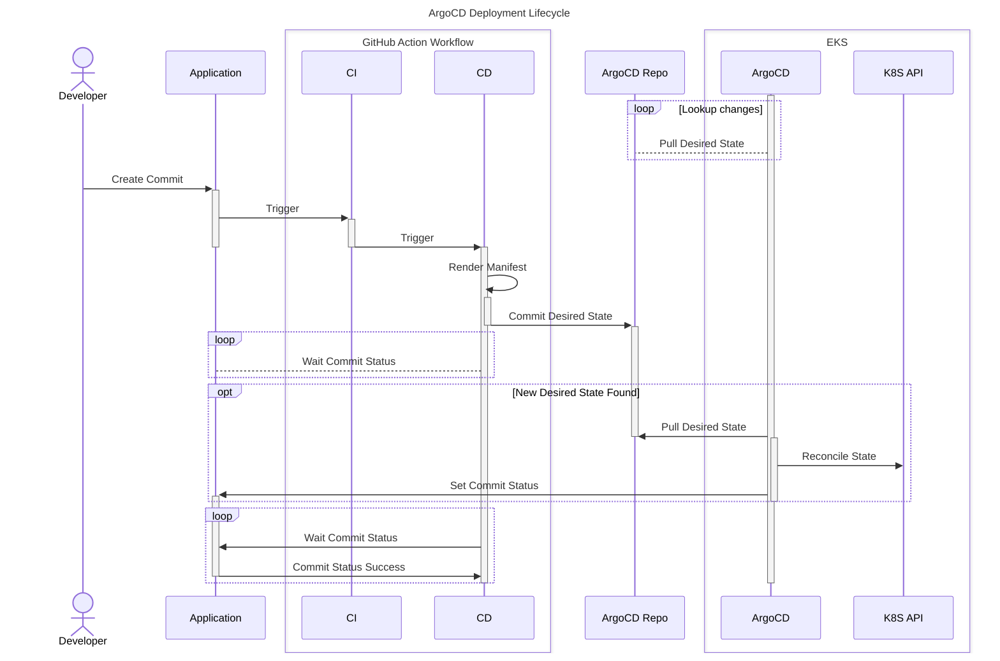

import Intro from '@site/src/components/Intro';
import KeyPoints from '@site/src/components/KeyPoints';
import Tabs from '@theme/Tabs';
import TabItem from '@theme/TabItem';

### Overview



### Deployment

Application repository will create a deployment when a workflow is triggered and call the relevant shared workflow.

<details>
<summary>Deploy</summary>

<Tabs>

<TabItem value="feature" label="Feature">

```yaml
# .github/workflows/feature-branch.yaml
name: Feature Branch
on:
  pull_request:
    branches: [ 'main' ]
    types: [opened, synchronize, reopened, closed, labeled, unlabeled]

permissions:
  pull-requests: write
  deployments: write
  id-token: write
  contents: read

jobs:
  do:
    uses: cloudposse/github-actions-workflows-docker-ecr-eks-helm-argocd/.github/workflows/feature-branch.yml@main
    with:
      organization: "${{ github.event.repository.owner.login }}"
      repository: "${{ github.event.repository.name }}"
      open: ${{ github.event.pull_request.state == 'open' }}
      labels: ${{ toJSON(github.event.pull_request.labels.*.name) }}
      ref: ${{ github.event.pull_request.head.ref  }}
    secrets:
      github-private-actions-pat: "${{ secrets.PUBLIC_REPO_ACCESS_TOKEN }}"
      registry: "${{ secrets.ECR_REGISTRY }}"
      secret-outputs-passphrase: "${{ secrets.GHA_SECRET_OUTPUT_PASSPHRASE }}"
      ecr-region: "${{ secrets.ECR_REGION }}"
      ecr-iam-role: "${{ secrets.ECR_IAM_ROLE }}"
```

</TabItem>

<TabItem value="main" label="Main">

```yaml
# .github/workflows/main-branch.yaml
name: Main Branch
on:
  push:
    branches: [ main ]

permissions:
  contents: write
  id-token: write

jobs:
  do:
    uses: cloudposse/github-actions-workflows-docker-ecr-eks-helm-argocd/.github/workflows/main-branch.yml@main
    with:
      organization: "${{ github.event.repository.owner.login }}"
      repository: "${{ github.event.repository.name }}"
    secrets:
      github-private-actions-pat: "${{ secrets.PUBLIC_REPO_ACCESS_TOKEN }}"
      registry: "${{ secrets.ECR_REGISTRY }}"
      secret-outputs-passphrase: "${{ secrets.GHA_SECRET_OUTPUT_PASSPHRASE }}"
      ecr-region: "${{ secrets.ECR_REGION }}"
      ecr-iam-role: "${{ secrets.ECR_IAM_ROLE }}"
```

</TabItem>

<TabItem value="release" label="Release">

```yaml
# .github/workflows/release.yaml
name: Release
on:
  release:
    types: [published]

permissions:
  id-token: write
  contents: write

jobs:
  perform:
    uses: cloudposse/github-actions-workflows-docker-ecr-eks-helm-argocd/.github/workflows/release.yml@main
    with:
      organization: "${{ github.event.repository.owner.login }}"
      repository: "${{ github.event.repository.name }}"
      version: ${{ github.event.release.tag_name }}
    secrets:
      github-private-actions-pat: "${{ secrets.PUBLIC_REPO_ACCESS_TOKEN }}"
      registry: "${{ secrets.ECR_REGISTRY }}"
      secret-outputs-passphrase: "${{ secrets.GHA_SECRET_OUTPUT_PASSPHRASE }}"
      ecr-region: "${{ secrets.ECR_REGION }}"
      ecr-iam-role: "${{ secrets.ECR_IAM_ROLE }}"
```

</TabItem>
</Tabs>
</details>

That workflow calls a Reusable Workflow, `cloudposse/github-actions-workflows-docker-ecr-eks-helm-argocd`, that is designed to deploy a
dockerized application from ECR to EKS using ArgoCD specifically.

### Hotfix Workflows

Hotfix workflows are designed to push changes directly to a released version in production. Ideally we want any change to move through the standard release lifecycle, but in reality there are times when we need the ability to push a hotfix directly to production.

In order to enable hotfix workflows, create two additional workflows and modify the existing release workflow. See each of the following workflows:

<details>
<summary>Hotfix Workflows</summary>

<Tabs>
<TabItem value="mixin" label="Release Branch">

Before running any hotfix workflows, we must first create release branches with any release. Modify the existing release workflow to include the `hotfix` job below.

```yaml
# .github/workflows/release.yaml
name: Release
on:
  release:
    types: [published]

permissions:
  id-token: write
  contents: write

jobs:
  perform:
  ...

  hotfix:
    name: release / branch
    uses: cloudposse/github-actions-workflows-docker-ecr-eks-helm-argocd/.github/workflows/hotfix-mixin.yml@main
    with:
      version: ${{ github.event.release.tag_name }}
```

</TabItem>
<TabItem value="branch" label="Hotfix Branch">

This `hotfix-branch.yaml` workflow will deploy a duplicate app in the _production_ cluster to a new namespace. We need to deploy to production to validate a hotfix directly for production.

Deploy this workflow by creating a Pull Request into the a release branch and adding the `deploy` label.

```yaml
# .github/workflows/hotfix-branch.yaml
name: Hotfix Branch
on:
  pull_request:
    branches: [ 'release/**' ]
    types: [opened, synchronize, reopened, closed, labeled, unlabeled]

permissions:
  pull-requests: write
  deployments: write
  id-token: write
  contents: read

jobs:
  do:
    uses: cloudposse/github-actions-workflows-docker-ecr-eks-helm-argocd/.github/workflows/hotfix-branch.yml@main
    with:
      organization: "${{ github.event.repository.owner.login }}"
      repository: "${{ github.event.repository.name }}"
      open: ${{ github.event.pull_request.state == 'open' }}
      labels: ${{ toJSON(github.event.pull_request.labels.*.name) }}
      ref: ${{ github.event.pull_request.head.ref }}
      path: deploy
    secrets:
      github-private-actions-pat: "${{ secrets.PRIVATE_REPO_ACCESS_TOKEN }}"
      registry: "${{ secrets.ECR_REGISTRY }}"
      secret-outputs-passphrase: "${{ secrets.GHA_SECRET_OUTPUT_PASSPHRASE }}"
      ecr-region: "${{ secrets.ECR_REGION }}"
      ecr-iam-role: "${{ secrets.ECR_IAM_ROLE }}"
```

</TabItem>
<TabItem value="release" label="Hotfix Release">

Once we've validated a Pull Request for a given hotfix, we can merge that change into the release branch. When changes are pushed to a release branch, the "Hotfix Release" workflow is triggered. _This workflow will deploy the given change directly to production_.

Before deploying, the workflow will create a minor version release and test it.
After the deployment, it will create a reintegration pull request to bring the hotfix back into the main branch and lower environments.

In order to enable the "Hotfix Release" workflow, add the following:

```yaml
# .github/workflows/hotfix-release.yaml
name: Hotfix Release
on:
  push:
    branches: [ 'release/**' ]

permissions:
  contents: write
  id-token: write

jobs:
  do:
    uses: cloudposse/github-actions-workflows-docker-ecr-eks-helm-argocd/.github/workflows/hotfix-release.yml@main
    with:
      organization: "${{ github.event.repository.owner.login }}"
      repository: "${{ github.event.repository.name }}"
      path: deploy
    secrets:
      github-private-actions-pat: "${{ secrets.PRIVATE_REPO_ACCESS_TOKEN }}"
      registry: "${{ secrets.ECR_REGISTRY }}"
      secret-outputs-passphrase: "${{ secrets.GHA_SECRET_OUTPUT_PASSPHRASE }}"
      ecr-region: "${{ secrets.ECR_REGION }}"
      ecr-iam-role: "${{ secrets.ECR_IAM_ROLE }}"
```

</TabItem>
</Tabs>
</details>

These workflows also call the same Reusuable Workflow repository, `cloudposse/github-actions-workflows-docker-ecr-eks-helm-argocd`, as well as several of the same Reusuable Workflows called from that repository. For example, `cloudposse/github-actions-workflows` and `cloudposse/actions-private`.

:::tip Verify environment configs carefully

Be sure the environment configuration mapping includes `hotfix`. This typically lives with your private configuration repository, for example `cloudposse/actions-private`, and is called by the `cloudposse/github-action-interface-environment` action.

For example, add the following:

```yaml
runs:
  using: "composite"
  steps:
    - name: Environment info
      uses: cloudposse/github-action-yaml-config-query@0.1.0
      id: result
      with:
        query: .${{ inputs.environment }}
        config: |
          ...
          hotfix:
            cluster: https://github.com/GH_ORG/argocd-deploy-prod/blob/main/plat/use2-prod/apps
            cluster-role: arn:aws:iam::PRODUCTION_ACCOUNT_ID:role/acme-plat-use2-prod-eks-cluster-gha
            namespace: ${{ inputs.namespace }}
            ssm-path: platform/acme-plat-use2-prod-eks-cluster
```

:::

### Implementation

- [`eks/argocd`](/components/library/aws/eks/argocd/): This component is responsible for provisioning [ArgoCD](https://argoproj.github.io/cd/).
- [`eks/platform`](/components/library/aws/eks/platform/): This component maps another components' outputs into SSM parameter store to declare platform context used by CI/CD workflows.
- [`argocd-repo`](/components/library/aws/argocd-repo/): This component is responsible for creating and managing an ArgoCD desired state repository.
- [`sso-saml-provider`](/components/library/aws/sso-saml-provider/): This component reads sso credentials from SSM Parameter store and provides them as outputs

## References
- [ArgoCD Setup](/reference-architecture/setup/argocd/)
- [Foundation Release Engineering](/reference-architecture/fundamentals/design-decisions/foundational-release-engineering/)
- [Decide on Pipeline Strategy](/reference-architecture/fundamentals/design-decisions/foundational-release-engineering/decide-on-pipeline-strategy/)

