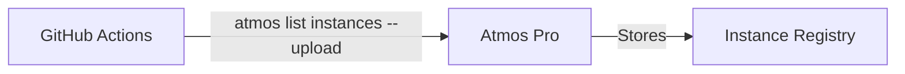
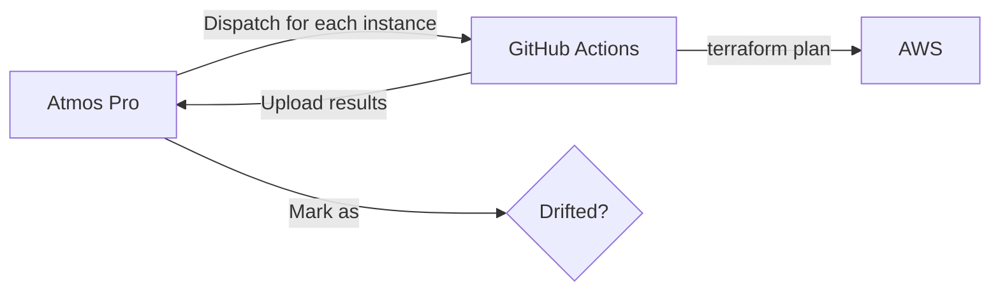
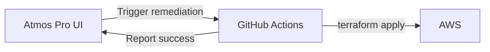

import Intro from '@site/src/components/Intro';
import KeyPoints from '@site/src/components/KeyPoints';
import Steps from '@site/src/components/Steps';
import Step from '@site/src/components/Step';
import StepNumber from '@site/src/components/StepNumber';
import TaskList from '@site/src/components/TaskList';
import ActionCard from '@site/src/components/ActionCard';
import PrimaryCTA from '@site/src/components/PrimaryCTA';
import Tabs from '@theme/Tabs';
import TabItem from '@theme/TabItem';
import CodeBlock from '@theme/CodeBlock';
import CollapsibleText from '@site/src/components/CollapsibleText';
import PartialListInstances from '@site/examples/snippets/.github/workflows/atmos-pro-list-instances.yaml';
import PartialTerraformPlan from '@site/examples/snippets/.github/workflows/atmos-pro-terraform-plan.yaml';
import PartialTerraformApply from '@site/examples/snippets/.github/workflows/atmos-pro-terraform-apply.yaml';

<Intro>
Drift detection identifies when your deployed infrastructure no longer matches your Terraform configuration. Atmos Pro provides automated drift detection with scheduled scans, detailed reports, and remediation workflows — all integrated into your existing GitOps process.
</Intro>

<KeyPoints title="What You'll Configure">
  <TaskList>
    - GitHub workflow to upload instance list to Atmos Pro
    - Atmos stack settings for drift detection and remediation
    - Scheduled drift detection runs
  </TaskList>
</KeyPoints>

## What is Infrastructure Drift?

Infrastructure drift occurs when the actual state of your cloud resources diverges from the desired state defined in your Terraform code. This can happen for several reasons:

<Steps>
1. **Manual Changes** — Someone modifies resources directly in the cloud console
1. **External Automation** — Other tools or scripts modify resources outside of Terraform
1. **Provider Updates** — Cloud provider changes default values or resource behavior
1. **Incomplete Applies** — Terraform runs that fail partway through
</Steps>

Undetected drift creates significant risks including security vulnerabilities, compliance violations, deployment failures, and operational confusion as teams lose confidence in their infrastructure code as the source of truth.

## How Drift Detection Works

Drift detection in Atmos Pro involves three coordinated workflows:

### 1. Instance Registration

First, Atmos Pro needs to know what instances (component + stack combinations) exist in your infrastructure. The **list-instances** workflow uploads this inventory to Atmos Pro.

This workflow runs on a schedule (e.g., nightly) or on-demand to keep the instance list current when components are added or removed.

### 2. Drift Detection

When a drift detection run is triggered from Atmos Pro, it dispatches the **detect** workflow for each registered instance. This workflow runs `terraform plan` and reports the results back to Atmos Pro.

Instances with detected changes are marked as "drifted" in the Atmos Pro dashboard.

### 3. Remediation

For any drifted instance, you can trigger remediation directly from the Atmos Pro UI. This dispatches the **remediate** workflow, which runs `terraform apply` to restore the desired state.

## Configuration

<Steps>
  <Step>
    ### <StepNumber/> Add the List Instances Workflow

    Add this workflow to your infrastructure repository. It runs on a schedule to keep Atmos Pro's instance registry current.

    <CollapsibleText type="medium">
      <CodeBlock language="yaml" title=".github/workflows/atmos-pro-list-instances.yaml">
        {PartialListInstances}
      </CodeBlock>
    </CollapsibleText>

    :::caution Update the IAM Role ARN
    Update the `role-to-assume` with your actual planner role ARN. The workflow needs read access to Terraform state to enumerate instances.
    :::

  </Step>

  <Step>
    ### <StepNumber/> Configure the Plan Workflow for Drift Detection

    The existing `atmos-pro-terraform-plan.yaml` workflow already supports drift detection through the `upload_status` input. When `upload_status: true`, the plan results are uploaded to Atmos Pro for drift tracking.

    <CollapsibleText type="medium">
      <CodeBlock language="yaml" title=".github/workflows/atmos-pro-terraform-plan.yaml">
        {PartialTerraformPlan}
      </CodeBlock>
    </CollapsibleText>

    Key parameters for drift detection:
    - **`upload_status`** — When `true`, uploads plan results to Atmos Pro (used by detect workflow)
    - **`atmos-pro-upload-status`** — The GitHub Action input that enables status upload

  </Step>

  <Step>
    ### <StepNumber/> Configure Atmos Stack Settings

    Add drift detection configuration to your Atmos stack defaults. This tells Atmos Pro which workflows to dispatch for detection and remediation.

    <CollapsibleText type="medium">
      <CodeBlock language="yaml" title="stacks/orgs/acme/_defaults.yaml">
{`vars:
  namespace: acme

# Workflow configuration anchors for reuse
plan-wf-config: &plan-wf-config
  atmos-pro-terraform-plan.yaml:
    inputs:
      component: "{{ .atmos_component }}"
      stack: "{{ .atmos_stack }}"

apply-wf-config: &apply-wf-config
  atmos-pro-terraform-apply.yaml:
    inputs:
      component: "{{ .atmos_component }}"
      stack: "{{ .atmos_stack }}"
      github_environment: "{{ .vars.tenant }}-{{ .vars.stage }}"

# Drift detection uses the plan workflow with upload_status enabled
detect-wf-config: &detect-wf-config
  atmos-pro-terraform-plan.yaml:
    inputs:
      component: "{{ .atmos_component }}"
      stack: "{{ .atmos_stack }}"
      upload_status: true

settings:
  pro:
    enabled: true
    # Standard PR workflows
    pull_request:
      opened:
        workflows: *plan-wf-config
      synchronize:
        workflows: *plan-wf-config
      reopened:
        workflows: *plan-wf-config
      merged:
        workflows: *apply-wf-config
    # Drift detection configuration
    drift_detection:
      enabled: true
      detect:
        workflows: *detect-wf-config
      remediate:
        workflows: *apply-wf-config`}
      </CodeBlock>
    </CollapsibleText>

    Key configuration:
    - **`detect.workflows`** — Uses the plan workflow with `upload_status: true` to report drift
    - **`remediate.workflows`** — Uses the apply workflow to fix drift (same as PR merge workflow)

  </Step>

  <Step>
    ### <StepNumber/> Configure Repository Permissions

    Drift detection requires additional repository permissions in Atmos Pro:

    <Steps>
    1. Go to [atmos-pro.com](https://atmos-pro.com) and log in to your organization
    1. From the dashboard, select your infrastructure repository
    1. Click **Quick Actions** in the top right corner
    1. Select **Repository Permissions**
    1. Add the following permissions:
    </Steps>

    <TaskList>
    - **Instances Create** — Allows the list-instances workflow to register new instances
    - **Instances Update** — Allows drift detection to update instance status
    </TaskList>

  </Step>

  <Step>
    ### <StepNumber/> Configure Drift Detection Schedule

    Create a drift detection schedule in the Atmos Pro dashboard:

    <Steps>
    1. Go to [atmos-pro.com](https://atmos-pro.com) and log in to your organization
    1. From the dashboard, select your infrastructure repository
    1. Click **Quick Actions** in the top right corner
    1. Select **Schedule Drift Detection**
    1. Configure the schedule frequency and save
    </Steps>

    Common schedule frequencies:

    - **Weekly** — Run once a week to audit infrastructure drift (recommended for most teams)
    - **Daily** — Run nightly for environments requiring tighter compliance

    :::tip Pausing Schedules
    Drift detection schedules can be paused and resumed at any time from the same Quick Actions menu. This is useful during planned maintenance windows or major migrations.
    :::

  </Step>
</Steps>

## Workflow Summary

| Workflow | Purpose | Trigger | Frequency |
| :------- | :------ | :------ | :-------- |
| `atmos-pro-list-instances.yaml` | Upload instance inventory | Schedule + on-demand | Nightly or weekly |
| `atmos-pro-terraform-plan.yaml` | Detect drift (with `upload_status`) | Atmos Pro dispatch | Per drift detection run |
| `atmos-pro-terraform-apply.yaml` | Remediate drift | Atmos Pro dispatch | On-demand from UI |

## Operational Workflow

The intended operational workflow for drift detection:

<Steps>
1. **List instances runs on schedule** — Keeps Atmos Pro's instance registry current (e.g., nightly)
1. **Drift detection runs on schedule** — Scans all instances for drift (e.g., weekly)
1. **Review drifted components** — Audit the list of drifted instances in Atmos Pro dashboard
1. **Remediate on demand** — Fix individual drifted components from the UI as needed
</Steps>

This approach provides regular visibility into infrastructure drift while allowing controlled, deliberate remediation rather than automatic fixes.

## Troubleshooting

### No instances appearing in Atmos Pro

<TaskList>
- Verify the `atmos-pro-list-instances.yaml` workflow is running successfully
- Check that `ATMOS_PRO_WORKSPACE_ID` is set in your repository variables
- Ensure the IAM role has permissions to read Terraform state
</TaskList>

### Drift detection not running

<TaskList>
- Verify `settings.pro.drift_detection.enabled: true` in your stack defaults
- Check that the drift detection schedule is configured in Atmos Pro
- Ensure the detect workflow configuration matches your actual workflow filename
</TaskList>

### Remediation failing

<TaskList>
- Verify the remediate workflow configuration matches your apply workflow
- Check that GitHub environments are properly configured for protected stages
- Review the GitHub Actions logs for specific errors
</TaskList>

<ActionCard title="Next Steps">
  Atmos Pro is fully configured! Continue with deploying the database layer—create a PR and let Atmos Pro handle the planning and deployment!
  <PrimaryCTA to="/layers/data/">Provision Databases</PrimaryCTA>
</ActionCard>
