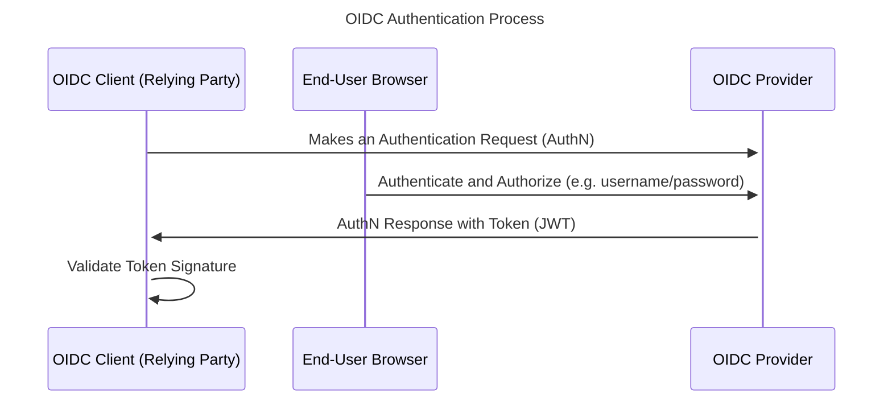
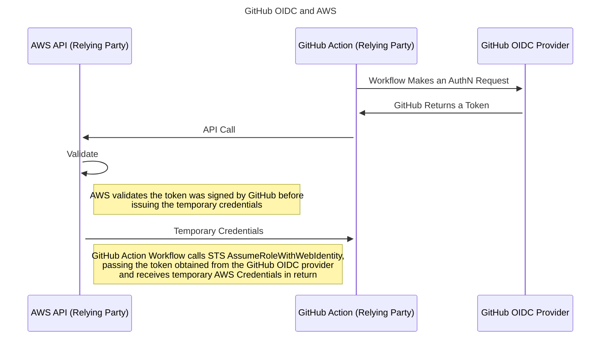

import Intro from '@site/src/components/Intro';
import KeyPoints from '@site/src/components/KeyPoints';
import Steps from '@site/src/components/Steps';
import Step from '@site/src/components/Step';
import StepNumber from '@site/src/components/StepNumber';

<Intro>
This is a detailed guide on how to integrate GitHub OpenID Connect (OIDC) with AWS to facilitate secure and efficient authentication and authorization for GitHub Actions, without the need for permanent (static) AWS credentials, thereby enhancing security and simplifying access management. First we explaini the concept of OIDC, illustrating its use with AWS, and then provide the step-by-step instructions for setting up GitHub as an OIDC provider in AWS.
</Intro>

GitHub OIDC (OpenID Connect) for AWS refers to the integration between GitHub as an identity provider using OpenID Connect and AWS services. This integration allows users to use their GitHub credentials to authenticate and access AWS resources securely. By configuring GitHub as an OIDC provider in AWS Identity and Access Management (IAM), organizations can establish a federated identity model. This enables GitHub users to sign in to AWS using their GitHub credentials, streamlining access management and eliminating the need for separate AWS-specific usernames and passwords. The integration also provides a centralized way to manage access permissions and enables Single Sign-On (SSO) capabilities, enhancing security and user experience in the AWS environment. Organizations can configure OIDC settings in AWS, including client IDs, client secrets, and the GitHub OIDC discovery URL, to establish a trust relationship between GitHub and AWS. For the most accurate and up-to-date information, it's recommended to check the official documentation of GitHub and AWS.

## OpenID Connect

OIDC is short for OpenID Connect and, like SAML, is a way to federate identities. Federating Identities is a fancy way of saying we trust a 3rd party (the OIDC provider) to handle two tasks:

1. Authentication: verify who the user is
2. Authorization: verify what the user has access to (claims)

You can think of this process as similar to arriving at an airport. You present your passport to airport personnel (authentication) so they can identify you along with your boarding pass (authorization claim) indicating you are authorized to pass through security and board a specific flight.



<details>
<summary>This is similar to how OpenID connect works with DataDog</summary>

We share this here only if it helps, as the process is conceptually similar for GitHub and GitHub Actions.


</details>

## GitHub OIDC and AWS

:::tip

The primary reason we want to use GitHub OIDC with AWS is so GitHub Actions can assume various AWS Roles without the need to store permanent credentials (e.g. _without_ hardcoding `AWS_ACCESS_KEY_ID` and `AWS_SECRET_ACCESS_KEY`) in GitHub.

:::



## Implementation

<KeyPoints title="Overview">

1. Install the [GitHub OIDC Provider component](https://github.com/cloudposse-terraform-components/aws-github-oidc-provider) in each account where GitHub Actions need to assume a role.
2. Create the role that GitHub Actions Workflows will assume
3. Configure the GitHub Actions Workflow to assume the role
</KeyPoints>

<Steps>
  <Step>
  ### <StepNumber/> Deploy GitHub OIDC Provider Component

  After deploying the [GitHub OIDC Provider component](https://github.com/cloudposse-terraform-components/aws-github-oidc-provider) into an account, you should see the Identity Provider in IAM in the AWS Web Console.

  Deploy this component in each account where GitHub Actions need to assume a role.

  <Steps>
    - Import `catalog/github-oidc-provider` in the `gbl` stack for the given account
    - Deploy the `github-oidc-provider` component: `atmos terraform apply github-oidc-provider -s plat-gbl-dev`
  </Steps>

  </Step>

  <Step>
  ### <StepNumber/> Option 1: Configure GitHub OIDC Mixin Role and Policy

  Use the mixin to grant GitHub the ability to assume a role for a specific component.

  - Add the [GitHub OIDC Mixin](https://github.com/cloudposse/terraform-aws-components/tree/main/mixins/github-actions-iam-role) to any component that needs to generate an IAM Role for GitHub Actions
  - Implement a custom IAM Policy with least privilege for the role. See [example policies here](https://github.com/cloudposse/terraform-aws-components/tree/main/mixins/github-actions-iam-policy)
  </Step>

  <Step>
  ### <StepNumber/> Option 2: Deploy GitHub OIDC Role Component

  Deploy the [GitHub OIDC Role component](https://github.com/cloudposse-terraform-components/aws-github-oidc-role) to create a generalized role for GitHub to access several resources in AWS.
  </Step>

  <Step>
  ### <StepNumber/> Configure GitHub Action Workflows

  First, give the GitHub Action Workflow the proper permissions

  ```yaml
  permissions:
    id-token: write # This is required for requesting the JWT
    contents: read  # This is required for actions/checkout
  ```

  Then, use the official [aws-actions/configure-aws-credentials](https://github.com/aws-actions/configure-aws-credentials) action to automatically obtain a token from the GitHub OIDC provider, exchange that token for AWS temporary credentials and set the proper env vars in your GitHub Action Workflow

  ```yaml
  - name: Configure AWS credentials
    uses: aws-actions/configure-aws-credentials@v4
    with:
      aws-region: us-east-2
      role-to-assume: arn:aws:iam::111111111111:role/my-github-actions-role
      role-session-name: my-github-actions-role-session
  ```
  </Step>
</Steps>

## FAQ

### Should I use the Mixin or the component to deploy a GitHub OIDC role?

Use the mixin when deploying a role tightly coupled with a specific component. For example, use the mixin with `ecr` to grant GitHub access to push and pull ECR images.

However, sometimes we need a role with access to many components or resources. In this case, we use the `github-oidc-role` component to define a generalized role for GitHub to assume. For example, we use the component for the `gitops` role.
