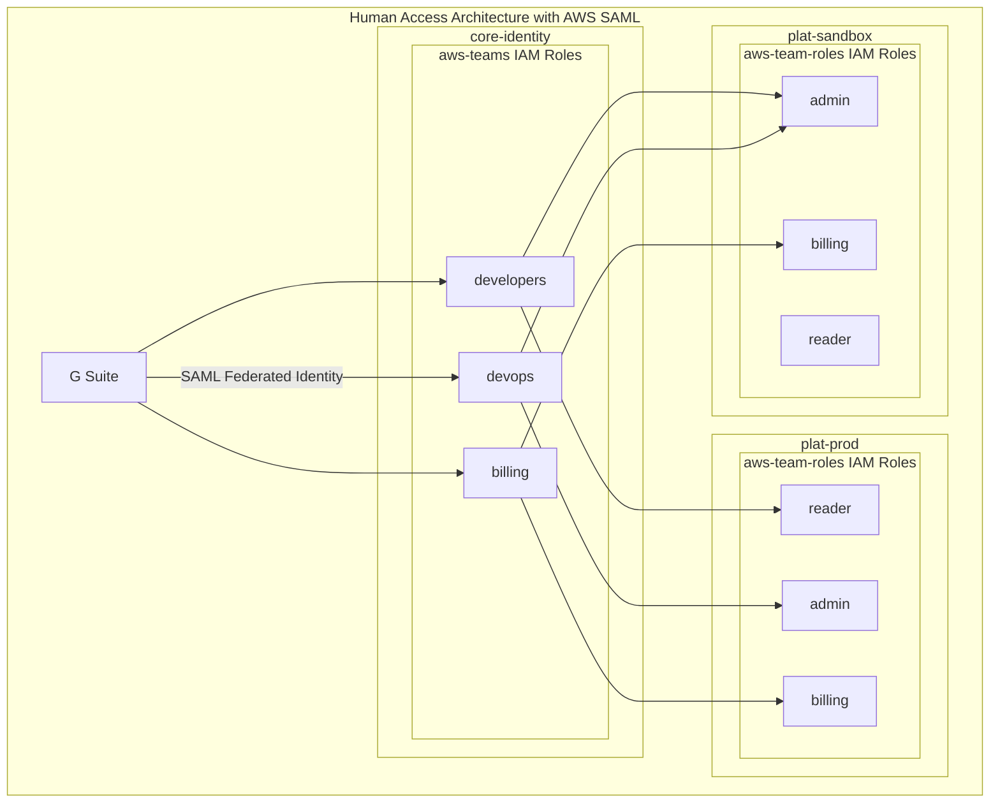
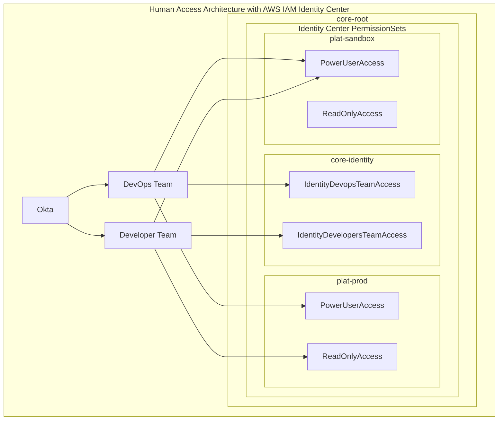
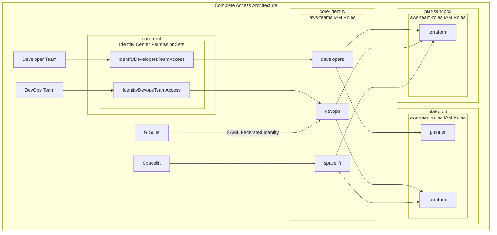

import Intro from '@site/src/components/Intro';
import KeyPoints from '@site/src/components/KeyPoints';

<Intro>
This is an overview of our approach to centralized access management and the relationships between the components used to implement it. It explains how SAML, SSO, and custom constructs for AWS teams and team roles interact to provide efficient role delegation and authentication across an AWS Organization.
</Intro>

The following components are designed to provision all primary user and system roles into a centralized identity
account. These components are expected to be used together to provide fine-grained role delegation across the account
hierarchy.

### AWS Teams

The `aws-teams` component creates AWS Teams in the Identity account. The **Team** is the entry point for a group of
users, and the Identity account acts as an "Identity Hub" for centralized role assumption management across all
delegated accounts.

Think of each team as a group of users, such as `developers` or `devops`.

### AWS Team Roles

The `aws-team-roles` component defines common IAM Roles in all accounts, as well as defines the AWS Team(s) able to
assume the role in any account.

These roles should be identical in all accounts, such that you can always expect `admin` to be `admin`, `poweruser` to
be `poweruser`, and `observer` to be `observer`. The only difference between accounts is which AWS Team is able to
assume the role.

### AWS SAML

The `aws-saml` component provides SAML access for Admin users to connect to the Identity account admin role `aws-teams`
without AWS IAM Identity Center (Successor to AWS Single Sign-On).

This component creates an Identity Provider (IdP) in the Identity account to allow federated access to an identity role.
Follow the Identity Providers documentation for adding a SAML login.

With AWS SAML, we create a federated SAML login that connects to the "team" in the identity account, and then users can assume other roles from there. We use the [AWS Extend Switch Roles plugin](https://github.com/tilfinltd/aws-extend-switch-roles) that makes this much easier, but it's not as intuitive as Identity Center.

### AWS IAM Identity Center (SSO)

The `aws-sso` component connects AWS IAM Identity Center (Successor to AWS Single Sign-On) Groups to Permission Sets.
Permission Sets grant access to `aws-teams` in the Identity account or (optional) access to an individual account for
convenience.

Permission Sets other than the Identity Team Access Permission Set are used only for console and cli access to a single
account. These are redundant with AWS Team Roles but are useful for quickly accessing a given account with limited
permission.

With AWS IAM Identity Center, you can directly access a specific account from the single sign-on page, which will automatically assume the role with the associated `PermissionSet`. This is great for web console usage but not ideal for locally applying Terraform. With Terraform, we need to apply changes across many accounts, where each account has its own role. We don't want to assume a new role each time we change accounts. To solve this, we have a specific Permission Set that can assume an AWS team role in the identity account. When applying Terraform, we assume that "team" role via SSO, and when accessing the web console, we use the Permission Set directly.

## Solution

AWS IAM Identity Center and AWS SAML are not mutually exclusive solutions. They can be used together to provide a seamless login experience for users. Cloud Posse frequently deploys both in customer environments - AWS SAML to log in ourselves for the duration of the engagement and AWS IAM Identity Center for the customer to use and support. That way the customer can access AWS via their chosen Identity Provider (IdP), and we can use G-Suite SAML to access the Identity account team directly. When an enagement is complete, we can easily decommission our access by removing the SAML connection.

:::tip AWS IAM Identity Center or AWS SAML? Which do I choose?

The vast majority of our customers prefer AWS IAM Identity Center (SSO). The convenience of a web console login is hard to beat. However, some customers prefer SAML for its simplicity and compatibility with existing systems. We support both methods, and you can choose the one that best fits your needs.

:::

