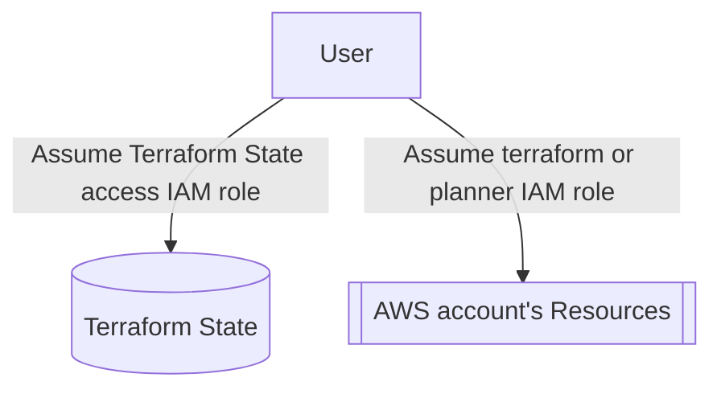

import Intro from '@site/src/components/Intro';
import KeyPoints from '@site/src/components/KeyPoints';
import Steps from '@site/src/components/Steps';

<Intro>
This document describes the architecture and design concept of the access control system in the *current* Cloud Posse reference architecture, including the "Dynamic Terraform Roles" feature.
</Intro>

For information about earlier versions of the access control architecture and design, See [AWS Access Control Evolution](/layers/identity/docs/aws-access-control-evolution).

- A person's access to resources is controlled by IAM policies attached to IAM
  roles in AWS accounts.
- The `aws-team-roles` component is deployed to an account to create its IAM
  policies and roles, attach policies to the roles, and configure access to the
  roles themselves.
- The Cloud Posse reference architecture supports 3 mechanisms that allow a
  person to access (assume) a role in an account:
  - Cloud Posse's `aws-teams` component deployed to a dedicated `identity`
    account. This is based on recommendations from AWS and Google, and
    implements a hub-and-spoke pattern where users log into an IAM Role or
    Identity Center Permission Set in the
    `identity` account, and then access other accounts by assuming roles in
    them. We call the Role or Permission Set in the `identity` account a "team",
    because it acts in much the same way that "groups" do in other access
    control systems: many people can be members of a team, and the rest of the
    access control system is configured to grant or deny access to teams rather
    than individuals.
  - They can assume a role using by logging directly into it via an external
    Identity Provider (IdP)
  - They can assume a role using by logging into the AWS IAM Identity Center
    (formerly AWS SSO) via an external Identity Provider (not covered here)
- For software running on resources in AWS accounts, AWS provides, and Cloud
  Posse supports, mechanisms for providing an initial role. Once the software is
  running, it can assume other roles as needed.
- Terraform has special support and requirements (explained below).

Logging in via an IdP is usually a multistep manual process that would be
tedious and annoying to have to do multiple times an hour. Conversely, AWS
provides tools that makes changing roles very easy, sometimes even automatic.
Because of this, and because automated processes can only access roles (other
than their initial roles) by changing roles, a hub-and-spoke pattern was
developed where certain roles are defined as "identity" roles, meant to be
initial points of access, and other roles, the ones used to interact with
resources, are defined to allow access by being assumed from identity roles.
This pattern is implemented by both the Cloud Posse reference architecture and
AWS IAM Identity Center.

As an administrator, you set up people in your Identity Provider (usually either
Google or Okta)
and configure their access to resources. (The details of how to do that are
beyond the scope of this document.)
For someone like a junior developer who only needs access to a single "sandbox"
account, or an auditor who only needs access to the "audit" account, you can set
up their access so that they can log in directly to a role in the account. For
someone who needs access to multiple accounts, you can set up their access so
that they can log into a role in the "identity" account (which Cloud Posse
refers to as a "team"), and then can assume roles in other accounts from there.

In order for an Identity Provider to be able to log someone into a role in an
AWS account, the account must be configured to trust the Identity Provider to do
so. This is done with the `aws-saml` component. This is detailed further below,
but the key points are:

- The `aws-saml` component must be deployed to every account the Identity
  Provider wants to log people into.
- The `aws-saml` component should always be deployed to the "identity" account.
- Typically, the `aws-saml` component is deployed once and only needs updating
  when certificates expire. It does not have to be updated when users, roles, or
  policies change.

## Details

### Policies, Roles, and Accounts

The most fundamental layers of access control are the AWS account and the
Identity and Access Management (IAM) roles and policies. For a person to be able
to do anything, they need to be able to assume an IAM role in an AWS account,
and that role has to have IAM policies attached to it that grant the permissions
needed to do the work.

#### Policies and Roles

An IAM Policy defines a set of permissions that a user or service can be
granted. A policy can be "attached" to a user, group, or role, although for our
purposes we will limit our discussion to roles. The role has the permissions
defined by all the policies attached to it.

An IAM role groups permissions into a single entity that allows many users to
share the same permissions by allowing them to "assume" the role. Several people
can be allowed to assume the same role, and each person can assume multiple
roles.

AWS provides a number of "AWS managed" policies that provide common sets of
permissions and are usually attached by themselves to IAM roles. For example,
the
`AdministratorAccess` role provides full access to all AWS services. The
`PowerUserAccess` role provides full access to all AWS services except for
management of users and groups. The `ReadOnlyAccess` role provides read-only
access to all AWS services. The `ViewOnlyAccess` role provides read-only access
to most AWS services except where such access might allow the user to see secret
or sensitive information.

AWS also allows users to define their own policies, called "Customer Managed
Policies".

#### Accounts

An AWS account is a logical grouping of resources. The architecture of IAM
Policies makes it difficult to allow access to some resources in an account but
not others of the same kind. However, by default, any access granted to
resources in one account does not grant access to resources in another account.
So we use accounts to group resources that we want to share and separate out
resources that we want to keep restricted.

Cloud Posse's reference architecture uses a number of accounts to separate out
resources in this way. Here is a sample of the accounts we use:

<dl>
  <dt>`plat-prod`</dt>
  <dd>Holds the production resources for the company, the ones that provide the company's services to its customers.</dd>
  <dt>`plat-dev`</dt>
  <dd>Holds the development resources for the company, the ones that are used to develop the company's services.</dd>
  <dt>`core-audit`</dt>
  <dd>Holds the logs and other resources that are used to audit the other accounts.</dd>
</dl>

Hopefully you can see how this separation allows us to give developers access to
the resources they need, perhaps giving them full administrative access to
the `plat-dev` account, while restricting their access to the `plat-prod`
account to read-only access and cutting off all access to the `core-audit`
account. At the same time, we can give auditors access to the `core-audit`
account without giving them access to the `plat-dev` or `plat-prod` accounts.
This separation helps to ensure that no one can make changes to critical
resources and then cover their tracks by erasing audit trails. This is just one
example of how the separation of accounts can be used to provide security.

#### Create policies and roles in accounts

Cloud Posse provides the `aws-team-roles` component to create policies and roles
in accounts
(and configure access to them, which will be discussed below).

For each account, the `aws-team-roles` component creates a set of roles with
specified policies attached. (See the `aws-team-roles` component's documentation
for more details.) For ease of administration, auditing, and comprehension,
Cloud Posse recommends that you use the same set of roles in each account. For
example, you might have `admin`, `developer`, and `reader`
roles in each account. The `admin` role would have the `AdministratorAccess`
policy attached, the `developer` role would have the `PowerUserAccess` policy
attached, and the `reader` role would have the `ReadOnlyAccess` policy attached.
This way, you can easily see what permissions a user has in each account by
looking at the roles they are allowed to assume.

Cloud Posse creates 2 special roles in each account: `terraform` and `planner`.
The `terraform` role is used by Terraform to create and manage resources in the
account. Any user who needs to make changes to resources via Terraform should be
allowed to assume this role. The `planner` role can be used by Terraform to plan
changes to resources in the account. Users who need to be able to plan changes
to resources via Terraform but who are not allowed to make changes should be
allowed to assume this role.

### Identity and Authentication

The next layer of access control is the identity and authentication layer. This
layer is responsible for determining who is allowed to assume a role in an
account and gain the corresponding permissions.

#### Identity providers

An identity provider (IdP) is a service that provides a way to authenticate a
user and determine their identity. The identity provider provides a company with
a central place to grant (and limit) access to services for its employees and
other individuals. Identity providers are enabled account-by-account via
the `aws-saml` component.

The most common identity providers Cloud Posse's customers use are Google and
Okta. These services provide a way for users to log in and prove their identity
to the identity provider. The identity provider then provides a way for other
services to verify that the user has been authenticated and is permitted to
access the service. In the case of Google and Okta, this is done
using [SAML](https://www.cloudflare.com/learning/access-management/what-is-saml/).

#### Trust relationships

Here is where things can start to become hard to follow.

In order for a user to assume a role in an account, AWS needs to know that the
user is authorized to do so. Each role in an account has a "trust policy" (also
called an "assume role policy") that configures who can assume that role. A
role's trust policy can be configured to allow other AWS roles, in the same or
other accounts, to assume it. So, once you are in a role, that role can be used
to grant you access to other roles. This is called "role chaining", and Cloud
Posse's reference architecture leverages this heavily, as will be explained
below, but you do not have to use role chaining if you prefer not to.

A trust relationship between an IdP (using SAML) and an AWS account is
established by creating what AWS calls an "IAM SAML Identity Provider" in the
account. (Cloud Posse sometimes calls this as "SAML Connector".) Cloud Posse
provides the `aws-saml` component to facilitate managing this via Terraform, but
there remain some manual steps since the Identity Provider itself is not
configurable via Terraform. (See the `aws-saml` component's documentation for
more details.)

Once the trust relationship between the IdP and the AWS account is established,
each role within the account can use its trust policy to allow the IdP to assume
it. This is how users get into their initial roles.

#### The chain of trust

Let's review two ways to get into a role in an account. Say that both
the `plat-dev` and `plat-prod`
accounts have the `terraform` and `planner` roles. We want to allow user Sandy
to be able to assume the `terraform` role in the `plat-dev` account (in order to
be able to make changes by running `terraform apply`) and the `planner` role in
the `plat-prod` account
(in order to see if changes need to be made, by running `terraform plan`, while
not being allowed to actually make changes).

##### Option 1: Login per account

One way to do this is for a user named Sandy is:

<Steps>
  1. Configure your AWS Organization to use the AWS Identity Center (formerly AWS
    SSO).
  2. Give Sandy access to Permission Sets in the target accounts with the desired
    access.
  3. If you want Sandy to be able to run Terraform in the account, give that
    Permission Set access to the Terraform state via the `tfstate-backend`
    component.
</Steps>

##### Option 2: Role chaining

Option 1 makes sense when a user only needs to assume one role in one account,
or if a user has a unique pattern of access to different accounts. However, if a
group of users all need to be able to assume the same set of multiple roles in
multiple accounts, it is more convenient to use role chaining via what Cloud
Posse calls `aws-teams`.

Let's say that Sandy, from the previous example, is one of several developers
who all need to be able to assume the `terraform` role in the `plat-dev` account
and the `planner` role in the `plat-prod` account. We can create a team
called `developers` and give all the developers access to that team. Then we can
configure the `terraform` role in the `plat-dev` account and the `planner` role
in the `plat-prod` account to allow the `developers` team to assume them. Now,
when Sandy logs into the IdP and selects the `developers`
team, Sandy will be able to assume the `terraform` role in the `plat-dev`
account and the `planner`
role in the `plat-prod` account.

As an added bonus, for the special cases of using Terraform or accessing a
Kubernetes cluster, we can configure the cross-account access to be automatic.
This means that Sandy can log in once and access all the accounts and roles that
Sandy needs to access without having to log in again or perform some kind of
manual role switching.

The `developers` team, and Sandy's access to it, is implemented as follows:

<Steps>
  - Deploy the `aws-saml` component to the `core-identity` account.
  - Create the `developers` team in `core-identity` using the `aws-teams`
    component, and set `aws_saml_login_enabled` to `true`.
  - Configure the `terraform` role in `plat-dev` and the `planner` role
    in `plat-prod` to allow the `developers` team to assume them by including
    the `developers` team in the `trusted_teams` list for each role.
  - Configure Sandy's account in the IdP to allow Sandy to assume the `developers`
    role in the `core-identity` account.
</Steps>

Sandy can then log into the IdP and select the `developers` team to gain access
to the `core-identity` account. From there, running any Terraform against any
Cloud Posse Terraform component will automatically assume the
`terraform` role when operating on the `plat-dev` account or the `planner` role
when operating on the `plat-prod` account.

Similarly, via the `eks/cluster` component, the `developers` team can be given
access to any RBAC role in any EKS clusters in any account, as desired. For
example, `developers` can be given access to
`cluster-admin` in the `plat-dev` cluster and `view` in the `plat-prod` cluster.
They can then use `kubectl` and other Kubernetes tools to access the clusters
without having to log in again or perform some kind of manual role switching (
though of course they will need to switch `kubectl` contexts).

## Terraform Support

Because of the special role Terraform plays in maintaining the infrastructure,
the Cloud Posse reference architecture includes special support for Terraform.

To use Terraform, you need 2 kinds of access:

1. Access to the Terraform state backend (S3 and DynamoDB)
2. Access to the AWS account where the infrastructure is deployed

When granting access to Terraform to a new user, you must ensure that the user
has both kinds of access.

### Access to the Terraform state backend

- The `tfstate-backend` component manages the Terraform state backend (S3 and
  DynamoDB) in the `root` (organization management) account.
- It creates a special role in the `root` account for read/write access to the
  Terraform state bucket and DynamoDB table.
- In order to use Terraform to manage the infrastructure, you must be able to
  assume this role. Assuming the role is handled automatically, but you still
  need to have permission to assume the role. This permission is granted
  by `tfstate-backend` (`allowed_roles`).

For complicated technical reasons, at present anyone who needs any kind of
access to Terraform needs to be able to assume the role that gives them
read/write access to the entire Terraform state backend. This is mainly a
limitation of Terraform itself. There are some workarounds, but they all have
significant trade-offs. Contact Cloud Posse if you need to discuss this further.

### Access to the AWS account where the infrastructure is deployed

For users who directly log into an account, they can use Terraform to manage the
infrastructure in that account to the extent their IAM permissions allow.
However, their role needs to be explicitly granted access to the Terraform state
backend (see previous section).

For users in teams, they should run Terraform from the team access role in the
identity account. This role also needs explicit access to the Terraform state
backend, but this is usually enabled in the initial configuration. The teams'
access to Terraform is implemented as follows:

<Steps>
  - The `aws-team-roles` component manages the roles in the AWS accounts.
  - It creates 2 special roles in each account to allow Teams to run Terraform in
    that account: `terraform` and `planner`.
  - To enable a team to run `terraform plan` and `terraform apply` in an account,
    add the team to the `trusted_teams` list for the `terraform` role in that
    account.
  - To enable a team to run `terraform plan` but NOT `terraform apply` in an
    account, add the team to the `trusted_teams` list for the `planner` role in
    that account.
</Steps>

### Roles are assumed automatically

When you run Terraform, 2 roles are automatically assumed:

1. The role that gives you access to the Terraform state backend (see earlier
   section)
2. The role that gives you access to the AWS account where the infrastructure is
   deployed

As a team member, the role for #2 is `terraform` if you are allowed to access
it, otherwise it is `planner`. However, if you are not allowed access to
either `terraform` or `planner`, then your current role is checked:

- If your current role is a role in the target account, then that role will be
  used (no role will be assumed)
- If your current role is a role in the `root` account, then the target
  account's OrganizationAccountAccessRole role will be assumed
- Otherwise, Terraform will try to assume the `terraform` role in the target
  account and would be expected to fail

