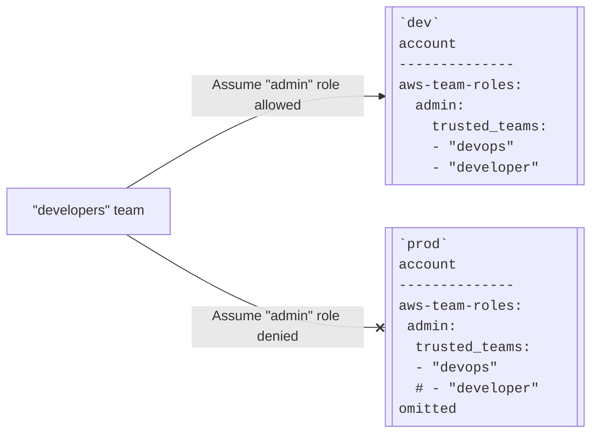

import Intro from '@site/src/components/Intro';
import KeyPoints from '@site/src/components/KeyPoints';
import Steps from '@site/src/components/Steps';

<Intro>
This document describes the Dynamic Terraform Roles feature and its benefits, and, for users of the previous architecture, **how to migrate to it**. The [AWS Access Control Architecture](/layers/identity/docs/aws-access-control-architecture) documentation assumes this feature is enabled and describes how to use it. The [AWS Access Control Evolution](/layers/identity/docs/aws-access-control-evolution#dynamic-terraform-roles-normalization-of-team-roles-better-team-and-team-role-iam-policy-management) documentation describes the feature in more detail.
</Intro>

:::info More than just Terraform

The Dynamic Terraform Roles feature is not just about Terraform. It is part of a
larger effort to normalize the roles and permissions in all accounts. As such,
it includes not just updates to various components, but it includes a
recommended restructuring of "teams" and "team roles". This restructuring makes
a clear distinction (via naming conventions) between the IAM roles that
represent teams and the IAM roles that team members can assume. The migration
portion of this document includes instructions on how to migrate to the new "
team" and "team role" names and configuration.

:::

This document alone is a lot of information. Combined with the above links and
specific migration instructions in the affected components, it could take days
to fully read, understand, and implement. Please prepare yourself accordingly.

### Background

Cloud Posse's current reference architecture includes a feature we call
"Dynamic Terraform Roles". This is in contrast to our previous implementation,
where we used a single, static role per account for all Terraform operations. In
the old implementation, access to Terraform was all-or-nothing (per account)
and based on whether or not the user was allowed to assume the static role. This
approach had some difficulties, including problems supporting AWS Identity
Center Permission Sets (which are implemented by dynamic roles), and an
inability to allow users to run `terraform plan` for drift detection or to
validate that their changes at least did not introduce any syntax errors,
without also allowing them to run `terraform apply`. It is also did not allow
for a "least privilege" approach to access control in the target accounts,
because the Terraform role requires full AdminAccess to the account, and there
was no way to give users more restricted access and still allow them to use
Terraform. The feature (or, more accurately, set of features) we call "Dynamic
Terraform Roles" addresses these issues.

## Features and Benefits

In this section we describe the features and benefits of the Dynamic Terraform
Roles feature at a high level. For a more detailed description, see
[AWS Access Control Evolution -> Dynamic Terraform Roles...](/layers/identity/docs/aws-access-control-evolution#dynamic-terraform-roles-normalization-of-team-roles-better-team-and-team-role-iam-policy-management).

Freed from the requirement that all users use the same, single, static IAM role
for all Terraform operations, we can now implement a more fine-grained access
control policy.

- **Full access**: This was the only option under the previous architecture.
  With full access, users are allowed to assume the Terraform role in some or
  all accounts, and that role can be used for all Terraform operations. As
  before, users can be limited to only certain accounts, but before, when
  limited, they would have no Terraform access at all to the accounts to which
  they were not granted full access. Now there are other options for giving
  users something less than full access but more than no access.
- **Plan-only access**: Users can be granted access to a role that allows
  only `terraform plan` operations, but does not allow any modifications to the
  infrastructure. This is particularly useful for automated users like Spacelift
  or GitHub actions to perform drift detection on critical security settings
  without giving them the necessary authority to make changes (which would make
  them a very attractive target for malicious users). This is also useful, for
  example, for developers who want to see what changes their pull requests would
  make to infrastructure in production. Typically, DevOps and CI users would be
  granted full access in most accounts and plan-only access in the most
  sensitive ones, while developers would get full access only in development and
  sandbox accounts.
- **Individual Per-Account Terraform Users**: Users can be granted access to
  custom roles in each account, allowing them to modify some infrastructure
  while not being able to modify other infrastructure, using ordinary IAM
  policies. For example, developers could be allowed to deploy applications to
  EKS without being allowed to modify the EKS cluster itself. As of this
  writing, such individual roles need to be explicitly granted access to the
  Terraform state via the configuration in the `tfstate-backend` component, but
  we could add attribute-based access control (ABAC) allowing access via tags on
  roles and thus eliminate the current requirement to the
  `tfstate-backend` component to grant access to new roles every time there is a
  change.
  Contact [Cloud Posse Professional Services](https://cloudposse.com/professional-services/)
  if you are interested in this feature.

### Direct Access versus Assume Role

In the previous architecture, users would be required to assume a role in
the `identity` account, and then Terraform would automatically assume the role
in the target account. This meant for every possible access pattern, there
needed to be a corresponding role in the `identity` account and users needed to
be granted access to that role, which would then be assumed in the target
account. This was a complex and unwieldy configuration, and it had an additional
downside: For users who were focused on working in a single account, they would
have to switch back and forth, using the `identity`
account role to perform Terraform operations in the target account, and then
switching back to their original role to perform AWS CLI or `kubectl`
operations in the target account.

Now it is possible to grant users a single role in the target account, and
enable that role to be used for all Terraform operations. This simplifies both
role assignments and user workflows.

### Reduced Need for SuperAdmin and Other Special Configurations

In both the current and the previous architecture, a special "SuperAdmin" role
is created in the `root` (organization owner) account with full Admin
privileges. This role is needed to create the infrastructure that supports
creating the IAM roles that are used for ordinary operations. For example,
SuperAdmin is required to create the accounts and initial IAM roles themselves.

In the previous architecture, anything that ever needed to be done by the
SuperAdmin role would _always_ need to be done by the SuperAdmin role. This
caused a lot of friction, because the SuperAdmin role was accessed by static API
keys which had to be protected, manually rotated, and manually activated, and
there was always a greater risk of these keys being leaked, since they were
long-lived.

In the previous and current implementations, there was and is a single static
role that is used to access the Terraform state backend, and all Terraform users
*except* SuperAdmin were required to assume this role to access the Terraform
state, a prerequisite for running Terraform. In the previous architecture,
SuperAdmin was not allowed to assume this role because the role did not exist in
the early stages of bringing up a set of accounts. This limitation required
special configurations, such as `var.privileged` and `backend.s3.role_arn:
null` in the Terraform configuration. In the new architecture, SuperAdmin can
assume the same static role as everyone else, so these special configurations
are only necessary for a small number of components, and to the extent an
organization desires, nearly all operations can be performed by the
`root-admin` role.

Enabling the `root-admin` role to do all the things that previously required the
SuperAdmin role converts the SuperAdmin role into more of a backup "break glass
in case of emergency" role, which allows for tighter access control, including
disabling or deleting access keys after use. Typically, whereas in the previous
architecture we only had the `identity-admin` role and greatly restricted what
the `root-admin` role could do, in the new architecture we add an
`identity-devops` role that matches roughly what the old `identity-admin`
role could do, and does not have access to the `root-admin` or
`root-terraform` roles. This would be the role that would be used for day-to-day
operations by senior DevOps engineers.

In this setup, the `identity-admin` is removed, to reduce confusion with
the `*-admin` roles in other accounts. A new role,
`identity-managers`, is added for those people who are trusted with full access
to the `root` account. From that role users would have access to the
`root-terraform` role to be able to run Terraform in the `root` account, and can
assume the`root-admin` role, which could be used for most purposes that
previously required the SuperAdmin role.

## Configuration and Usage

To understand how access control works using Dynamic Terraform Roles, see
[AWS Access Control Architecture](/layers/identity/docs/aws-access-control-architecture),
especially [the section on Terraform Support](/layers/identity/docs/aws-access-control-architecture#terraform-support).

The instructions below provide a thorough overview of the migration steps, but
you should always refer to the latest documentation for each component to see if
anything has changed since this was written.

## Migrating to Dynamic Terraform Roles, pt. 1, preparation

This section describes how to start using Dynamic Terraform Roles if you are
already using the previous implementation. Customers who are new to Cloud Posse,
or who started using Cloud Posse's reference architecture after the release of
version 1.242.0 of the `terraform-aws-components` module, should not need to do
anything, it should already be enabled.

### Phased Migration

The migration to Dynamic Terraform Roles can be done in a single step, but doing
so would have the effect of locking everyone (except SuperAdmin) out of all
accounts, and then you would have to reconfigure your IdP to allow people to log
into the new roles. This is a significant disruption, so we recommend a phased
approach:

<Steps>
1. Ensure prerequisites are met
2. Add the new roles to the `aws-teams` configuration
3. Migrate users to the new roles
4. Remove the old roles from the `aws-teams` configuration and
   deploy `aws-team-roles` to the `identity` account
</Steps>

This phased approach is laid out in the following sections. If you want to do it
all at once, you can just go through all the phases without doing any commits or
apply operations until the end, at which point, as SuperAdmin, apply the
components in the following order:

<Steps>
1. `tfstate-backend`
2. `account-map`
3. `aws-teams`
4. `aws-team-roles`
</Steps>

### Prerequisites

:::important Prerequisites

This migration guide assumes your current configuration already meets the
following prerequisites. If it does not, you may be able to find instructions
adequate to upgrade your configuration to meet the prerequisites in
the [AWS Access Control Evolution](/layers/identity/docs/aws-access-control-evolution)
documentation and/or the change logs for the individual components. If you
cannot find the information you need there, please
contact [Cloud Posse Professional Services](https://cloudposse.com/professional-services/)
for assistance.

:::

You must be using version 1.242.0 or later of these `terraform-aws-components`
components:

* `account-map`
* `aws-team-roles`
* `aws-teams`
* `tfstate-backend`
* `rootfs/usr/local/bin/aws-config`

You must also have upgraded the `providers.tf` file in all your Terraform
components to the v1.238.0 version or later. This means if the component is
older than that version, you can either upgrade it to that version or later, or
you can just cherry-pick the `providers.tf` file (and any other providers for
those components that have multiple providers configured) from the v1.238.0
version.

All of the above components are backwards compatible with the old configurations
via `legacy_*` feature flags that are set to "legacy mode" by default. This
means you can upgrade the components first and then migrate your configuration
at your own pace.

You must have access to the `SuperAdmin` user. Although after the migration, you
may have little use for `SuperAdmin`, two areas where it should always be used
are when updating `tfstate-backend` and when updating the
`aws-team-roles` in the `root` account. During the migration, all Terraform
operations should be performed by `SuperAdmin`.

You must have already configured your Atmos stacks to use a
`backend.s3.role_arn` whose name ends in `tfstate` (or at least is not
`terraform`), created by the `tfstate-backend` component.

:::warning The root account "terraform" role's usage has radically changed

In older versions of the Cloud Posse reference architecture,
the `root-terraform`
role was used (assumed) by all users to access the Terraform state, and had
extremely limited permissions. In the new architecture, the `root-terraform`
role has full AdminAccess permissions and is used to perform all Terraform
operations in the `root` account, and therefore access to it should be highly
restricted.

It is therefore critical to ensure the following configuration is already in
place:

- Your `tfstate-backend` component and Atmos stacks use a `backend.s3.role_arn`
  that does not end in `terraform`.
- If a `terraform` role exists in the `root` account, only individuals
  authorized to use Terraform to modify the `root` account have access to it.

Failing to meet these requirements could result in users

- losing access to the Terraform state, or
- obtaining full AdminAccess to the `root` account

depending on the specific configuration.

:::

## Migrating to Dynamic Terraform Roles, pt. 2, Add the New Stuff

### Configure the new teams

:::important Update Atmos stacks first

Because of some automatic configuration done in the new architecture, you need
to update all of your `aws-teams` and `aws-team-roles` stacks before applying
any Terraform changes.

:::

#### Refresher: What are "teams" and "team roles"?

Cloud Posse, based on recommendations from Google and AWS, uses a hub-and-spoke
architecture for access control. In this architecture, we create a hub account
we call `identity`, and spoke accounts, which are all the other accounts in the
organization. There are no AWS Resource deployed in or owned by the `identity`
account other than IAM resources. Through various mechanisms, users and
automated services are granted IAM Roles in the
`identity` account. We call these roles "teams", and they are analogous to
"groups" in conventional access control systems. We call the IAM Roles in the
spoke accounts "team roles", and they grant access to the resources in those
accounts. Teams are granted or denied access to accounts by configuring the team
roles in those accounts to allow or deny the team to assume them.



#### Add the new teams to `aws-teams`

:::caution This configuration enables "managers" to have full Admin access to the "root" account.

The configuration described below enables "managers" to have full Admin access
to the `root` account, largely replacing the SuperAdmin user, meaning that
access to the role should be as highly restricted as was access to the
SuperAdmin role. The configuration adds a "devops" team that has admin access to
all accounts other than `root` and `identity`, to take the place of
`identity-admin` in the previous configuration (which had limited access to
`root` and `identity` via other restrictions).

This is the configuration most popular with our customers, but obviously, other
configurations are reasonable, trading off convenience for security. Adjust your
configuration to suit your organization's needs.

:::

:::tip AWS Identity Center (previously AWS SSO) support

In the configuration below, we include `trusted_permission_sets` for
organizations using AWS Identity Center (previously AWS SSO). If you are not
using the Cloud Posse `aws-sso` component, just remove the
`trusted_permission_sets` entries.

In much older versions of the Cloud Posse architecture, using the component
`iam-primary-roles` rather than `aws-teams`, the Permission Sets intended to
correspond to what we now call "teams" had names that ended with `RoleAccess`.
In the new architecture, these Permission Sets have names that end
with `TeamAccess`. We recommend you use the new names, but if you find that such
migration is too difficult, you can continue to use the old names. To use the
earlier convention, create
a `account-map/modules/roles-to-principles/variables_override.tf`
file in which you set variable
`overridable_team_permission_set_name_pattern` to default to
`"Identity%sRoleAccess"`

:::

As a first step, we add the new teams and roles to the stacks. In the
`aws-teams` configuration, add the new teams:

```yaml
  managers:
    <<: *user-template
    role_description: "Team with AdministratorAccess to all accounts **including** `root`"
    role_policy_arns:
    - "arn:aws:iam::aws:policy/AdministratorAccess"
    aws_saml_login_enabled: true
    trusted_teams: [ "managers" ]
    trusted_permission_sets: [ "IdentityManagersTeamAccess" ]

  # The devops team is the normal team for DevOps personnel.
  # It has full access to all accounts except `iam` and `root`.
  devops:
    <<: *user-template
    role_description: "Team with PowerUserAccess permissions in `identity` and AdministratorAccess to all other accounts except `root`"
    # Limit `devops` to Power User to prevent accidentally destroying the `devops` role itself
    # Use SuperAdmin to administer IAM access
    role_policy_arns:
    - "arn:aws:iam::aws:policy/PowerUserAccess"
    aws_saml_login_enabled: true
    # list of roles in primary that can assume into this role in delegated accounts
    # primary admin can assume delegated admin
    trusted_teams:  [ "managers", "devops" ]
    trusted_permission_sets: [ "IdentityManagersTeamAccess", "IdentityDevopsTeamAccess" ]
```

In the old architecture, "teams" and "team roles" had the same name, and were
both referred to as roles. Access to a role in any account was automatically
granted by having access to the role of the same name in the `identity` account.
This was done to simplify configuration and implementation, before we
had [Atmos](https://atmos.tools), but it was very confusing and inflexible, and
violated our preference that the same role name should mean the same thing in
every account.

In the new architecture, teams have names distinct from team
roles, (team names are plural, while team role names are singular), and team
roles get deployed to the `identity`
account via `aws-team-roles`, just like every other account.

In the first phase of our multiphase migration, you leave the team roles
in `aws-teams` and do not deploy `aws-team-roles` to `identity`. This preserves
the ability to use the old roles for a transition period. However, if you can
afford the disruption and can run as `SuperAdmin`, you can remove the team roles
from `aws-teams` and deploy
`aws-team-roles` to `identity` at the same times as you make all the other
changes.

:::info Remove the old roles from `aws-teams`

At some point (see warning below) you want to remove these roles from the
`aws-teams` configuration:

- `admin`
- `poweruser`
- `observer`
- `reader`
- `support`
- `billing`
- `billing_admin`
- `helm`
- `terraform`

Most of those roles will be restored, because in the new architecture, we
deploy `aws-team-roles` to the `identity` account, too. For now, in the phased
migration approach, you should leave them in the configuration. Especially, you
should leave the `terraform` role in the `identity` account with full
AdminAccess, and enable the new `managers` team (and whatever other teams you
want to be able to use Terraform to make changes in the
`identity` account)
to assume it.

:::

:::warning EVERYONE will lose access to ALL accounts if you remove these roles first

If you remove these roles from the `aws-teams` configuration before deploying
the new teams and giving people access to them, everyone but SuperAdmin will
lose access to all accounts.

:::

You may want to add one or more teams for users that need some AWS access in
some accounts, but not full Admin Access everywhere. As an example, here is how
to create a new team for developers, who will have less access than DevOps
personnel:

```yaml
  developers:
    <<: *user-template
    role_description: "Team with view permissions in `identity` and limited access to all other accounts"
    role_policy_arns:
      - "arn:aws:iam::aws:policy/job-function/ViewOnlyAccess"
      - team_role_access
    aws_saml_login_enabled: true
    trusted_teams:
    - managers
    - devops
    - developers
    trusted_permission_sets:
    - IdentityManagersTeamAccess
    - IdentityDevopsTeamAccess
    - IdentityDevelopersTeamAccess
```

The extra entries under `trusted_teams` and `trusted_permission_sets` allow
people on the `managers` and `devops` teams to assume the `developers` role in
`identity`, thereby allowing them to test out the permissions that developers
will have in other accounts.

:::info Restrictions in the `identity` account

You may have been wondering about the `team_role_access` entry under
`role_policy_arns` in the `developers` team configuration above.

The `identity` account is an account that has no resources other than IAM roles
and policies. It is used to manage access to other accounts. Therefore, there is
not much that is needed to be done and few people need IAM permissions to do
anything in this account. We recommend in general minimizing permissions in
the `identity` account.

However, the prime function of the "teams" (implemented as IAM Roles) in the
`identity` account is to allow users to assume roles in other accounts. This
requires they have the IAM permissions to assume roles. Therefore, the
`aws-teams` component ships with a `team_role_access` policy that allows this.
Formally, all teams should have this policy, but in practice, it is redundant
for some users and can be omitted.

:::

We recommend you add, at a minimum, these teams to the `aws-teams`:

- `managers`: Full AdminAccess to all accounts. This is the role that mostly
  replaces the SuperAdmin role. You may want to give this role to just one or
  two people, or you may want to disable access to this role entirely, enabling
  access only when needed. In the `identity` account, this role has full
  `AdministratorAccess`.
- `devops`: Terraform `planner` (`ReadOnlyAccess`) access in the `root` and the
  `identity` account and AdminAccess to all other accounts. This is the role
  that most DevOps engineers will use for day-to-day operations. In the
  `identity` account, this role has `PowerUserAccess`, which is access to almost
  anything other than IAM.

You may want to add these teams:

- `developers`: (See above) Configured via `aws-team-roles` to have whatever
  access you want developers to have in whatever accounts. In `identity`, we
  recommend `ViewOnlyAccess` and `team_role_access`.
- `helpdesk`: A team that has access to the `support` role in all accounts. This
  is useful for troubleshooting and for performing routine maintenance tasks.
- `bookkepers`: A team that has access to the `billing` role in all accounts.
  This is useful for reading billing invoice and tracking payments.
- `controllers`: A team that has access to the `billing_admin` role in all
  accounts. This is useful for managing billing, budgets, and creating reports.

### Configure the new roles: pt. 1: The defaults

You should have default settings for `aws-team-roles` in your stacks. Review
the default settings and make the following changes.

#### Add the `planner` role

In the `aws-team-roles` configuration, add a `planner` role:

```yaml
# The planner role allows use of `terraform plan` but does not allow any changes to be made
planner:
  # This assumes you have &user-template defined earlier in the YAML file
  <<: *user-template
  enabled: true
  role_description: "Role for running terraform plan"
  role_policy_arns:
  - "arn:aws:iam::aws:policy/ReadOnlyAccess"
  - "eks_viewer"
  # You may want to add other teams here, e.g. helpdesk
  # If you have a CI/CD team, you may want to add it here, too
  trusted_teams: [ "managers", "devops", "developers" ]
  trusted_permission_sets: [ "IdentityManagersTeamAccess", "IdentityDevopsTeamAccess", "IdentityDevelopersTeamAccess" ]
```

:::tip Naming roles `terraform` and `planner`

This guide assumes you are using Cloud Posse's naming conventions for roles,
specifically, `terraform` for Terraform-managed infrastructure modifications
and `planner` for Terraform plan-only access. You can use different names if
you want to, but you will need to create roles with some name that fulfill
these purposes, and you will need to configure `account-map` (specifically,
`terraform_role_name_map`) with the names you choose.

:::

##### Configure access to the `planner` role

One major point of this whole migration is to enable users to run `terraform
plan` without being able to make changes. Give those users access to the
`planner` role via `trusted_teams`, `trusted_permission_sets`, or both.

##### Further limit the `planner` role (optional, not recommended)

You can further restrict the `planner` role, for example by removing the
`eks_viewer` policy, and replacing `ReadOnlyAccess` with a more restrictive
policy such as `arn:aws:iam::aws:policy/job-function/ViewOnlyAccess` in certain
accounts. However, this will probably cause `terraform plan` to fail for some
components. This may be acceptable if you are allowing Spacelift or some other
automated process access to the full `terraform` role in those accounts, but if
you are restricting those, too, (as you should for the
`root` and `identity` accounts), then you will lose the ability to perform drift
detection on those components.

You might want to make such changes in only a subset of accounts, such as
`security` or `audit` accounts, or production accounts. Although this goes
against the rule of having the same role mean the same thing in every account,
it is a tradeoff the architecture designers made in order to have consistent
automatic access to the appropriate role via Terraform.

#### Remove outdated roles

You might want to remove outdated roles such as `helm` and `cicd` if you
have them in your configuration. You can add them back later if you need
them. At the time of this writing, the standard set of roles from Cloud
Posse is:

- `admin`: Full access to all resources
- `billing`: Read-only access to AWS billing information
- `billing_admin`: Full access to AWS billing information
- `support`: Access to AWS support resources
- `poweruser`: Full access to all resources except IAM
- `observer`: View-only access to non-sensitive resources
- `reader`: Read-only access to all resources
- `terraform`: Used by Terraform to make changes to the infrastructure via
  `apply` operations
- `planner`: Used by Terraform when the user does not have access to the
  `terraform` role, with the intention that this role be allowed to perform
  plan operations without being able to make changes

We also include a disabled role called `template` that is used to establish the
default settings for roles to help keep things DRY.

**Outdated** Cloud Posse roles include:

- `helm`: Previously we used `helm` and `helmfile` for deploying Helm charts to
  Kubernetes. We now use Terraform exclusively (using the `helm` and
  `kubernetes` providers). If you are still using Helm, you may want to keep
  this role.
- `cicd` and `spacelift`: These were the roles used by automated processes. We
  now recommend they assume a team in `identity`, and that team be allowed to
  assume the roles in other accounts as usual.

You are more than welcome to add additional roles that suit your purposes,
but if you find a role that is not in this list and not one you added,
such as `helm` or `spacelift`, then you can delete it now.


#### Add custom roles

For all accounts, including `root` and `identity`, add your standard set of team
roles and remove outdated roles. Remember, we strongly recommend that the roles
in each account have exactly the same permissions, so that the same role name
means the same thing everywhere. However, you can and probably should have
different `trusted_teams` and `trusted_permission_sets` for the same role in
different accounts. For example, in a "sandbox" account, you might be OK with
giving developers access to the `admin` role, but in a production account, you
might want to restrict them to the `planner` role or even the
`observer` role.

This difference in who can assume the role in different accounts is the chief
benefit of the new architecture. By changing who has access to the
`terraform` or `planner` role in each account, you can restrict who can do what
via Terraform in each account. We recommend that only `managers`
should have access to `terraform` and `admin` in `root` and `identity`. As you
update the team roles, you should review and adjust who has access to them in
each account.

If you need a role in some account with different permissions, give it a
different name. For example, maybe give Developers a `developer` role in some
accounts where `admin`
or `poweruser` is not appropriate, but only deploy that role in those accounts
where you want developers to have that level of access, and in other accounts,
create a `triage` role or use the
`support` role so that developers can have some more restricted access. Do not
create a `developer` role in every account and then change what IAM policies are
attached to that role in each account, because we have seen in practice that
this leads to confusion and mistakes.


#### Enable access to the roles from the new teams

In the `aws-team-roles` configuration, add the new teams to the `trusted_teams`
list for all the roles, as appropriate. For example, add `managers` to all
the roles, maybe add `devops` to all the roles (to be overridden in the
`root` and `identity` accounts), and add `helpdesk` to the `support` role

Later, you will remove the old roles from `trusted_teams`, but you want to
wait until everyone is using the new teams before you do that.

### Configure the new roles: pt. 2: The exceptions

You should have customized settings for `aws-team-roles` for the `root` and
`identity` accounts. Update the settings for those accounts as follows.


#### Fully normalize the `terraform` role, pt. 1

As discussed under [Prerequisites](#prerequisites) above, the `terraform` role
in much older versions of the Cloud Posse reference architecture was used to
access the Terraform state backend, and had extremely limited permissions.
You should have already updated your configuration to use a `backend.s3.role_arn`
that does not end in `terraform`, but it is possible you simply removed
or disabled the `terraform` role from the `root` account and left the
configuration using the `admin` role to perform Terraform operations in the
`root` and `identity` accounts.

We will prepare to undo this wart in the configuration by giving the
`terraform` role in `root` and `identity` full AdminAccess, and restricting
access to them to the `managers` team.

**In the `root` account:**

In the `aws-team-roles` stack configuration for the `root` account, ensure that
the `terraform` role is enabled and has full AdminAccess. This is the default
configuration for `aws-team-roles`, so it may have already been inherited by
default and then simply disabled, in which case you can just enable it now.

You will, however, want to restrict access to the `terraform` role to the
`managers` team. This is done by setting the `trusted_teams` list to
`["managers"]`. (In Atmos, maps are merged, but lists are replaced.)

While you are there, you may want to modify the `planner` role, giving
the `devops` team access to it, and perhaps including the CI/CD team(s).

**In the `identity` account:**

In the `identity` account, the `terraform` role should currently be
controlled by the `aws-teams` configuration. You should have already added
`mangers` the `trusted_teams` list for the `terraform` role via `aws-teams`,
but double-check now.

Later, you will deploy the `aws-team-roles` stack to the `identity` account,
and move control of the role from `aws-teams` to `aws-team-roles`. At that
point you will want to ensure the same non-default access controls for
`identity` that you established above for `root`.

#### Migrate your current customizations

You may have customized access to any of the `aws-team-roles` roles in
certain accounts. We have already discussed `root` and `identity`, but you
may have also customized the roles in production accounts, or security or
audit or other sensitive accounts. You should review and update these
customizations to ensure that the new teams (`managers`, `devops`,
`developers`, etc.) have the appropriate access to the roles in those
accounts.

### Apply phase 1 changes to `account-map`

At this point, your `aws-teams` and `aws-team-roles` configurations should be
updated to include the new teams and roles, and the new teams should be given
access to the roles in the `aws-team-roles` configuration.

Update your `account-map` configuration to toggle the features:

```yaml
  legacy_terraform_uses_admin: true
  terraform_dynamic_role_enabled: true
```

Optionally, have Atmos validate the syntax of your configuration:

```bash
atmos validate stacks
```

Fix any issues, then apply the changes (you will need to be SuperAdmin to do
this). Adjust the stack name as necessary to match your configuration.

```bash
atmos terraform apply account-map -s core-gbl-root
```

### Update `tfstate-backend`

Your configuration for the `tfstate-backend` component should already be set up
to manage the role that is used to access the Terraform state and specified
in your backend.s3.role_arn configuration. Update that configuration to include
the new teams, plus `root-admin` and SuperUser.

```yaml
access_roles:
  default: &access-template
    write_enabled: true
    allowed_roles:
      # Everyone who uses Terraform, even for planning, needs read/write access.
      # Add the new teams to the list, e.g "managers", "devops", "developers"
      # that currently looks something like this:
      core-identity: ["admin", "cicd", "ops", "platform", "poweruser", "spacelift"]
      # Add a new entry to allow the root-admin role to access the Terraform state
      core-root: ["admin"]
    # Add a new entry to allow the SuperUser role to access the Terraform state
    # Replace existing `allowed_principal_arns` empty list with a list containing
    # the ARN of the SuperUser role, substituting your root account ID for <root-account-ID>
    allowed_principal_arns: [arn:aws:iam::<root-account-ID>:user/SuperAdmin]
```

If you have a read-only role, make the same additions, being careful not to
remove any access.

Apply that configuration, adjusting the stack name as necessary to match your
configuration. Note that unlike the other components we are changing, whose
stacks are in the global `gbl` "region", `tfstate-backend` is deployed to
your primary region, so you will need to adjust that part of the stack name
accordingly.

Note that you will need to be SuperAdmin to do this.

```bash
atmos terraform apply tfstate-backend -s core-usw2-root
```

### Apply phase 1 changes to `aws-teams` and `aws-team-roles`

Now you are ready to apply the changes to `aws-teams` and `aws-team-roles`.

Deploy the `aws-teams` stack to the `identity` account:

```bash
atmos terraform apply aws-teams -s core-gbl-identity
```

Deploy the `aws-team-roles` stack all the other accounts except `identity`:

```bash
atmos terraform apply aws-team-roles -s <tenant>-gbl-<stage>
```

### Update `aws-config-teams`

Check your Dockerfile to see if you are using the `aws-config-teams` file to
configure the AWS SDK. Look for this line:

```Dockerfile
ENV AWS_CONFIG_FILE=/etc/aws-config/aws-config-teams
```

If you are not using that exact configuration, consider starting to use it
now (more below).

It is managed by the `aws-config` script, which is installed in your Git
repository in the `rootfs/usr/local/bin` directory. You can install or
update it from
[`terraform-aws-components`](https://github.com/cloudposse/terraform-aws-components/blob/main/rootfs/usr/local/bin/aws-config).

You can then update the `aws-config-teams` file by running the `aws-config`
script:

```bash
aws-config teams > rootfs/etc/aws-config/aws-config-teams
```

Note that the script depends on files in
the `components/terraform/account-map/account-info/` and
`components/terraform/aws-team-roles/iam-role-info/` directories that are
generated by `account-map` and `aws-team-roles` (plus `aws-teams`),
respectively. Make sure all the files in those directories are checked into Git
and updated. If you did not have the `aws-config` script installed before, you
will probably need to add these files to your repository.

If you are using something other than `aws-config-teams` to configure the
AWS SDK, now would be a good time to start using it. Unlike earlier
solutions, `aws-config` is automatically maintained by the Terraform
components, so after making changes to the `aws-teams` and `aws-team-roles`,
you just need to run `account-map` and then `aws-config` to update the AWS
configuration.

The `aws-config` script also can generate the configuration for the browser
plugin [AWS Extend Switch Roles](https://github.com/tilfinltd/aws-extend-switch-roles),
via the `switch-roles` subcommand. If you are using that plugin, update that
configuration now, too:

```bash
aws-config switch-roles > rootfs/etc/aws-config/aws-extend-switch-roles
```

You may also want to generate a configuration for Spacelift or other CICD.

```bash
aws-config spacelift > rootfs/etc/aws-config/aws-config-spacelift
```

The `spacelift` subcommand generates a configuration appropriate for
Spacelift, but it is likely to be a useful starting for other CICD systems,
too. All you likely need to do is change the `role_arn` and
`role_session_name` for the `<namespace-identity>` profile.

Run `aws-config` with no arguments to list all the subcommands.

## Migrating to Dynamic Terraform Roles, pt. 3, switch over to the new stuff

Somehow you are currently giving users access to roles in the `identity`
account, perhaps via AWS Identity Center (previously AWS SSO) Permission Sets,
perhaps via a SAML IdP. However you are doing that, you need to switch users
over to using the new teams: `managers`, `devops`, `developers`, etc.

We leave those details up to you. Once you have everyone switched over to
using the new teams, you can move on to the next step.


## Migrating to Dynamic Terraform Roles, pt. 4, clean up

### Remove the old teams from `aws-teams`

Remove all the old teams from the `aws-teams` configuration.

:::caution This will temporarily disable ordinary Terraform operations in `identity`

Once you remove the `terraform` role from the `aws-teams` configuration,
ordinary Terraform usage in the `identity` account will be broken. However,
the goal of the `identity` is to have no resources other than IAM roles and
thus no ordinary Terraform operations should be necessary. The SuperUser
will continue to be able to deploy `aws-teams` and `aws-team-roles`, and
after making the changes, ordinary Terraform operations will be restored.

:::

Remove the following teams from the `aws-teams` configuration:

- `admin`
- `billing`
- `billing_admin`
- `support`
- `poweruser`
- `observer`
- `reader`
- `terraform`
- `helm`

You may also want to remove teams like `ops`, `cicd`, and `spacelift`, but
check first to make sure they are not still needed.

Apply the changes to the `aws-teams` stack in the `identity` account:

```bash
atmos terraform apply aws-teams -s core-gbl-identity
```


### Remove the old access from `aws-team-roles`

Go through the `aws-team-roles` configurations and remove the old teams
(like `admin`) from the `trusted_teams` list for all the roles. Note that in
the new configuration, no team roles have the same name as teams, so if you
see a team role's own name in the `trusted_teams` list (previously standard
configuration, now outdated), you should remove it.

#### Fully normalize the `terraform` role, pt. 2

In earlier versions of the Cloud Posse reference architecture, the `terraform`
role in the `identity` account was managed by `aws-teams`, and
`aws-team-roles` was not deployed to the `identity` account. Now that you have
cleaned out the old teams from `aws-teams`, you can and should deploy
`aws-team-roles` to the `identity` account. It should be configured in the
same way you have `aws-team-roles` configured for the `root` account.

### Deploy `aws-team-roles` to the all accounts

Deploy the `aws-team-roles` stack to all the accounts, _including_ `identity`:

```bash
atmos terraform apply aws-team-roles -s <tenant>-gbl-<stage>
```

### Apply final changes to `account-map`

Update your `account-map` configuration to toggle the features:

```yaml
  legacy_terraform_uses_admin: false
  terraform_dynamic_role_enabled: true
```

Update `account-map` (Adjust the stack name as necessary to match your
configuration.)

```bash
atmos terraform apply account-map -s core-gbl-root
```

### Normalize Terraform State Backend Access

Search your stacks for `backend` and `remote_state_backend` configurations
that have `role_arn: null` or `var.privileged: true`. You can remove these
settings, and if those are the only `backend` or `remote_state_backend`
settings being overridden, remove the entire configuration section.


### Update config files (optional)

If you want to, you can use the `aws-config` script to update the various files
generated earlier. This is optional, as all it will do is remove the old
teams and roles no longer in use.

