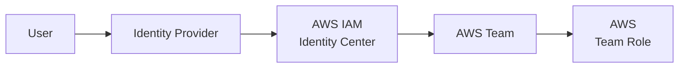
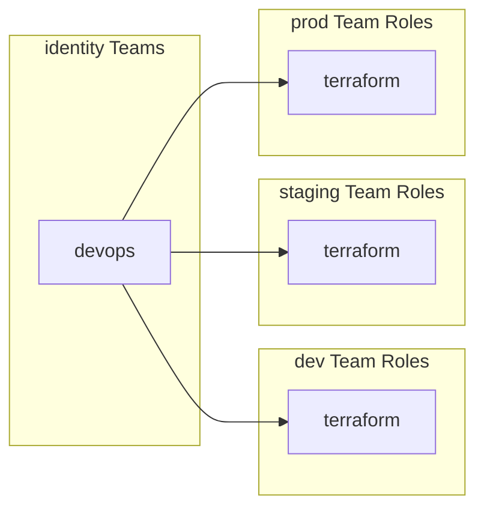

import ReactPlayer from "react-player";
import Steps from '@site/src/components/Steps';
import Step from '@site/src/components/Step';
import StepNumber from '@site/src/components/StepNumber';
import ActionCard from '@site/src/components/ActionCard';
import PrimaryCTA from '@site/src/components/PrimaryCTA';
import SecondaryCTA from '@site/src/components/SecondaryCTA';

There are several methods available to sign in to AWS through a browser or terminal, such as AWS SAML or IAM Identity
Center (successor to AWS Single Sign-On). Various tooling has been tried to support AWS SAML, like "saml2aws," and
others to support AWS SSO, such as "aws sso login" and "aws configure," to manage terminal access. However, these tools
often had issues, such as not handling all methods of login with different IdPs and using screenscraping, which caused
anti-bot measures to block them, for example, Google Workspaces.

Cloud Posse's approach involves using IAM roles that provide highly precise control to different user groups. These
groups are assigned to users through AWS SAML Apps or AWS SSO Groups ("Groups") and enable the user to assume roles into
any allowed accounts. A significant advantage of this approach is the availability of an easy-to-use tool that works
with all AWS sign-in methods. In the following pages, the Cloud Posse strategy will be explained in detail,
demonstrating how it can be used to establish fine-grained access control for an entire organization.

<figure>
  <ReactPlayer controls url="https://docs.cloudposse.com/assets/refarch/handoffs/identity-and-authentication.mp4" />
  <figcaption>AI generated voice</figcaption>
</figure>

## Our Requirements

Let’s start by identifying the minimum requirements for an identity and authentication system.

<Steps>
  <Step>
    ### <StepNumber/> Accessing AWS as a human or as a machine user.

    First we need to implement a system that is easy for both humans and machines to access securely, following the principle of least privilege
  </Step>
  <Step>
    ### <StepNumber/> Centralized management of user permissions

    Plus, all users and permissions must be centrally managed and integrated into an identity platform. We don’t want to copy and paste permissions across accounts or rely on any manual processes
  </Step>
  <Step>
    ### <StepNumber/> Highly precise control of user groups

    Next, we need fine grained access control for user groups. Then assign users to one or more groups depending on what they need access to. It needs to be easy to understand for both users and administrators.
  </Step>
  <Step>
    ### <StepNumber/> Apply Terraform for many accounts across an Organization

    With Terraform, we need to manage resources concurrently across multiple accounts. We don’t want to put this burden on the operator to constantly switch roles, so Terraform needs to do this for us.
  </Step>
  <Step>
    ### <StepNumber/> Switch roles into other accounts easily both in the UI and locally

    Finally for engineers, we want to quickly jump between accounts, access the “AWS” web console, or run “AWS” “CLI” commands without having to think how to do it every time.
  </Step>
</Steps>

## Problem We've Encountered

Now you may be asking some questions. There are plenty of existing solutions out there for authentication and identity. How did Cloud Posse arrive at their solution? What’s wrong with the alternatives?

<Steps>
  <Step>
    ### <StepNumber/> AWS Control Tower lacked APIs

    First off, you might notice we don’t use AWS Control Tower. That’s because until recently, Control Tower didn’t have an API available. So we couldn’t programmatically manage it with Terraform. Of course Cloud Posse does everything with infrastructure as code, so that was a hard stop for us.

    We’re planning to add support for Control Tower now that it’s available, once it matures.
  </Step>
  <Step>
    ### <StepNumber/> AWS IAM Identity Center is only for humans

    The ideal way to access AWS for humans is with Identity Center, formally called “AWS SSO”, and this is included in our reference architecture. But that doesn’t solve how we provide access to machines. For example, integrating with GitHub Actions or Spacelift.

    With Identity Center, a user assumes a single role for one account. That’s not going to work for us with Terraform if we’re trying to apply Terraform concurrently across accounts. For example, transit gateway architecture requires provisioning resources and connecting them across accounts. Identity Center is also limited because it only works with a single IdP. For larger enterprises, multiple IdPs might be used.

    In addition, for the duration of an engagement, Cloud Posse configures our own IdP to access your infrastructure so that it’s easy for you to revoke our access when we’re done.
  </Step>
  <Step>
    ### <StepNumber/> AWS IAM Roles with SAML is cumbersome

    We needed to find a solution for machine access and to apply Terraform across accounts. To do that, we can use IAM roles with a SAML provider and assume them in Terraform or third party integrations such as GitHub Actions.

    The challenge then becomes making it easy for users. AWS SAML provides low level controls and is a little more cumbersome to use, especially when you compare how easy it is for users to use the IAM Identity Center.

    How can we have a consistent solution that works for both?
  </Step>
</Steps>
 

AWS doesn’t make it easy to log in. Control Tower lacked APIs, until recently. Identity Center doesn’t work with automation. And IAM roles with SAML is cumbersome to use.

It’s gotten a lot better with Identity Center, which is one of the reasons we recommend it, but it still doesn’t solve the problem of how to distribute configurations to developers to easily log in on their workstations or how to use IAM roles with SAML.

## Our Solution

### Integrated with Single Sign On

We use Identity Center to easily manage users and groups. These are connected with your Identity provider, such as Okta or GSuite.

Users can sign into Identity Center to access any account they have access to with fine grained access controls. Administrators have a single place to manage users and can use Terraform to define those fine grained access controls. Then we’ve bridged the gap between Identity Center and IAM roles

### Team Oriented

To simplify managing IAM access roles, we’ve created two concepts. AWS Teams and AWS Team Roles.

All access in AWS is “Team” oriented. A “Team” is a group of users that we deploy into a central “identity” account. Then we deploy a number of “Team Roles” into every single account. A “Team” can assume any “Team Role” across the organization.

We’ll explain in detail in the following pages.

### Highly Accessible

Then to make it incredibly easy for users to log in, we recommend using Leapp to manage local AWS sessions. Leap supports all Identity Providers and can automatically refresh credentials when they expire.

Plus, it’s open source and free to use. It also offers paid options that make it easier for administrators to share configurations. Please note, the Cloud Posse solution does not require any subscription.

### Pre-Configured for your Team

Finally, to get everyone up and running on your Team, we pre-configured a single, common AWS config for all users.

We preinstall the AWS config in the Geodesic toolbox, and users will automatically assume the correct access roles in AWS. Users can quickly apply Terraform across accounts and assume roles directly in the accounts they have access.

## Next Steps

<ActionCard title="How is this implemented?">
  Next, we'll explain how we've implemented this solution in details.

  If you're curious about the thought that went into this process, please review the design decisions documentation.
  

    <PrimaryCTA to="/layers/identity/centralized-terraform-access/">Next Step</PrimaryCTA>
    <SecondaryCTA to="/layers/identity/design-decisions">Review Design Decisions</SecondaryCTA >
  

</ActionCard>
