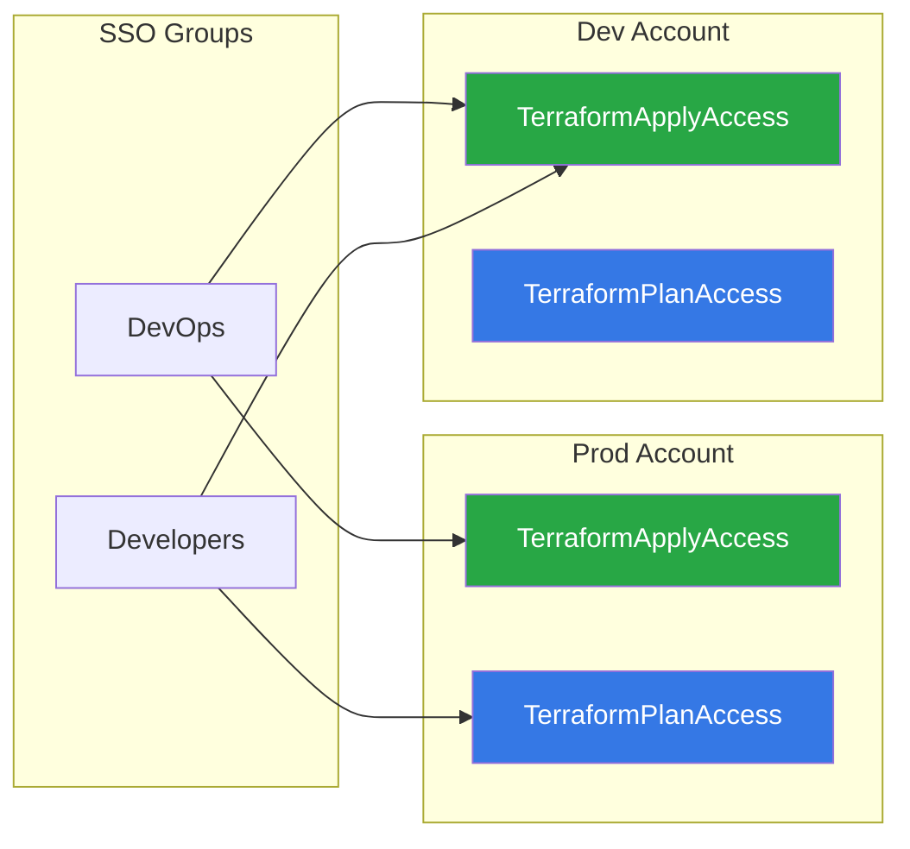

import ReactPlayer from "react-player";
import Steps from '@site/src/components/Steps';
import Step from '@site/src/components/Step';
import StepNumber from '@site/src/components/StepNumber';
import ActionCard from '@site/src/components/ActionCard';
import PrimaryCTA from '@site/src/components/PrimaryCTA';
import SecondaryCTA from '@site/src/components/SecondaryCTA';

{/* TODO:DEPRECATE-ACCOUNT-MAP - UPDATE PAGE - Status: Done */}

Cloud Posse's identity architecture provides fine-grained access control for AWS organizations using **AWS IAM Identity Center** (formerly AWS SSO) with **Permission Sets** for human users and **IAM roles** for machine users (CI/CD).

<Steps>
  1. **Centralized Identity** — Users managed via your IdP (Okta, Google Workspace, Azure AD) and synced to IAM Identity Center
  1. **Permission Sets** — Define what users can do in each account, assigned to SSO Groups
  1. **Atmos Profiles** — Role-based access patterns for different user types (devops, developers, CI/CD)
  1. **Atmos Auth** — Seamless CLI authentication with automatic credential refresh
  1. **Static Configuration** — Account mappings as static YAML, no dynamic lookups or circular dependencies
</Steps>

<figure>
  <ReactPlayer controls url="https://docs.cloudposse.com/assets/refarch/handoffs/identity-and-authentication.mp4" />
  <figcaption>AI generated voice</figcaption>
</figure>

## Our Requirements

Let’s start by identifying the minimum requirements for an identity and authentication system.

<Steps>
  <Step>
    ### <StepNumber/> Accessing AWS as a human or as a machine user.

    First we need to implement a system that is easy for both humans and machines to access securely, following the principle of least privilege
  </Step>
  <Step>
    ### <StepNumber/> Centralized management of user permissions

    Plus, all users and permissions must be centrally managed and integrated into an identity platform. We don’t want to copy and paste permissions across accounts or rely on any manual processes
  </Step>
  <Step>
    ### <StepNumber/> Tight control over user groups

    Next, we need fine grained access control for user groups. Then assign users to one or more groups depending on what they need access to. It needs to be easy to understand for both users and administrators.
  </Step>
  <Step>
    ### <StepNumber/> Apply Terraform for many accounts across an Organization

    With Terraform, we need to manage resources concurrently across multiple accounts. We don’t want to put this burden on the operator to constantly switch roles, so Terraform needs to do this for us.
  </Step>
  <Step>
    ### <StepNumber/> Switch roles into other accounts easily both in the UI and locally

    Finally for engineers, we want to quickly jump between accounts, access the “AWS” web console, or run “AWS” “CLI” commands without having to think how to do it every time.
  </Step>
</Steps>

## Problem We've Encountered

Now you may be asking some questions. There are plenty of existing solutions out there for authentication and identity. How did Cloud Posse arrive at their solution? What’s wrong with the alternatives?

<Steps>
  <Step>
    ### <StepNumber/> AWS Control Tower lacked APIs

    First off, you might notice we don’t use AWS Control Tower. That’s because until recently, Control Tower didn’t have an API available. So we couldn’t programmatically manage it with Terraform. Of course Cloud Posse does everything with infrastructure as code, so that was a hard stop for us.

    We’re planning to add support for Control Tower now that it’s available, once it matures.
  </Step>
  <Step>
    ### <StepNumber/> AWS IAM Identity Center is only for humans

    The ideal way to access AWS for humans is with Identity Center, formally called “AWS SSO”, and this is included in our reference architecture. But that doesn’t solve how we provide access to machines. For example, integrating with GitHub Actions or Spacelift.

    With Identity Center, a user assumes a single role for one account. That’s not going to work for us with Terraform if we’re trying to apply Terraform concurrently across accounts. For example, transit gateway architecture requires provisioning resources and connecting them across accounts. Identity Center is also limited because it only works with a single IdP. For larger enterprises, multiple IdPs might be used.

    In addition, for the duration of an engagement, Cloud Posse configures our own IdP to access your infrastructure so that it’s easy for you to revoke our access when we’re done.
  </Step>
  <Step>
    ### <StepNumber/> AWS IAM Roles with SAML is cumbersome

    We needed to find a solution for machine access and to apply Terraform across accounts. To do that, we can use IAM roles with a SAML provider and assume them in Terraform or third party integrations such as GitHub Actions.

    The challenge then becomes making it easy for users. AWS SAML provides low level controls and is a little more cumbersome to use, especially when you compare how easy it is for users to use the IAM Identity Center.

    How can we have a consistent solution that works for both?
  </Step>
</Steps>
<br/>

Ultimately, AWS does not provide a single solution that meets all our requirements. We need to combine the best of both worlds. Identity Center is great for human access, but it doesn’t work well for machines. On the other hand, AWS SAML is great for machines but is cumbersome for users to navigate the AWS web console without a third party tool.

## Our Solution

### Integrated with Single Sign On


We use IAM Identity Center to manage users and groups, connected to your Identity Provider (Okta, Google Workspace, Azure AD, etc.).

Users sign into Identity Center to access any account they're authorized for. Administrators manage access through **Permission Sets** that define what actions users can perform. All access control is defined in Terraform, providing a complete audit trail and infrastructure-as-code management.

### Permission Set Based Access



Access is managed through **Permission Sets** assigned to SSO Groups:

| Permission Set | Purpose |
|----------------|---------|
| `TerraformPlanAccess` | Read-only access for running `terraform plan` |
| `TerraformApplyAccess` | Full access for running `terraform apply` |
| `TerraformStateAccess` | Read access to Terraform state for Atmos functions |

Users are assigned to SSO Groups in your Identity Provider, and those groups are mapped to Permission Sets. This provides a clean separation between identity management (in your IdP) and access control (in AWS).

### CLI Authentication with Atmos Auth

For command-line access, we use **Atmos Auth** which provides seamless authentication:

```bash
# Login to AWS
atmos auth login

# Use a specific profile for operations
ATMOS_PROFILE=devops atmos terraform plan vpc -s plat-ue1-dev
```

Atmos Auth integrates with IAM Identity Center and handles credential refresh automatically. See [Atmos Auth](/layers/identity/atmos-auth) for setup details.

## Next Steps

<ActionCard title="Set up authentication">
  Learn how to configure Atmos Auth for CLI access and set up your team's profiles.
  <div>
    <PrimaryCTA to="/layers/identity/atmos-auth/">Configure Atmos Auth</PrimaryCTA>
    <SecondaryCTA to="/layers/identity/how-to-log-into-aws/">How to Log into AWS</SecondaryCTA>
  </div>
</ActionCard>
