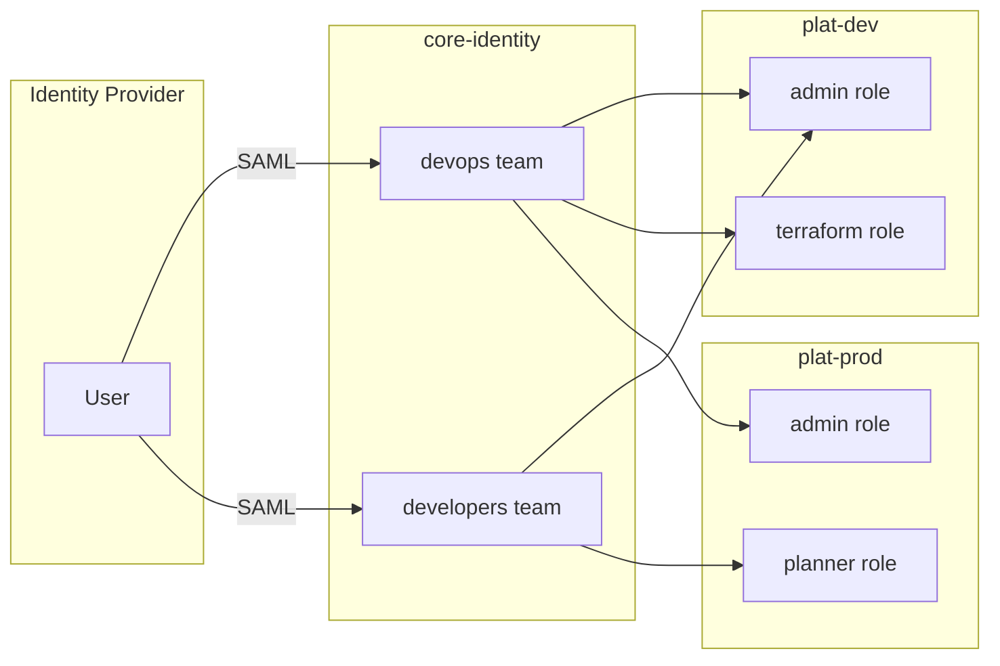
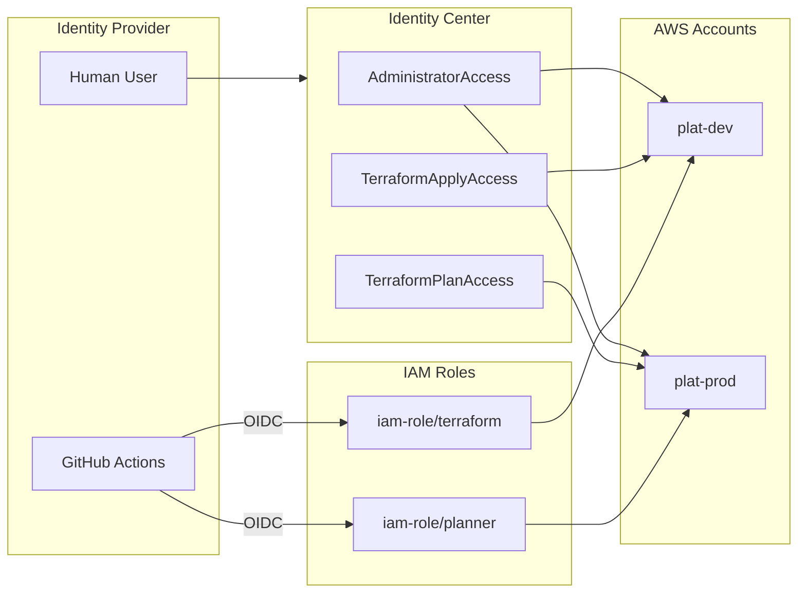

import Intro from '@site/src/components/Intro';
import Steps from '@site/src/components/Steps';

<Intro>
Cloud Posse's approach to AWS access control has evolved significantly over time. This document traces that evolution from our earliest architecture through to the current recommended approach using Permission Sets and IAM roles.
</Intro>

## Overview

Unsurprisingly, Cloud Posse has evolved its approach to access control over time. This document traces that evolution in terms of "phases" that were introduced over time. The intent is to help you understand which version of the access control system you are currently using, how it integrates with current and future versions of the Reference Architecture, what features are available but not yet imported into your system, and what the benefits of upgrading would be.

This document is not intended as an upgrade guide. Upgrade guides are found in release notes and component documentation. This document is intended to help you understand what you have and what you can have, and to help you decide when and if you want to upgrade.

Understanding the evolution helps you:

- **Identify your current architecture** — Know which version you're using
- **Understand migration paths** — See how to upgrade to the current approach
- **Maintain legacy systems** — Support existing deployments that haven't migrated

### Features are Both Code and Configuration

The phases described here are implemented in both code and configuration. Some upgrades require changes to all related components, some only to some of them. Sometimes, only a single component needs to be upgraded. Sometimes, if the components are already feature-capable, then only configuration changes are needed.

### The Four Phases

The evolution progressed through four major phases:

<Steps>
  1. **IAM Primary and Delegated Roles** — The original architecture with separate role components
  1. **AWS Teams and Team Roles** — Hub-and-spoke pattern with centralized identity account
  1. **Dynamic Terraform Roles** — Refined team roles with plan-only access and normalization
  1. **Permission Sets and IAM Roles** — Current approach using Identity Center directly
</Steps>

## Phase 1: IAM Primary and Delegated Roles

**Components:** `iam-primary-roles`, `iam-delegated-roles`

The original Cloud Posse architecture predates Atmos and was designed to work with standard Terraform configurations.

### How It Worked

- `iam-primary-roles` deployed to the `identity` account created both the primary roles and templates for delegated roles
- `iam-delegated-roles` deployed to other accounts created roles based on those templates
- Users logged in via SAML to a primary role, then assumed delegated roles in other accounts

### Limitations

- **Confusing configuration** — The dual-purpose nature of `iam-primary-roles` made configuration error-prone
- **Inflexible role management** — Adding new roles to a subset of accounts was difficult
- **No SSO integration** — Predated AWS Identity Center
- **SuperAdmin dependency** — Many operations required the SuperAdmin role because the Terraform state backend role wasn't available until after `iam-delegated-roles` was deployed

## Phase 2: AWS Teams and Team Roles

**Components:** `aws-teams`, `aws-team-roles`, `aws-saml`, `account-map`

Introduced in [Components v1.27.0](https://github.com/cloudposse/terraform-aws-components/releases/tag/1.27.0), this architecture separated the concepts of "teams" (user groups) from "team roles" (permissions in accounts).

### How It Worked

- `aws-teams` deployed to the `identity` account created team IAM roles (like groups)
- `aws-team-roles` deployed to each account created consistent roles (`admin`, `terraform`, `planner`, etc.)
- The `account-map` component provided dynamic lookups between teams and roles
- Users logged in to a team, then automatically assumed appropriate roles via role chaining

### Architecture

### Benefits Over Phase 1

- **Clear separation** — Teams are distinct from team roles
- **Centralized management** — All team definitions in one place
- **SSO integration** — Permission Sets could mirror teams
- **Atmos support** — DRY configuration via Atmos stacks

### Limitations

- **Dynamic dependencies** — The `account-map` component created circular dependencies
- **Complex role discovery** — Terraform had to query `account-map` to find the right role
- **Identity account overhead** — Required a dedicated `core-identity` account

## Phase 3: Dynamic Terraform Roles

**Components:** `aws-teams`, `aws-team-roles`, `account-map`, `tfstate-backend` (updated)

Introduced in [Components v1.227.0](https://github.com/cloudposse/terraform-aws-components/releases/tag/1.227.0), this phase refined the teams architecture with better Terraform integration.

### Key Improvements

- **Plan-only access** — New `planner` role for `terraform plan` without apply permissions
- **Normalized role names** — Consistent `terraform` role in all accounts (including `root` and `identity`)
- **Backend role in tfstate-backend** — Terraform state access role created earlier, reducing SuperAdmin dependency
- **Individual per-account access** — Users could use their own role permissions instead of team roles

### Features Added

| Feature | Description |
|---------|-------------|
| Plan-only access | `planner` role for drift detection without modification capability |
| Per-account users | SSO users can Terraform directly in accounts they have access to |
| Normalized roles | `terraform` role works consistently in all accounts |
| AWS config generation | Automated generation of AWS CLI and browser plugin configs |

### Limitations

- **Still requires account-map** — Dynamic lookups remained
- **Complex upgrade path** — Migration required careful coordination
- **Circular dependencies** — Components still had implicit dependencies on each other

## Phase 4: Permission Sets and IAM Roles (Current)

**Components:** `aws-sso`, `iam-role`

The current recommended architecture eliminates the complexity of teams and dynamic lookups in favor of direct Permission Set assignments and static configuration.

### How It Works

- **Human users** authenticate via Identity Center and assume Permission Sets directly
- **Machine users** (CI/CD) authenticate via OIDC and assume IAM roles
- **No account-map** — Account mappings are static YAML in stack configurations
- **No identity account** — Identity managed in `core-root` alongside other core services

### Architecture

### Permission Sets

| Permission Set | Purpose |
|----------------|---------|
| `AdministratorAccess` | Full access for administrative tasks |
| `PowerUserAccess` | Full access except IAM management |
| `ReadOnlyAccess` | View resources without modification |
| `TerraformApplyAccess` | Run `terraform apply` |
| `TerraformPlanAccess` | Run `terraform plan` only |
| `TerraformStateAccess` | Access Terraform state backend |

### Benefits

- **No circular dependencies** — Static configuration eliminates dynamic lookups
- **Simpler architecture** — Fewer components to manage
- **Direct SSO access** — No intermediate team role assumption required
- **Clear separation** — Human users use Permission Sets, machines use IAM roles
- **Atmos Auth integration** — Seamless CLI authentication via `atmos auth`

### Migration

For migration from the teams-based architecture, see [Migrate from Account-Map](/layers/project/tutorials/migrate-from-account-map/).

## Identifying Your Architecture

| If you have... | You're using... |
|----------------|-----------------|
| `iam-primary-roles` and `iam-delegated-roles` | Phase 1 |
| `aws-teams`, `aws-team-roles`, `account-map` | Phase 2 or 3 |
| `aws-sso`, `iam-role`, no `account-map` | Phase 4 (current) |

### Component Forensics

**Phase 1:** Look for `iam-primary-roles` or `iam-delegated-roles` directories in your components.

**Phase 2/3:** Check if `account-map/modules/roles-to-principals/variables.tf` exists. If it contains `overridable_team_permission_sets_enabled`, you have at least Phase 3.

**Phase 4:** You have `aws-sso` component but no `account-map` component, and your stacks use static `account_map` variables.

## Recommendations

**New deployments** should use Phase 4 (Permission Sets and IAM Roles).

**Existing deployments** on Phase 2 or 3 should plan migration to Phase 4 to benefit from:
- Simplified architecture
- No circular dependencies
- Better Atmos Auth integration
- Reduced maintenance overhead

**Phase 1 deployments** should upgrade directly to Phase 4 rather than going through intermediate phases.
