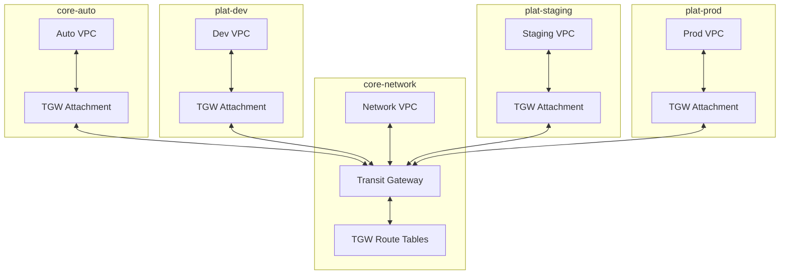

import Intro from '@site/src/components/Intro';
import KeyPoints from '@site/src/components/KeyPoints';
import Note from '@site/src/components/Note';
import Steps from '@site/src/components/Steps';
import AtmosWorkflow from '@site/src/components/AtmosWorkflow';
import ActionCard from '@site/src/components/ActionCard';
import PrimaryCTA from '@site/src/components/PrimaryCTA';

<Intro>
AWS Transit Gateway (TGW) provides a central hub for connecting VPCs across multiple AWS accounts. This guide explains the Transit Gateway components, their architecture, and how to deploy them to establish network connectivity.
</Intro>

## Components Overview

The Transit Gateway solution consists of several components that work together:

<dl>
  <dt>
    <a href="/components/library/aws/tgw/hub/">
      <code>tgw/hub</code>
    </a>
  </dt>
  <dd>Creates the Transit Gateway in the network account (<code>core-network</code>). This is the central routing hub that all other VPCs connect to.</dd>
  <dt>
    <a href="/components/library/aws/tgw/attachment/">
      <code>tgw/attachment</code>
    </a>
  </dt>
  <dd>Creates and manages Transit Gateway VPC attachments in connected accounts. Each account with a VPC needs an attachment to connect to the Transit Gateway.</dd>
  <dt>
    <a href="/components/library/aws/tgw/routes/">
      <code>tgw/routes</code>
    </a>
  </dt>
  <dd>Manages Transit Gateway route tables in the network account. Controls how traffic flows between attachments.</dd>
  <dt>
    <a href="/components/library/aws/vpc-routes/">
      <code>vpc-routes</code>
    </a>
  </dt>
  <dd>Configures VPC route tables in connected accounts to route traffic through the Transit Gateway. In stacks, this is typically configured as <code>vpc/routes/private</code>.</dd>
</dl>

## Architecture

The Transit Gateway components work together to create a hub-and-spoke network topology:

<Steps>
1. The Transit Gateway is created in the `core-network` account (`tgw/hub`)
1. VPCs in other accounts attach to the Transit Gateway (`tgw/attachment`)
1. Transit Gateway route tables control routing between attachments (`tgw/routes`)
1. VPC route tables in connected accounts direct traffic through the Transit Gateway (`vpc/routes/private`)
</Steps>

### Connected Accounts

In the reference architecture, the following accounts connect to the Transit Gateway:

<Steps>
1. **`core-network`** — The hub account where the Transit Gateway is deployed
1. **`core-auto`** — Automation account for self-hosted GitHub runners
1. **`plat-dev`** — Development environment
1. **`plat-staging`** — Staging environment
1. **`plat-prod`** — Production environment
1. **`plat-sandbox`** — Optional sandbox environment
</Steps>

## Deployment

Deploy the Transit Gateway infrastructure using the network workflow:

<AtmosWorkflow workflow="deploy/tgw" fileName="quickstart/foundation/network" />

This workflow deploys the components in the correct order:

<Steps>
1. Creates the Transit Gateway hub in `core-network`
1. Creates VPC attachments in each connected account
1. Configures Transit Gateway route tables
1. Updates VPC route tables in connected accounts
</Steps>

## References

<Steps>
1. [AWS Transit Gateway Documentation](https://docs.aws.amazon.com/vpc/latest/tgw/what-is-transit-gateway.html)
1. [Transit Gateway Peering](https://docs.aws.amazon.com/vpc/latest/tgw/tgw-peering.html)
1. [tgw/hub Component](/components/library/aws/tgw/hub/)
1. [tgw/attachment Component](/components/library/aws/tgw/attachment/)
</Steps>
