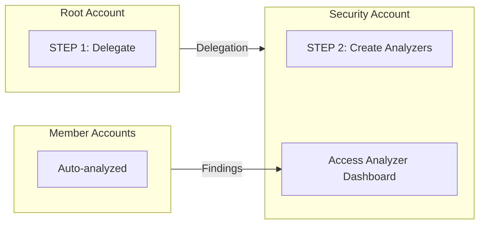

import Intro from '@site/src/components/Intro';
import KeyPoints from '@site/src/components/KeyPoints';
import Note from '@site/src/components/Note';

<Intro>
AWS IAM Access Analyzer identifies resources shared with external entities and detects unused IAM permissions,
enabling you to implement least-privilege access and identify unintended access to your resources.
</Intro>

## Overview

Access Analyzer provides:

- **External Access Analysis**: Identifies resources shared with external principals outside your organization
- **Unused Access Analysis**: Detects unused IAM roles, users, and permissions
- **Policy Validation**: Validates IAM policies against best practices
- **Policy Generation**: Generates least-privilege policies based on CloudTrail activity
- **Multi-account Coverage**: Organization-wide analysis from a central account

## Analyzer Types

This component creates two types of organization-wide analyzers:

| Analyzer Type | Purpose | Findings |
|---------------|---------|----------|
| `ORGANIZATION` | External access analysis | Public access, cross-account access, cross-organization access |
| `ORGANIZATION_UNUSED_ACCESS` | Unused access analysis | Unused roles, users, permissions (configurable threshold) |

## Supported Resources

External access analyzer monitors:

- Amazon S3 buckets and access points
- IAM roles and policies
- AWS KMS keys
- AWS Lambda functions and layers
- Amazon SQS queues
- AWS Secrets Manager secrets
- Amazon SNS topics
- Amazon EBS volume snapshots
- Amazon RDS DB snapshots
- Amazon ECR repositories
- Amazon EFS file systems

## Architecture



## Deployment

Access Analyzer uses a **2-step delegated administrator** deployment model.

### Step 1: Deploy to Organization Management Account

<Note title="SuperAdmin Required">
This step requires SuperAdmin permissions to deploy to the root account.
</Note>

```yaml
# core-gbl-root
components:
  terraform:
    aws-access-analyzer/root:
      metadata:
        component: aws-access-analyzer
      backend:
        s3:
          role_arn: null
      vars:
        enabled: true
        delegated_administrator_account_name: core-security
        organizations_delegated_administrator_enabled: true
        service_linked_role_enabled: true
        # Analyzers created in security account
        accessanalyzer_organization_enabled: false
        accessanalyzer_organization_unused_access_enabled: false
```

```bash
atmos terraform apply aws-access-analyzer/root -s core-gbl-root
```

### Step 2: Deploy Organization Analyzers

```yaml
# core-ue1-security
components:
  terraform:
    aws-access-analyzer/delegated-administrator/ue1:
      metadata:
        component: aws-access-analyzer
      vars:
        enabled: true
        delegated_administrator_account_name: core-security
        environment: ue1
        region: us-east-1
        # Create organization analyzers
        accessanalyzer_organization_enabled: true
        accessanalyzer_organization_unused_access_enabled: true
        unused_access_age: 30
        # Already delegated
        organizations_delegated_administrator_enabled: false
```

```bash
atmos terraform apply aws-access-analyzer/delegated-administrator/ue1 -s core-ue1-security
```

## Multi-Region Deployment

Access Analyzer is a regional service. Deploy analyzers to each region:

```bash
# Delegation (once, globally)
atmos terraform apply aws-access-analyzer/root -s core-gbl-root

# Analyzers per region
atmos terraform apply aws-access-analyzer/delegated-administrator/ue1 -s core-ue1-security
atmos terraform apply aws-access-analyzer/delegated-administrator/uw2 -s core-uw2-security
```

## Unused Access Configuration

Configure the threshold for unused access findings:

```yaml
components:
  terraform:
    aws-access-analyzer/delegated-administrator/ue1:
      vars:
        accessanalyzer_organization_unused_access_enabled: true
        # Days without use before generating findings (default: 30)
        unused_access_age: 30
```

## Key Variables

| Variable | Description | Default |
|----------|-------------|---------|
| `organizations_delegated_administrator_enabled` | Enable delegation to security account | `false` |
| `service_linked_role_enabled` | Create the service-linked role | `true` |
| `accessanalyzer_organization_enabled` | Enable external access analyzer | `false` |
| `accessanalyzer_organization_unused_access_enabled` | Enable unused access analyzer | `false` |
| `unused_access_age` | Days without use before generating findings | `30` |

## Cost Considerations

- **External Access Analyzer**: No additional charge (included with AWS account)
- **Unused Access Analyzer**: Charged per IAM role or user analyzed per month

## Security Hub Integration

Access Analyzer findings are automatically sent to Security Hub when both services are enabled.

## See Also

- [AWS Security Hub](/layers/security-and-compliance/aws-security-hub/) - Aggregates Access Analyzer findings
- [AWS Config](/layers/security-and-compliance/aws-config/) - Monitors IAM policy configurations
- [Setup Guide](/layers/security-and-compliance/setup/) - Complete deployment instructions

## References

- [AWS IAM Access Analyzer Documentation](https://docs.aws.amazon.com/IAM/latest/UserGuide/what-is-access-analyzer.html)
- [aws-access-analyzer Component](https://github.com/cloudposse-terraform-components/aws-access-analyzer)
- [Access Analyzer Findings](https://docs.aws.amazon.com/IAM/latest/UserGuide/access-analyzer-findings.html)
- [Unused Access Analysis](https://docs.aws.amazon.com/IAM/latest/UserGuide/access-analyzer-unused-access.html)
