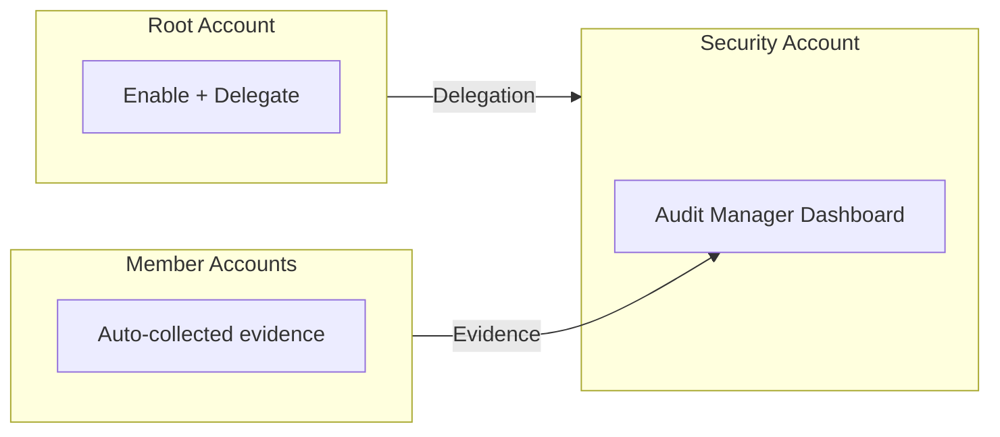

import Intro from '@site/src/components/Intro';
import KeyPoints from '@site/src/components/KeyPoints';
import Note from '@site/src/components/Note';

<Intro>
AWS Audit Manager helps you continuously audit your AWS usage to simplify compliance assessment with regulations
and industry standards. It automates evidence collection and generates audit-ready reports.
</Intro>

## Overview

Audit Manager provides:

- **Prebuilt Frameworks**: CIS, FedRAMP, GDPR, HIPAA, PCI DSS, SOC 2, NIST 800-53
- **Automated Evidence**: Collects evidence from CloudTrail, Config, Security Hub, and other services
- **Custom Controls**: Build custom frameworks and controls for specific requirements
- **Assessment Reports**: Cryptographically verified reports with organized evidence
- **Multi-account Support**: Assessments across multiple AWS accounts via Organizations

## Supported Compliance Frameworks

| Framework | Description |
|-----------|-------------|
| **PCI DSS** | Payment Card Industry Data Security Standard |
| **HIPAA** | Health Insurance Portability and Accountability Act |
| **SOC 2** | Service Organization Control 2 |
| **NIST 800-53** | National Institute of Standards and Technology (Rev 4 and Rev 5) |
| **FedRAMP** | Federal Risk and Authorization Management Program |
| **GDPR** | General Data Protection Regulation |
| **ISO 27001** | Information Security Management |
| **CIS** | Center for Internet Security benchmarks |
| **AWS Control Tower** | AWS Control Tower guardrails |

## Architecture

Audit Manager uses a **unique single-step deployment model**:



## Deployment Model Comparison

| Aspect | AWS Audit Manager | Other Security Services |
|--------|-------------------|------------------------|
| **Deployment Steps** | 1 step (root only) | 2-3 steps |
| **Member Account Setup** | Automatic | Auto-enabled by admin |
| **Provisioning Location** | Root account only | Root + Security account |

## Deployment

Audit Manager uses a **single-step** deployment from the root account.

<Note title="SuperAdmin Required">
This deployment requires SuperAdmin permissions for the root account.
</Note>

### Stack Configuration

```yaml
# core-ue1-root
components:
  terraform:
    audit-manager/root/ue1:
      metadata:
        component: audit-manager
      backend:
        s3:
          role_arn: null
      vars:
        enabled: true
        delegated_administrator_account_name: core-security
        environment: ue1
        region: us-east-1
        privileged: true
        deregister_on_destroy: true
```

### Provisioning

```bash
atmos terraform apply audit-manager/root/ue1 -s core-ue1-root
```

This single deployment:
- Enables Audit Manager in the organization
- Delegates administration to the security account
- Begins automatic evidence collection from member accounts

## Multi-Region Deployment

Deploy to each region where you want to run compliance assessments:

```bash
# us-east-1
atmos terraform apply audit-manager/root/ue1 -s core-ue1-root

# us-west-2
atmos terraform apply audit-manager/root/uw2 -s core-uw2-root
```

## Assessment Report S3 Buckets

Create S3 buckets in the delegated administrator account for assessment reports:

```yaml
# core-ue1-security
components:
  terraform:
    audit-manager-reports-bucket:
      metadata:
        component: s3-bucket
      vars:
        enabled: true
        name: audit-manager-reports
        s3_object_ownership: "BucketOwnerEnforced"
        versioning_enabled: false
```

```bash
atmos terraform apply audit-manager-reports-bucket -s core-ue1-security
```

## Creating Assessments

After deployment, create assessments in the delegated administrator account:

1. **Via Console**: AWS Audit Manager → Assessments → Create assessment
2. **Via CLI**: Use `aws auditmanager` CLI commands
3. **Via Terraform**: Use `aws_auditmanager_assessment` resource

### Assessment Components

| Component | Description |
|-----------|-------------|
| **Framework** | Choose prebuilt or custom framework |
| **Scope** | Select AWS accounts and services to assess |
| **Roles** | Define who can access the assessment |
| **Report Destination** | Specify S3 bucket for reports |

## Key Variables

| Variable | Description | Default |
|----------|-------------|---------|
| `delegated_administrator_account_name` | Account to delegate administration | `core-security` |
| `deregister_on_destroy` | Deregister on terraform destroy | `true` |
| `privileged` | Required for root account deployment | `true` |

## Evidence Sources

Audit Manager collects evidence from:

- **AWS CloudTrail**: API activity logs
- **AWS Config**: Configuration compliance data
- **AWS Security Hub**: Security findings
- **AWS License Manager**: License compliance
- **Manual Evidence**: Policy documents, training records

## Cost Considerations

- **Assessment Price**: Based on number of evidence items collected per month
- **Evidence Storage**: S3 storage costs for assessment reports
- **Free Tier**: Limited free usage during first 13 months
- **Regional**: Costs are per region

## References

- [AWS Audit Manager Documentation](https://docs.aws.amazon.com/audit-manager/)
- [aws-audit-manager Component](https://github.com/cloudposse-terraform-components/aws-audit-manager)
- [Audit Manager Frameworks](https://docs.aws.amazon.com/audit-manager/latest/userguide/frameworks.html)
- [Evidence Collection](https://docs.aws.amazon.com/audit-manager/latest/userguide/evidence.html)
