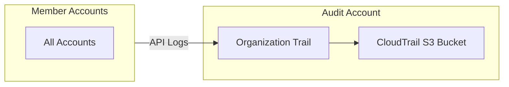

import Intro from '@site/src/components/Intro';
import KeyPoints from '@site/src/components/KeyPoints';
import Note from '@site/src/components/Note';

<Intro>
AWS CloudTrail records API activity across your AWS Organization, providing an audit trail for security analysis,
compliance auditing, and operational troubleshooting.
</Intro>

## Overview

AWS CloudTrail provides:

- **API Activity Logging**: Records all API calls made in your AWS accounts
- **Organization Trail**: Single trail that logs activity from all accounts automatically
- **Log File Validation**: Cryptographic signatures to verify log integrity
- **CloudWatch Integration**: Real-time analysis and alerting on API activity
- **Centralized Storage**: All logs stored in the audit account S3 bucket

## Architecture



## Deployment

CloudTrail uses a simple deployment model - deploy the organization trail once, and it covers all accounts.

### Prerequisites

1. **CloudTrail Bucket**: Deploy `cloudtrail-bucket` component in the audit account
2. **Service Access Principal**: Enable `cloudtrail.amazonaws.com` in AWS Organizations

### Stack Configuration

```yaml
# stacks/catalog/cloudtrail.yaml
components:
  terraform:
    cloudtrail:
      vars:
        enabled: true
        cloudtrail_bucket_environment_name: ue1
        cloudtrail_bucket_stage_name: audit
        cloudwatch_logs_retention_in_days: 730
        is_organization_trail: true
        is_multi_region_trail: true
        include_global_service_events: true
        enable_log_file_validation: true
        enable_logging: true
```

### Provisioning

Deploy the organization trail from the audit account:

```bash
atmos terraform apply cloudtrail -s core-gbl-audit
```

For per-account trails (not recommended for most use cases):

```yaml
components:
  terraform:
    cloudtrail:
      vars:
        enabled: true
        is_organization_trail: false
        # ... other configuration
```

## Key Variables

| Variable | Description | Default |
|----------|-------------|---------|
| `is_organization_trail` | Create trail for all accounts in organization | `false` |
| `is_multi_region_trail` | Create trail in all regions | `true` |
| `include_global_service_events` | Include global services (IAM, STS) | `true` |
| `enable_log_file_validation` | Enable log integrity validation | `true` |
| `cloudwatch_logs_retention_in_days` | Log retention period (CIS recommends 365) | `365` |
| `cloudtrail_bucket_environment_name` | Environment where bucket is deployed | - |
| `cloudtrail_bucket_stage_name` | Stage where bucket is deployed | - |

## CloudWatch Logs Integration

CloudTrail can send logs to CloudWatch for real-time analysis:

```yaml
components:
  terraform:
    cloudtrail:
      vars:
        enabled: true
        cloudwatch_logs_retention_in_days: 730
        cloudwatch_log_group_class: STANDARD
```

This enables:
- Real-time metric filters for specific API activities
- CloudWatch Alarms for security events
- Integration with SIEM systems

## KMS Encryption

For additional security, enable KMS encryption for CloudTrail logs:

```yaml
components:
  terraform:
    cloudtrail:
      vars:
        enabled: true
        kms_key_enabled: true
        kms_key_alias: "alias/cloudtrail"
```

## CIS Benchmark Compliance

CloudTrail configuration supports CIS AWS Foundations Benchmark requirements:

- **CIS 3.1-3.14**: CloudWatch Log Metric Filters and Alarms
- **CIS 3.x**: Log file validation enabled
- **CIS 3.x**: Multi-region trail enabled
- **CIS 3.x**: CloudTrail enabled in all regions

## See Also

- [AWS GuardDuty](/layers/security-and-compliance/aws-guardduty/) - Analyzes CloudTrail logs for threat detection
- [AWS Security Hub](/layers/security-and-compliance/aws-security-hub/) - Monitors CloudTrail CIS compliance
- [AWS Audit Manager](/layers/security-and-compliance/aws-audit-manager/) - Uses CloudTrail for compliance evidence
- [Setup Guide](/layers/security-and-compliance/setup/) - Complete deployment instructions

## References

- [AWS CloudTrail Documentation](https://docs.aws.amazon.com/cloudtrail/)
- [aws-cloudtrail Component](https://github.com/cloudposse-terraform-components/aws-cloudtrail)
- [CIS AWS Foundations Benchmark](https://docs.aws.amazon.com/securityhub/latest/userguide/securityhub-cis-controls.html)
- [CloudTrail Log File Validation](https://docs.aws.amazon.com/awscloudtrail/latest/userguide/cloudtrail-log-file-validation-intro.html)
