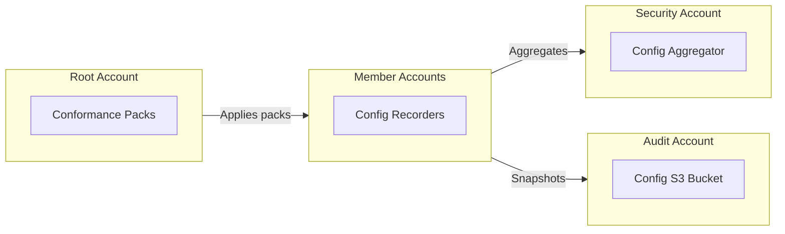

import Intro from '@site/src/components/Intro';
import KeyPoints from '@site/src/components/KeyPoints';
import Note from '@site/src/components/Note';
import TaskList from '@site/src/components/TaskList';

<Intro>
AWS Config provides configuration compliance monitoring and resource inventory across your AWS Organization.
It continuously evaluates resources against compliance rules and maintains configuration history for auditing.
</Intro>

## Overview

AWS Config is responsible for:

- **Configuration Recording**: Deploys Configuration Recorders in each account and region to track resource configurations
- **Centralized Aggregation**: Configures the security account as the central aggregation point for all AWS Config data
- **Compliance Monitoring**: Deploys conformance packs to monitor resources for compliance (CMMC, CIS, HIPAA)
- **Configuration Storage**: Delivers configuration snapshots and history to a centralized S3 bucket in the audit account
- **Organization Conformance Packs**: Deploys organization-wide conformance packs from the management account

## Architecture



## Deployment

AWS Config uses a **per-account** deployment model with organization conformance packs.

### Prerequisites

<TaskList>
  - Deploy `config-bucket` component in the audit account
  - Enable `config.amazonaws.com` and `config-multiaccountsetup.amazonaws.com` service access principals
</TaskList>

### Stack Configuration

#### Defaults Configuration

```yaml
# stacks/catalog/aws-config/defaults.yaml
components:
  terraform:
    aws-config/defaults:
      metadata:
        type: abstract
        component: aws-config
      vars:
        enabled: true
        default_scope: account
        create_iam_role: true
        account_map_tenant: core
        root_account_stage: root
        global_environment: gbl
        global_resource_collector_region: us-east-1
        central_resource_collector_account: security
        config_bucket_component_name: config-bucket
        config_bucket_tenant: core
        config_bucket_env: ue1
        config_bucket_stage: audit
        sns_encryption_key_id: "alias/aws/sns"
        conformance_packs: []
```

#### Member Account Configuration

```yaml
# stacks/catalog/aws-config/member-account.yaml
import:
  - catalog/aws-config/defaults

components:
  terraform:
    aws-config:
      metadata:
        component: aws-config
        inherits:
          - aws-config/defaults
```

#### Organization Configuration (Root Account)

```yaml
# stacks/catalog/aws-config/organization.yaml
import:
  - catalog/aws-config/defaults

components:
  terraform:
    aws-config:
      metadata:
        component: aws-config
        inherits:
          - aws-config/defaults
      vars:
        default_scope: organization
        conformance_packs:
          - name: Operational-Best-Practices-for-CIS-AWS-v1.4-Level2
            conformance_pack: "https://raw.githubusercontent.com/awslabs/aws-config-rules/master/aws-config-conformance-packs/Operational-Best-Practices-for-CIS-AWS-v1.4-Level2.yaml"
            parameter_overrides: {}
```

### Provisioning Order

:::caution Important
Deploy member accounts **BEFORE** the organization account. Organization conformance packs require all member accounts
to have configuration recorders already set up.
:::

**Step 1: Deploy to Member Accounts (Global Collector Region First)**

```bash
# Core tenant accounts
atmos terraform apply aws-config -s core-ue1-audit
atmos terraform apply aws-config -s core-ue1-security
atmos terraform apply aws-config -s core-ue1-network

# Platform tenant accounts
atmos terraform apply aws-config -s plat-ue1-dev
atmos terraform apply aws-config -s plat-ue1-staging
atmos terraform apply aws-config -s plat-ue1-prod
```

**Step 2: Deploy to Organization Account (Last)**

```bash
atmos terraform apply aws-config -s core-ue1-root
```

## Conformance Packs

Conformance packs define AWS Config rules for compliance monitoring. This component supports:

- **Remote URLs**: AWS-managed packs from GitHub
- **Local Files**: Custom packs from your component directory

### Example Configuration

```yaml
conformance_packs:
  # Remote URL (AWS Labs managed packs)
  - name: CIS-AWS-v1.4-Level2
    conformance_pack: "https://raw.githubusercontent.com/awslabs/aws-config-rules/master/aws-config-conformance-packs/Operational-Best-Practices-for-CIS-AWS-v1.4-Level2.yaml"
    parameter_overrides:
      AccessKeysRotatedParamMaxAccessKeyAge: "45"

  # Local file (relative to component directory)
  - name: Custom-CMMC-Pack
    conformance_pack: "conformance-packs/custom-cmmc-pack.yaml"
    parameter_overrides: {}

  # Override scope for specific pack
  - name: Org-Wide-Security-Pack
    conformance_pack: "https://example.com/pack.yaml"
    scope: organization
    parameter_overrides: {}
```

## Key Variables

| Variable | Description | Default |
|----------|-------------|---------|
| `global_resource_collector_region` | Region that tracks global resources (IAM, Route53) | `us-east-1` |
| `central_resource_collector_account` | Account that aggregates all Config data | `security` |
| `default_scope` | Scope for conformance packs (`account` or `organization`) | `account` |
| `create_iam_role` | Create IAM role for Config recorder | `true` |
| `sns_encryption_key_id` | KMS key for SNS topic encryption (CMMC compliance) | `alias/aws/sns` |

## Known Issues

### IAM Inline Policy Check - Service-Linked Roles

The `IAM_NO_INLINE_POLICY_CHECK` rule flags AWS Service-Linked Roles (SLRs) as NON_COMPLIANT. This is a **known false
positive** because AWS Service-Linked Roles must have inline policies by design.

**Common SLRs that trigger this finding:**
- `AWSServiceRoleForAmazonGuardDuty`
- `AWSServiceRoleForConfig`
- `AWSServiceRoleForSecurityHub`
- `AWSServiceRoleForAccessAnalyzer`
- `AWSServiceRoleForAmazonMacie`
- `AWSServiceRoleForInspector2`

**Recommended Action**: Document these as accepted false positives and focus remediation on user-created roles.

## See Also

- [AWS Security Hub](/layers/security-and-compliance/aws-security-hub/) - Aggregates Config compliance findings
- [AWS Audit Manager](/layers/security-and-compliance/aws-audit-manager/) - Uses Config for compliance evidence
- [Setup Guide](/layers/security-and-compliance/setup/) - Complete deployment instructions

## References

- [AWS Config Documentation](https://docs.aws.amazon.com/config/)
- [aws-config Component](https://github.com/cloudposse-terraform-components/aws-config)
- [AWS Conformance Packs](https://github.com/awslabs/aws-config-rules/tree/master/aws-config-conformance-packs)
- [CIS AWS Foundations Benchmark](https://docs.aws.amazon.com/securityhub/latest/userguide/securityhub-cis-controls.html)
