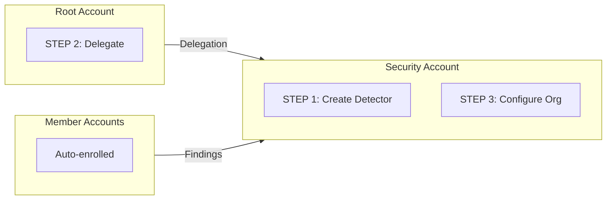

import Intro from '@site/src/components/Intro';
import KeyPoints from '@site/src/components/KeyPoints';
import Note from '@site/src/components/Note';

<Intro>
AWS GuardDuty is a managed threat detection service that continuously monitors for malicious activity and unauthorized
behavior across your AWS accounts using ML-based analysis.
</Intro>

## Overview

GuardDuty provides:

- **Threat Detection**: ML-based analysis of CloudTrail, VPC Flow Logs, and DNS logs
- **Threat Intelligence**: Integration with AWS and partner threat intelligence feeds
- **Real-time Alerts**: Notifications through CloudWatch Events and SNS
- **Multi-account Support**: Centralized management across your organization
- **Protection Features**: S3, EKS, Lambda, Malware, and Runtime monitoring

## Supported Protection Features

| Feature | Description |
|---------|-------------|
| **S3 Protection** | Monitors S3 data events for suspicious activities |
| **EKS Audit Log Monitoring** | Analyzes Kubernetes audit logs from EKS clusters |
| **Malware Protection** | Scans EBS volumes for malware |
| **Lambda Protection** | Monitors Lambda function network activity |
| **Runtime Monitoring** | Runtime threat detection for EC2, ECS, and EKS with automatic agent management |

## Architecture



## Deployment

GuardDuty uses a **3-step delegated administrator** deployment model.

### Prerequisites

Enable GuardDuty trusted access in AWS Organizations:

```bash
aws organizations enable-aws-service-access --service-principal guardduty.amazonaws.com
```

Or add `guardduty.amazonaws.com` to `aws_service_access_principals` in your `account` component.

### Step 1: Deploy to Delegated Administrator Account

```yaml
# core-ue1-security
components:
  terraform:
    guardduty/delegated-administrator/ue1:
      metadata:
        component: guardduty
      vars:
        enabled: true
        delegated_administrator_account_name: core-security
        environment: ue1
        region: us-east-1
```

```bash
atmos terraform apply guardduty/delegated-administrator/ue1 -s core-ue1-security
```

### Step 2: Deploy to Organization Management Account

<Note title="SuperAdmin Required">
This step requires SuperAdmin permissions to deploy to the root account.
</Note>

```yaml
# core-ue1-root
components:
  terraform:
    guardduty/root/ue1:
      metadata:
        component: guardduty
      backend:
        s3:
          role_arn: null
      vars:
        enabled: true
        delegated_administrator_account_name: core-security
        environment: ue1
        region: us-east-1
        privileged: true
```

```bash
atmos terraform apply guardduty/root/ue1 -s core-ue1-root
```

### Step 3: Deploy Organization Settings

```yaml
# core-ue1-security
components:
  terraform:
    guardduty/org-settings/ue1:
      metadata:
        component: guardduty
      vars:
        enabled: true
        delegated_administrator_account_name: core-security
        environment: ue1
        region: us-east-1
        admin_delegated: true
        # Protection features
        s3_protection_enabled: true
        kubernetes_audit_logs_enabled: true
        malware_protection_scan_ec2_ebs_volumes_enabled: true
        lambda_network_logs_enabled: true
        # Runtime Monitoring
        runtime_monitoring_enabled: true
        runtime_monitoring_additional_config:
          eks_addon_management_enabled: true
          ecs_fargate_agent_management_enabled: true
          ec2_agent_management_enabled: true
```

```bash
atmos terraform apply guardduty/org-settings/ue1 -s core-ue1-security
```

## Multi-Region Deployment

Repeat all 3 steps for each region:

```bash
# us-east-1
atmos terraform apply guardduty/delegated-administrator/ue1 -s core-ue1-security
atmos terraform apply guardduty/root/ue1 -s core-ue1-root
atmos terraform apply guardduty/org-settings/ue1 -s core-ue1-security

# us-west-2
atmos terraform apply guardduty/delegated-administrator/uw2 -s core-uw2-security
atmos terraform apply guardduty/root/uw2 -s core-uw2-root
atmos terraform apply guardduty/org-settings/uw2 -s core-uw2-security
```

## SNS Notifications

Enable SNS notifications for GuardDuty findings:

```yaml
components:
  terraform:
    guardduty/delegated-administrator/ue1:
      vars:
        enabled: true
        create_sns_topic: true
        cloudwatch_enabled: true
```

This creates:
- KMS key with permissions for EventBridge, SNS, and SQS
- Encrypted SNS topic for findings
- SQS queue subscribed to the SNS topic
- CloudWatch Event Rules to route findings

## Key Variables

| Variable | Description | Default |
|----------|-------------|---------|
| `admin_delegated` | Set to `true` after delegation is complete | `false` |
| `auto_enable_organization_members` | Auto-enroll members (`ALL`, `NEW`, `NONE`) | `NEW` |
| `s3_protection_enabled` | Enable S3 data event monitoring | `true` |
| `kubernetes_audit_logs_enabled` | Enable EKS audit log monitoring | `false` |
| `malware_protection_scan_ec2_ebs_volumes_enabled` | Enable EBS malware scanning | `false` |
| `lambda_network_logs_enabled` | Enable Lambda network monitoring | `false` |
| `runtime_monitoring_enabled` | Enable runtime monitoring | `false` |

## References

- [AWS GuardDuty Documentation](https://docs.aws.amazon.com/guardduty/)
- [aws-guardduty Component](https://github.com/cloudposse-terraform-components/aws-guardduty)
- [GuardDuty Protection Features](https://docs.aws.amazon.com/guardduty/latest/ug/guardduty-features-activation-model.html)
- [Runtime Monitoring](https://docs.aws.amazon.com/guardduty/latest/ug/runtime-monitoring.html)
