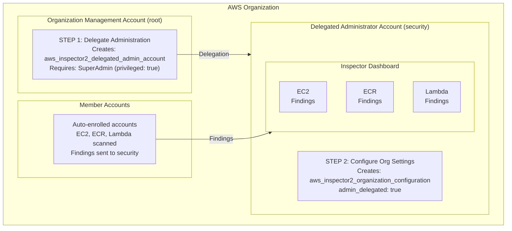

import Intro from '@site/src/components/Intro';
import KeyPoints from '@site/src/components/KeyPoints';
import Note from '@site/src/components/Note';

<Intro>
AWS Inspector 2 provides automated vulnerability scanning for EC2 instances, container images in ECR, and Lambda
functions across your AWS Organization using machine learning and pattern matching.
</Intro>

## Overview

AWS Inspector 2 provides:

- **EC2 Scanning**: Vulnerability assessment of EC2 instances using SSM Agent
- **ECR Scanning**: Container image scanning for vulnerabilities in your registries
- **Lambda Scanning**: Function code and dependency vulnerability detection
- **Continuous Monitoring**: Real-time vulnerability detection as CVEs are published
- **Multi-account Support**: Centralized management across your organization

## Scan Types

| Scan Type | Description |
|-----------|-------------|
| **EC2** | Scans for software vulnerabilities and network reachability issues |
| **ECR** | Scans container images for OS and programming language package vulnerabilities |
| **Lambda** | Scans function code and dependencies for vulnerabilities |

## Architecture



## Deployment

Inspector uses a **2-step delegated administrator** deployment model.

### Step 1: Deploy to Organization Management Account

<Note title="SuperAdmin Required">
This step requires SuperAdmin permissions to deploy to the root account.
</Note>

```yaml
# core-ue1-root
components:
  terraform:
    inspector2/root/ue1:
      metadata:
        component: aws-inspector2
      backend:
        s3:
          role_arn: null
      vars:
        enabled: true
        delegated_administrator_account_name: core-security
        environment: ue1
        region: us-east-1
```

```bash
atmos terraform apply inspector2/root/ue1 -s core-ue1-root
```

### Step 2: Deploy Organization Settings

```yaml
# core-ue1-security
components:
  terraform:
    inspector2/org-settings/ue1:
      metadata:
        component: aws-inspector2
      vars:
        enabled: true
        delegated_administrator_account_name: core-security
        environment: ue1
        region: us-east-1
        admin_delegated: true
        # Scan types to enable
        auto_enable_ec2: true
        auto_enable_ecr: true
        auto_enable_lambda: true
```

```bash
atmos terraform apply inspector2/org-settings/ue1 -s core-ue1-security
```

## Multi-Region Deployment

Repeat both steps for each region:

```bash
# us-east-1
atmos terraform apply inspector2/root/ue1 -s core-ue1-root
atmos terraform apply inspector2/org-settings/ue1 -s core-ue1-security

# us-west-2
atmos terraform apply inspector2/root/uw2 -s core-uw2-root
atmos terraform apply inspector2/org-settings/uw2 -s core-uw2-security
```

## Scan Configuration

Configure which resource types to scan:

```yaml
components:
  terraform:
    inspector2/org-settings/ue1:
      vars:
        enabled: true
        admin_delegated: true
        # Enable/disable specific scan types
        auto_enable_ec2: true
        auto_enable_ecr: true
        auto_enable_lambda: true
```

## Key Variables

| Variable | Description | Default |
|----------|-------------|---------|
| `admin_delegated` | Set to `true` after delegation is complete | `false` |
| `auto_enable_ec2` | Auto-enable EC2 scanning for new members | `true` |
| `auto_enable_ecr` | Auto-enable ECR scanning for new members | `true` |
| `auto_enable_lambda` | Auto-enable Lambda scanning for new members | `true` |
| `member_association_excludes` | List of accounts to exclude from scanning | `[]` |

## Security Hub Integration

Inspector automatically sends findings to Security Hub when both services are enabled. No additional configuration required.

## References

- [AWS Inspector 2 Documentation](https://docs.aws.amazon.com/inspector/)
- [aws-inspector2 Component](https://github.com/cloudposse-terraform-components/aws-inspector2)
- [Inspector Scanning Types](https://docs.aws.amazon.com/inspector/latest/user/what-is-inspector.html)
- [Inspector Findings](https://docs.aws.amazon.com/inspector/latest/user/findings.html)
