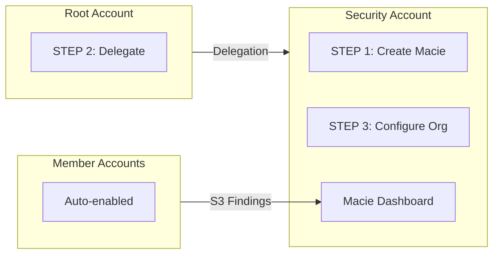

import Intro from '@site/src/components/Intro';
import KeyPoints from '@site/src/components/KeyPoints';
import Note from '@site/src/components/Note';

<Intro>
AWS Macie is a data security service that discovers sensitive data in Amazon S3 using machine learning and pattern
matching, providing visibility into data security risks and enabling automated protection.
</Intro>

## Overview

Macie provides:

- **Sensitive Data Discovery**: Automatically discovers PII, financial data, credentials, and other sensitive information
- **S3 Bucket Inventory**: Comprehensive inventory of S3 buckets with security and access control evaluation
- **Policy Findings**: Detects security issues like publicly accessible buckets, disabled encryption, external sharing
- **Sensitive Data Findings**: Reports discovered sensitive data including location and data type
- **Multi-account Coverage**: Monitors S3 data across all accounts in the AWS Organization

## Key Features

| Feature | Description |
|---------|-------------|
| **Data Discovery** | ML-based detection of PII, PHI, financial data, and credentials |
| **Bucket Monitoring** | Continuous evaluation of bucket security posture |
| **Custom Identifiers** | Define custom patterns for sensitive data detection |
| **Security Hub Integration** | Findings published to AWS Security Hub |
| **EventBridge Integration** | Findings published to EventBridge for automation |

## Architecture



## Deployment

Macie uses a **3-step delegated administrator** deployment model.

### Step 1: Deploy to Delegated Administrator Account

```yaml
# core-ue1-security
components:
  terraform:
    macie/delegated-administrator/ue1:
      metadata:
        component: macie
      vars:
        enabled: true
        delegated_administrator_account_name: core-security
        environment: ue1
        region: us-east-1
        # Not yet delegated - creates Macie account only
        admin_delegated: false
```

```bash
atmos terraform apply macie/delegated-administrator/ue1 -s core-ue1-security
```

### Step 2: Deploy to Organization Management Account

<Note title="SuperAdmin Required">
This step requires SuperAdmin permissions to deploy to the root account.
</Note>

```yaml
# core-ue1-root
components:
  terraform:
    macie/root/ue1:
      metadata:
        component: macie
      backend:
        s3:
          role_arn: null
      vars:
        enabled: true
        delegated_administrator_account_name: core-security
        environment: ue1
        region: us-east-1
        privileged: true
```

```bash
atmos terraform apply macie/root/ue1 -s core-ue1-root
```

### Step 3: Deploy Organization Settings

```yaml
# core-ue1-security
components:
  terraform:
    macie/org-settings/ue1:
      metadata:
        component: macie
      vars:
        enabled: true
        delegated_administrator_account_name: core-security
        environment: ue1
        region: us-east-1
        admin_delegated: true
        finding_publishing_frequency: FIFTEEN_MINUTES
```

```bash
atmos terraform apply macie/org-settings/ue1 -s core-ue1-security
```

## Multi-Region Deployment

Macie is a regional service. Deploy to each region where you have S3 buckets:

```bash
# us-east-1
atmos terraform apply macie/delegated-administrator/ue1 -s core-ue1-security
atmos terraform apply macie/root/ue1 -s core-ue1-root
atmos terraform apply macie/org-settings/ue1 -s core-ue1-security

# us-west-2
atmos terraform apply macie/delegated-administrator/uw2 -s core-uw2-security
atmos terraform apply macie/root/uw2 -s core-uw2-root
atmos terraform apply macie/org-settings/uw2 -s core-uw2-security
```

## Finding Publishing Frequency

Configure how often Macie publishes findings to Security Hub and EventBridge:

| Value | Description |
|-------|-------------|
| `FIFTEEN_MINUTES` | Publish every 15 minutes (default, recommended) |
| `ONE_HOUR` | Publish every hour |
| `SIX_HOURS` | Publish every 6 hours |

## Key Variables

| Variable | Description | Default |
|----------|-------------|---------|
| `admin_delegated` | Set to `true` after delegation is complete | `false` |
| `finding_publishing_frequency` | How often to publish findings | `FIFTEEN_MINUTES` |
| `member_accounts` | List of member account names to enable | `[]` |

## Sensitive Data Types

Macie can detect:

- **PII**: Names, addresses, phone numbers, SSN, passport numbers
- **Financial**: Credit card numbers, bank account numbers
- **Health**: PHI, medical record numbers
- **Credentials**: API keys, passwords, private keys
- **Custom**: User-defined patterns using regex

## See Also

- [AWS Security Hub](/layers/security-and-compliance/aws-security-hub/) - Aggregates Macie findings
- [AWS Config](/layers/security-and-compliance/aws-config/) - Monitors S3 bucket configurations
- [Setup Guide](/layers/security-and-compliance/setup/) - Complete deployment instructions

## References

- [AWS Macie Documentation](https://docs.aws.amazon.com/macie/)
- [aws-macie Component](https://github.com/cloudposse-terraform-components/aws-macie)
- [Macie Discovery Jobs](https://docs.aws.amazon.com/macie/latest/user/discovery-jobs.html)
- [Custom Data Identifiers](https://docs.aws.amazon.com/macie/latest/user/custom-data-identifiers.html)
