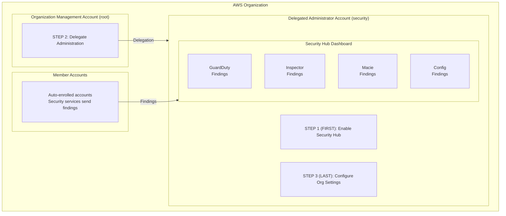

import Intro from '@site/src/components/Intro';
import KeyPoints from '@site/src/components/KeyPoints';
import Note from '@site/src/components/Note';

<Intro>
AWS Security Hub provides a centralized dashboard for aggregating, organizing, and prioritizing security findings
from AWS services and third-party tools across your organization.
</Intro>

## Overview

Security Hub provides:

- **Centralized Security Management**: Unified dashboard for security findings from multiple accounts and regions
- **Product Subscriptions**: Integration with GuardDuty, Inspector, Macie, Config, and Access Analyzer
- **Compliance Standards**: CIS AWS Foundations, PCI DSS, AWS Foundational Security Best Practices
- **Finding Aggregation**: Cross-region aggregation for centralized visibility
- **Automated Remediation**: EventBridge integration for automated response

## Key Features

| Feature | Description |
|---------|-------------|
| **Product Subscriptions** | Automatically receive findings from AWS security services |
| **Security Standards** | Compliance checks against industry frameworks |
| **Custom Insights** | Create custom views of security data |
| **Finding Aggregation** | Aggregate findings from all regions into one |
| **SNS Notifications** | Alert on new findings via SNS |

## Product Subscriptions

Security Hub integrates with these AWS services:

| Product | Default | Description |
|---------|---------|-------------|
| GuardDuty | `true` | Threat detection findings |
| Inspector | `true` | Vulnerability scanning findings |
| Macie | `true` | Sensitive data discovery findings |
| Config | `true` | Configuration compliance findings |
| Access Analyzer | `true` | External access findings |
| Firewall Manager | `false` | Firewall policy compliance |

## Architecture



## Deployment

Security Hub uses a **3-step delegated administrator** deployment model.

### Step 1: Deploy to Delegated Administrator Account

```yaml
# core-ue1-security
components:
  terraform:
    security-hub/delegated-administrator/ue1:
      metadata:
        component: security-hub
      vars:
        enabled: true
        delegated_administrator_account_name: core-security
        environment: ue1
        region: us-east-1
        # Product subscriptions for AWS security service integrations
        product_subscriptions:
          guardduty: true
          inspector: true
          macie: true
          config: true
          access_analyzer: true
          firewall_manager: false
```

```bash
atmos terraform apply security-hub/delegated-administrator/ue1 -s core-ue1-security
```

### Step 2: Deploy to Organization Management Account

<Note title="SuperAdmin Required">
This step requires SuperAdmin permissions to deploy to the root account.
</Note>

```yaml
# core-ue1-root
components:
  terraform:
    security-hub/root/ue1:
      metadata:
        component: security-hub
      backend:
        s3:
          role_arn: null
      vars:
        enabled: true
        delegated_administrator_account_name: core-security
        environment: ue1
        region: us-east-1
        privileged: true
```

```bash
atmos terraform apply security-hub/root/ue1 -s core-ue1-root
```

### Step 3: Deploy Organization Settings

```yaml
# core-ue1-security
components:
  terraform:
    security-hub/org-settings/ue1:
      metadata:
        component: security-hub
      vars:
        enabled: true
        delegated_administrator_account_name: core-security
        environment: ue1
        region: us-east-1
        admin_delegated: true
```

```bash
atmos terraform apply security-hub/org-settings/ue1 -s core-ue1-security
```

## Compliance Standards

Enable security standards for compliance monitoring:

```yaml
components:
  terraform:
    security-hub/delegated-administrator/ue1:
      vars:
        enabled_standards:
          - standards/aws-foundational-security-best-practices/v/1.0.0
          - standards/cis-aws-foundations-benchmark/v/1.4.0
          # Optional additional standards:
          # - standards/pci-dss/v/3.2.1
```

## Finding Aggregation

Enable cross-region finding aggregation:

```yaml
components:
  terraform:
    security-hub/delegated-administrator/ue1:
      vars:
        finding_aggregator_enabled: true
        finding_aggregator_linking_mode: ALL_REGIONS
        # Or aggregate from specific regions:
        # finding_aggregator_linking_mode: SPECIFIED_REGIONS
        # finding_aggregator_regions:
        #   - us-east-1
        #   - us-west-2
```

## Key Variables

| Variable | Description | Default |
|----------|-------------|---------|
| `admin_delegated` | Set to `true` after delegation | `false` |
| `auto_enable_organization_members` | Auto-enroll new members | `true` |
| `product_subscriptions` | Map of product subscription settings | See above |
| `enabled_standards` | List of compliance standards to enable | `[]` |
| `finding_aggregator_enabled` | Enable cross-region aggregation | `false` |
| `create_sns_topic` | Create SNS topic for notifications | `false` |

## Verification

After deployment, verify product subscriptions:

```bash
# Via Terraform output
atmos terraform output security-hub/delegated-administrator/ue1 -s core-ue1-security

# Via AWS CLI
aws securityhub list-enabled-products-for-import --region us-east-1
```

## References

- [AWS Security Hub Documentation](https://docs.aws.amazon.com/securityhub/)
- [aws-security-hub Component](https://github.com/cloudposse-terraform-components/aws-security-hub)
- [Security Hub Product Integrations](https://docs.aws.amazon.com/securityhub/latest/userguide/securityhub-findings-providers.html)
- [Security Hub Standards](https://docs.aws.amazon.com/securityhub/latest/userguide/securityhub-standards.html)
