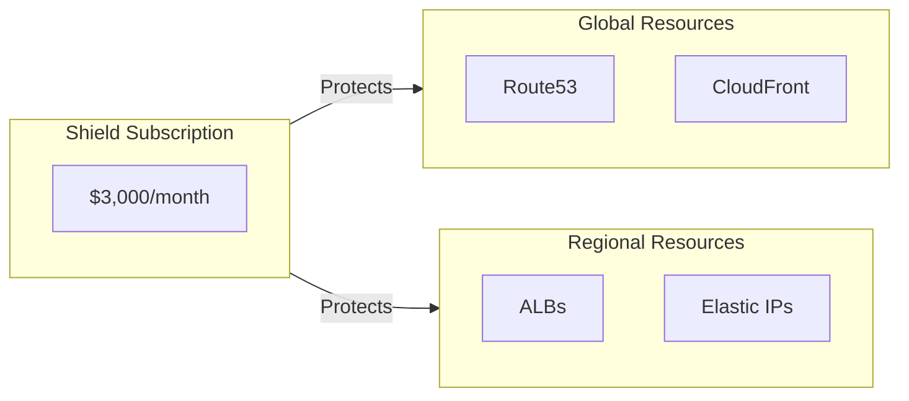

import Intro from '@site/src/components/Intro';
import KeyPoints from '@site/src/components/KeyPoints';
import Note from '@site/src/components/Note';

<Intro>
AWS Shield Advanced provides enhanced DDoS protection for your AWS resources, including ALBs, CloudFront distributions,
Route53 hosted zones, and Elastic IPs, with access to the AWS DDoS Response Team (DRT).
</Intro>

## Overview

AWS Shield has two tiers:

| Feature | Shield Standard | Shield Advanced |
|---------|-----------------|-----------------|
| **Cost** | Free (included with AWS) | $3,000/month per organization |
| **Protection** | Layer 3/4 (network/transport) | Layer 3/4/7 (includes application layer) |
| **DRT Access** | No | Yes (24/7 DDoS Response Team) |
| **Cost Protection** | No | Yes (credits for DDoS-related scaling) |
| **Advanced Metrics** | No | Yes (CloudWatch metrics) |
| **WAF Integration** | Basic | Advanced (custom rules during attacks) |

## Protected Resources

Shield Advanced protects:

| Resource Type | Stack Level | Description |
|---------------|-------------|-------------|
| **Route53 Hosted Zones** | Global | DNS infrastructure protection |
| **CloudFront Distributions** | Global | CDN and web application protection |
| **Application Load Balancers** | Regional | Application endpoint protection |
| **Elastic IPs** | Regional | NAT Gateway and EC2 protection |

## Architecture



## Deployment

Shield Advanced uses a **per-resource** deployment model (no delegated administrator pattern).

### Prerequisites

<Note title="Subscription Required">
Shield Advanced subscription must be activated before deploying this component.
</Note>

```bash
# Subscribe via AWS CLI
aws shield create-subscription

# Or subscribe via AWS Console:
# AWS Shield → Getting started → Subscribe to Shield Advanced
```

### Global Resources Configuration

```yaml
# plat-gbl-prod
components:
  terraform:
    aws-shield:
      metadata:
        component: aws-shield
      vars:
        enabled: true
        # Route53 hosted zones
        route53_zone_names:
          - example.com
          - api.example.com
        # CloudFront distributions
        cloudfront_distribution_ids:
          - E1ABCDEFG12345
          - E2BCDEFGH23456
```

```bash
atmos terraform apply aws-shield -s plat-gbl-prod
```

### Regional Resources Configuration

```yaml
# plat-ue1-prod
components:
  terraform:
    aws-shield:
      metadata:
        component: aws-shield
      vars:
        enabled: true
        region: us-east-1
        # Application Load Balancers
        alb_protection_enabled: true
        alb_names:
          - k8s-common-2c5f23ff99
          - api-gateway-alb
        # Elastic IPs (NAT Gateways, EC2 instances)
        eips:
          - 3.214.128.240    # NAT Gateway AZ-a
          - 35.172.208.150   # NAT Gateway AZ-b
```

```bash
atmos terraform apply aws-shield -s plat-ue1-prod
```

### Complete Example (All Resources)

```yaml
components:
  terraform:
    aws-shield:
      metadata:
        component: aws-shield
      vars:
        enabled: true
        # Global resources
        route53_zone_names:
          - example.com
          - api.example.com
        cloudfront_distribution_ids:
          - E1ABCDEFG12345
        # Regional resources
        alb_protection_enabled: true
        alb_names:
          - k8s-common-2c5f23ff99
        eips:
          - 3.214.128.240
          - 35.172.208.150
```

## Auto-Discovery from EKS

When `alb_protection_enabled: true` and `alb_names` is empty, the component auto-discovers ALBs from the EKS ALB controller:

```yaml
components:
  terraform:
    aws-shield:
      vars:
        enabled: true
        alb_protection_enabled: true
        # alb_names is empty - auto-discovers from EKS ALB controller
```

## Key Variables

| Variable | Description | Default |
|----------|-------------|---------|
| `route53_zone_names` | List of Route53 hosted zone names to protect | `[]` |
| `cloudfront_distribution_ids` | List of CloudFront distribution IDs to protect | `[]` |
| `alb_protection_enabled` | Enable ALB protection | `false` |
| `alb_names` | List of ALB names to protect | `[]` |
| `eips` | List of Elastic IPs to protect | `[]` |

## Finding Resources

Use these AWS CLI commands to find resource identifiers:

```bash
# List ALB names
aws elbv2 describe-load-balancers --query 'LoadBalancers[*].LoadBalancerName' --output table

# List Elastic IPs
aws ec2 describe-addresses --query 'Addresses[*].[PublicIp,AllocationId]' --output table

# List Route53 hosted zones
aws route53 list-hosted-zones --query 'HostedZones[*].[Name,Id]' --output table

# List CloudFront distributions
aws cloudfront list-distributions --query 'DistributionList.Items[*].[Id,DomainName]' --output table
```

## Verifying Protection

```bash
# List all protected resources
aws shield list-protections --query 'Protections[*].[Name,ResourceArn]' --output table

# Check subscription status
aws shield describe-subscription
```

## See Also

- [AWS Security Hub](/layers/security-and-compliance/aws-security-hub/) - Centralized security dashboard
- [AWS GuardDuty](/layers/security-and-compliance/aws-guardduty/) - Complementary threat detection
- [Setup Guide](/layers/security-and-compliance/setup/) - Complete deployment instructions

## References

- [AWS Shield Documentation](https://docs.aws.amazon.com/shield/)
- [aws-shield Component](https://github.com/cloudposse-terraform-components/aws-shield)
- [Subscribing to Shield Advanced](https://docs.aws.amazon.com/waf/latest/developerguide/enable-ddos-prem.html)
- [DDoS Response Team Support](https://docs.aws.amazon.com/waf/latest/developerguide/ddos-srt-support.html)
