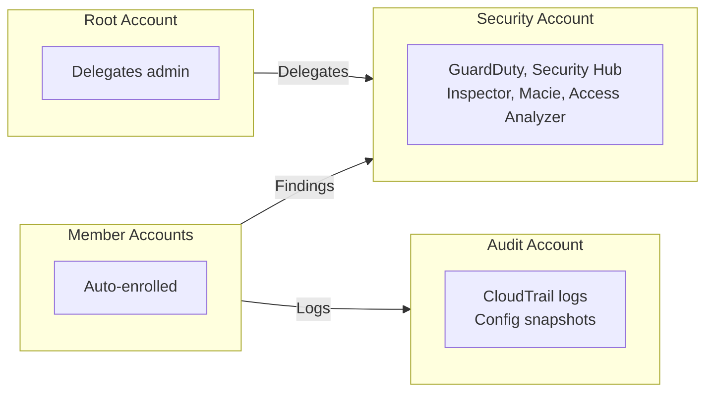
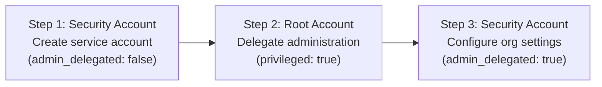
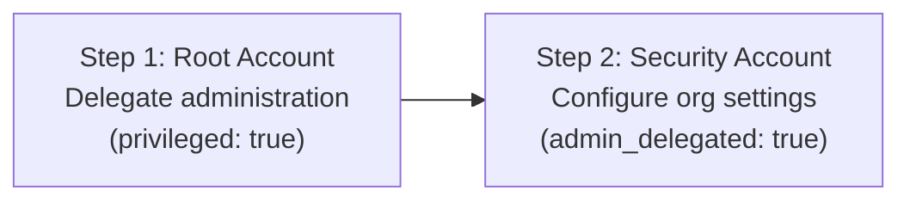
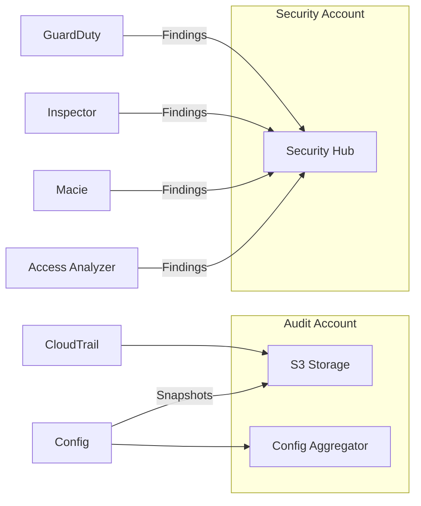

import Intro from '@site/src/components/Intro';
import KeyPoints from '@site/src/components/KeyPoints';
import Note from '@site/src/components/Note';
import Steps from '@site/src/components/Steps';

<Intro>
Learn Cloud Posse's approach to deploying AWS security services and compliance monitoring across your AWS Organization.
We cover essential topics such as threat detection, vulnerability scanning, configuration compliance, sensitive data
discovery, and centralized security findings aggregation.
</Intro>

## The Problem

Ensuring your AWS Organization meets compliance benchmarks (e.g., SOC2, HIPAA, PCI/DSS, CIS) requires comprehensive
security monitoring across all accounts and regions. Your AWS accounts contain thousands of resources, making manual
auditing impossible. Each security service has its own deployment model, regional requirements, and configuration
complexity. Setting up this automation by hand is tedious, error-prone, and difficult to maintain at scale.

## Our Solution

Deploy a comprehensive set of Cloud Posse components to enable security monitoring and compliance across your entire
AWS Organization. Our approach uses the **delegated administrator** pattern, where a central `security` account manages
organization-wide security services, while logs are stored in an isolated `audit` account.

## Security Components Overview

Cloud Posse provides 9 Terraform components for comprehensive AWS security and compliance:

| Component | Purpose | Deployment Model |
|-----------|---------|------------------|
| [AWS Config](/layers/security-and-compliance/aws-config/) | Configuration compliance and resource inventory | Per-account + Org conformance packs |
| [AWS CloudTrail](/layers/security-and-compliance/aws-cloudtrail/) | API activity logging and audit trail | Organization trail |
| [AWS GuardDuty](/layers/security-and-compliance/aws-guardduty/) | Intelligent threat detection | 3-step delegated admin |
| [AWS Security Hub](/layers/security-and-compliance/aws-security-hub/) | Centralized security findings aggregation | 3-step delegated admin |
| [AWS Inspector 2](/layers/security-and-compliance/aws-inspector2/) | Automated vulnerability scanning | 2-step delegated admin |
| [Amazon Macie](/layers/security-and-compliance/aws-macie/) | Sensitive data discovery in S3 | 3-step delegated admin |
| [IAM Access Analyzer](/layers/security-and-compliance/aws-access-analyzer/) | External and unused access detection | 2-step delegated admin |
| [AWS Shield](/layers/security-and-compliance/aws-shield/) | DDoS protection | Per-resource |
| [AWS Audit Manager](/layers/security-and-compliance/aws-audit-manager/) | Compliance evidence collection | Single-step (root) |

### AWS Config

[**AWS Config**](/layers/security-and-compliance/aws-config/) provides configuration compliance monitoring and resource
inventory across your AWS Organization. It continuously evaluates resources against compliance rules (conformance packs)
and maintains a configuration history for auditing.

**Key Features:**
- Continuous configuration recording and compliance evaluation
- CMMC Level 2, CIS, and custom conformance packs
- Central aggregation in the security account
- Configuration snapshots stored in the audit account

### AWS CloudTrail

[**AWS CloudTrail**](/layers/security-and-compliance/aws-cloudtrail/) records API activity across your AWS Organization,
providing an audit trail for security analysis, compliance auditing, and operational troubleshooting.

**Key Features:**
- Organization-wide trail covering all accounts automatically
- Log file validation with cryptographic signatures
- CloudWatch Logs integration for real-time analysis
- Centralized storage in the audit account with lifecycle policies

### AWS GuardDuty

[**AWS GuardDuty**](/layers/security-and-compliance/aws-guardduty/) is an intelligent threat detection service that
continuously monitors for malicious activity and unauthorized behavior across your AWS accounts.

**Key Features:**
- ML-based threat detection for account compromise, instance compromise, and reconnaissance
- S3 data event protection and EKS audit log monitoring
- EBS malware scanning and Lambda network activity analysis
- Runtime monitoring with agent management for EKS, ECS, and EC2

### AWS Security Hub

[**AWS Security Hub**](/layers/security-and-compliance/aws-security-hub/) provides a centralized dashboard for
aggregating, organizing, and prioritizing security findings from AWS services and third-party tools.

**Key Features:**
- Aggregates findings from GuardDuty, Inspector, Macie, Config, and Access Analyzer
- Compliance checks against CIS, PCI DSS, AWS Foundational Security Best Practices
- Cross-region finding aggregation
- Custom insights and automated remediation via EventBridge

### AWS Inspector 2

[**AWS Inspector 2**](/layers/security-and-compliance/aws-inspector2/) provides automated vulnerability scanning for
EC2 instances, container images in ECR, and Lambda functions.

**Key Features:**
- Continuous CVE detection with risk-based prioritization
- EC2 scanning (requires SSM Agent), ECR image scanning, Lambda function scanning
- Network reachability analysis
- Automatic enablement for new organization members

### Amazon Macie

[**Amazon Macie**](/layers/security-and-compliance/aws-macie/) is a data security service that uses machine learning
to discover, classify, and protect sensitive data stored in Amazon S3.

**Key Features:**
- ML-based detection of PII, financial data, credentials, and other sensitive information
- Automated S3 bucket inventory with security posture assessment
- Policy findings for publicly accessible buckets and encryption issues
- Custom data identifiers with regex patterns

### IAM Access Analyzer

[**IAM Access Analyzer**](/layers/security-and-compliance/aws-access-analyzer/) helps identify resources shared with
external entities and detects unused access permissions.

**Key Features:**
- External access detection for S3, IAM, KMS, Lambda, SQS, Secrets Manager
- Unused access analysis for identifying overly permissive policies
- Policy validation before deployment
- Archive rules for known external access patterns

### AWS Shield

[**AWS Shield**](/layers/security-and-compliance/aws-shield/) provides DDoS protection for your applications.
Shield Advanced offers enhanced protection with 24/7 DDoS Response Team access.

**Key Features:**
- Layer 3/4/7 DDoS protection for ALBs, CloudFront, Elastic IPs, Route53
- DDoS cost protection (credits for scaling during attacks)
- 24/7 DDoS Response Team (DRT) access
- Advanced CloudWatch metrics and WAF integration

### AWS Audit Manager

[**AWS Audit Manager**](/layers/security-and-compliance/aws-audit-manager/) automates evidence collection for
compliance audits using prebuilt frameworks.

**Key Features:**
- Prebuilt frameworks for SOC 2, HIPAA, PCI DSS, GDPR, FedRAMP
- Automated evidence collection from AWS services
- Assessment reports for auditors
- Custom framework support

<Note title="GovCloud Consideration">
AWS Audit Manager has limited framework availability in GovCloud. Many prebuilt frameworks (HIPAA, PCI DSS, GDPR, SOC 2)
are not available in the GovCloud partition. Consider using AWS Config conformance packs as an alternative.
</Note>

## Deployment Models

The components use different deployment patterns based on AWS service requirements:

### 3-Step Delegated Administrator

Used by: **GuardDuty**, **Security Hub**, **Macie**

### 2-Step Delegated Administrator

Used by: **Inspector**, **Access Analyzer**

### Per-Account Deployment

Used by: **Config**, **CloudTrail**

Deploy to each account with central aggregation in security/audit accounts.

### Per-Resource Deployment

Used by: **Shield**

Deploy to each account/resource that needs protection (not organization-wide).

## Integration Architecture

All security services integrate through AWS Security Hub for centralized visibility:

## Regional Deployment

All AWS security services are regional. You must deploy to:

<Steps>
  1. **All regions enabled by default** (cannot be disabled):

     |                |                |           |           |
     | -------------- | -------------- | --------- | --------- |
     | ap-northeast-1 | ap-southeast-2 | eu-west-2 | us-west-1 |
     | ap-northeast-2 | ca-central-1   | eu-west-3 | us-west-2 |
     | ap-northeast-3 | eu-central-1   | sa-east-1 |           |
     | ap-south-1     | eu-north-1     | us-east-1 |           |
     | ap-southeast-1 | eu-west-1      | us-east-2 |           |

  1. **Any additional regions** you have opted into
</Steps>

## Getting Started

<Steps>
  1. Review the [Setup Guide](/layers/security-and-compliance/setup/) for step-by-step deployment instructions
  1. Explore individual component documentation for detailed configuration options
  1. Check the [Design Decisions](/layers/security-and-compliance/design-decisions/) for architectural considerations
  1. Review the [FAQ](/layers/security-and-compliance/faq/) for common issues and solutions
</Steps>

:::caution Important

Follow the deployment steps carefully and in order. Incorrect deployment order may result in a condition that requires
manual cleanup across multiple regions in each of your accounts.

:::
