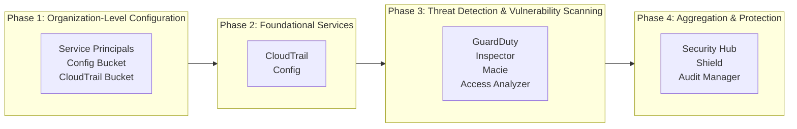

import Intro from '@site/src/components/Intro';
import KeyPoints from '@site/src/components/KeyPoints';
import Steps from '@site/src/components/Steps';
import Step from '@site/src/components/Step';
import StepNumber from '@site/src/components/StepNumber';
import Admonition from '@theme/Admonition';
import Note from '@site/src/components/Note';
import TaskList from '@site/src/components/TaskList';

<Intro>
This guide walks you through deploying AWS security and compliance services across your AWS Organization.
Follow the steps in order to ensure proper configuration of all services.
</Intro>

<KeyPoints title="Before You Begin">
  <TaskList>
    - AWS Organizations is configured with your account structure
    - Account baseline has been deployed (see [Deploy Accounts](/layers/accounts/deploy-accounts/))
    - Root account access is available for root account deployments (such as with the `managers` profile)
  </TaskList>
</KeyPoints>

## Deployment Order

The security components have dependencies and must be deployed in a specific order:



---

## Phase 1: Organization-Level Configuration

These steps are required once for the entire organization.

<Steps>
  <Step>
    ### <StepNumber/> Vendor Components

    Vendor all security and compliance components:

    ```bash
    atmos vendor pull --component aws-config
    atmos vendor pull --component aws-cloudtrail
    atmos vendor pull --component aws-guardduty
    atmos vendor pull --component aws-security-hub
    atmos vendor pull --component aws-inspector2
    atmos vendor pull --component aws-macie
    atmos vendor pull --component aws-access-analyzer
    atmos vendor pull --component aws-shield
    atmos vendor pull --component aws-audit-manager
    ```
  </Step>

  <Step>
    ### <StepNumber/> Add Service Principals

    Add the following service principals to the `aws_service_access_principals` variable of the `account` component
    in `stacks/catalog/account.yaml`:

    ```yaml
    # stacks/catalog/account.yaml
    components:
      terraform:
        account:
          vars:
            aws_service_access_principals:
              # Existing principals...
              - access-analyzer.amazonaws.com
              - cloudtrail.amazonaws.com
              - config.amazonaws.com
              - config-multiaccountsetup.amazonaws.com
              - guardduty.amazonaws.com
              - inspector2.amazonaws.com
              - macie.amazonaws.com
              - securityhub.amazonaws.com
    ```

    <Note title="Root Access Required">
      This requires root account access (such as with the `managers` profile). Ensure the `plan` output
      only modifies service principals.
    </Note>

    ```bash
    atmos terraform plan account -s core-gbl-root
    atmos terraform apply account -s core-gbl-root
    ```
  </Step>

  <Step>
    ### <StepNumber/> Deploy Config Bucket

    Deploy the S3 bucket for AWS Config data storage. This bucket stores configuration snapshots and history
    for compliance auditing.

    <Note title="Important">
    Deploy only one config-bucket per organization. It stores data from all accounts and regions.
    </Note>

    ```bash
    atmos terraform apply config-bucket -s core-ue1-audit
    ```
  </Step>

  <Step>
    ### <StepNumber/> Deploy CloudTrail Bucket

    Deploy the S3 bucket for CloudTrail logs. This bucket stores API activity logs from all accounts
    in the organization.

    <Note title="Important">
    Deploy only one cloudtrail-bucket per organization. It may already exist from the
    [Deploy Accounts](/layers/accounts/deploy-accounts/).
    </Note>

    ```bash
    # Verify bucket exists or create it
    atmos terraform plan cloudtrail-bucket -s core-ue1-audit
    atmos terraform apply cloudtrail-bucket -s core-ue1-audit
    ```
  </Step>

  <Step>
    ### <StepNumber/> Deploy CIS Benchmark IAM Role

    CIS AWS Foundations Benchmark requires a support role for managing incidents with AWS Support.
    See [CIS Benchmark 1.20](https://docs.aws.amazon.com/securityhub/latest/userguide/securityhub-cis-controls.html#securityhub-cis-controls-1.20).

    This role is managed through the [Identity Layer](/layers/identity/deploy/) using `aws-teams` and `aws-team-roles`.
  </Step>
</Steps>

---

## Phase 2: Foundational Services

### AWS CloudTrail

[AWS CloudTrail](/layers/security-and-compliance/aws-cloudtrail/) records API activity across your organization.
Deploy the organization trail to capture events from all accounts.

<Steps>
  <Step>
    ### <StepNumber/> Deploy Organization Trail

    Deploy CloudTrail to create an organization-wide trail that automatically logs API activity from all accounts.

    ```bash
    atmos terraform apply aws-cloudtrail-s core-gbl-audit
    ```
  </Step>
</Steps>

### AWS Config

[AWS Config](/layers/security-and-compliance/aws-config/) provides configuration compliance monitoring and resource
inventory. It must be deployed to every account and region.

<Steps>
  <Step>
    ### <StepNumber/> Deploy AWS Config Globally

    Deploy AWS Config to each region to collect data for global resources (IAM, etc.) and regional resources.

    ```bash
    atmos terraform apply aws-config -s core-ue1-security
    atmos terraform apply aws-config -s core-ue2-security
    atmos terraform apply aws-config -s core-uw2-security
    # ... repeat for each region
    ```
  </Step>

  <Step>
    ### <StepNumber/> Deploy AWS Config for Root Accounts

    Deploy AWS Config to accounts that require root access to apply (root, security).

    <Note title="Root Access Required">
      This requires root account access (such as with the `managers` profile).
    </Note>

    ```bash
    atmos terraform apply aws-config -s core-ue1-root
    atmos terraform apply aws-config -s core-ue2-root
    atmos terraform apply aws-config -s core-uw2-root
    # ... repeat for each region
    ```
  </Step>
</Steps>

---

## Phase 3: Threat Detection & Vulnerability Scanning

### AWS GuardDuty

[AWS GuardDuty](/layers/security-and-compliance/aws-guardduty/) provides intelligent threat detection using ML-based
analysis. It uses a 3-step delegated administrator deployment model.

<Steps>
  <Step>
    ### <StepNumber/> Deploy to Delegated Administrator (Step 1)

    First, deploy to the security account to create the GuardDuty detector.

    ```bash
    atmos terraform apply aws-guardduty/delegated-administrator -s core-ue1-security
    ```
  </Step>

  <Step>
    ### <StepNumber/> Delegate from Organization Management (Step 2)

    Deploy to the root account to designate the security account as the delegated administrator.

    <Note title="Root Access Required">
      This requires root account access (such as with the `managers` profile).
    </Note>

    ```bash
    atmos terraform apply aws-guardduty/root -s core-ue1-root
    ```
  </Step>

  <Step>
    ### <StepNumber/> Configure Organization Settings (Step 3)

    Deploy to the security account again to enable GuardDuty organization-wide with all protection features.

    ```bash
    atmos terraform apply aws-guardduty/org-settings -s core-ue1-security
    ```
  </Step>
</Steps>

### AWS Inspector 2

[AWS Inspector 2](/layers/security-and-compliance/aws-inspector2/) provides automated vulnerability scanning for EC2,
ECR, and Lambda. It uses a 2-step delegated administrator deployment model.

<Steps>
  <Step>
    ### <StepNumber/> Delegate from Organization Management (Step 1)

    Deploy to the root account to designate the security account as the delegated administrator.

    <Note title="Root Access Required">
      This requires root account access (such as with the `managers` profile).
    </Note>

    ```bash
    atmos terraform apply aws-inspector2/root -s core-ue1-root
    ```
  </Step>

  <Step>
    ### <StepNumber/> Configure Organization Settings (Step 2)

    Deploy to the security account to enable Inspector organization-wide.

    ```bash
    atmos terraform apply aws-inspector2/org-settings -s core-ue1-security
    ```
  </Step>
</Steps>

### Amazon Macie

[Amazon Macie](/layers/security-and-compliance/aws-macie/) discovers sensitive data in S3 using ML-based classification.
It uses a 3-step delegated administrator deployment model.

<Steps>
  <Step>
    ### <StepNumber/> Deploy to Delegated Administrator (Step 1)

    First, deploy to the security account to create the Macie account.

    ```bash
    atmos terraform apply aws-macie/delegated-administrator -s core-ue1-security
    ```
  </Step>

  <Step>
    ### <StepNumber/> Delegate from Organization Management (Step 2)

    Deploy to the root account to designate the security account as the delegated administrator.

    <Note title="Root Access Required">
      This requires root account access (such as with the `managers` profile).
    </Note>

    ```bash
    atmos terraform apply aws-macie/root -s core-ue1-root
    ```
  </Step>

  <Step>
    ### <StepNumber/> Configure Organization Settings (Step 3)

    Deploy to the security account again to enable Macie organization-wide.

    ```bash
    atmos terraform apply aws-macie/org-settings -s core-ue1-security
    ```
  </Step>
</Steps>

### IAM Access Analyzer

[IAM Access Analyzer](/layers/security-and-compliance/aws-access-analyzer/) identifies resources shared with external
entities and unused access. It uses a 2-step delegated administrator deployment model.

<Steps>
  <Step>
    ### <StepNumber/> Delegate from Organization Management (Step 1)

    Deploy to the root account to designate the security account as the delegated administrator.

    <Note title="Root Access Required">
      This requires root account access (such as with the `managers` profile).
    </Note>

    ```bash
    atmos terraform apply aws-access-analyzer/root -s core-gbl-root
    ```
  </Step>

  <Step>
    ### <StepNumber/> Configure Organization Settings (Step 2)

    Deploy to the security account to create organization and account analyzers.

    ```bash
    atmos terraform apply aws-access-analyzer/org-settings -s core-ue1-security
    ```
  </Step>
</Steps>

---

## Phase 4: Aggregation & Protection

### AWS Security Hub

[AWS Security Hub](/layers/security-and-compliance/aws-security-hub/) aggregates findings from all security services
into a centralized dashboard. It uses a 3-step delegated administrator deployment model.

<Steps>
  <Step>
    ### <StepNumber/> Deploy to Delegated Administrator (Step 1)

    First, deploy to the security account to enable Security Hub and configure product subscriptions.

    ```bash
    atmos terraform apply aws-security-hub/delegated-administrator -s core-ue1-security
    ```
  </Step>

  <Step>
    ### <StepNumber/> Delegate from Organization Management (Step 2)

    Deploy to the root account to designate the security account as the delegated administrator.

    <Note title="Root Access Required">
      This requires root account access (such as with the `managers` profile).
    </Note>

    ```bash
    atmos terraform apply aws-security-hub/root -s core-ue1-root
    ```
  </Step>

  <Step>
    ### <StepNumber/> Assume Identity Role

    Switch back to your default identity role:

    ```bash
    assume-role acme-identity
    ```
  </Step>

  <Step>
    ### <StepNumber/> Configure Organization Settings (Step 3)

    Deploy to the security account again to enable Security Hub organization-wide with compliance standards.

    ```bash
    atmos terraform apply aws-security-hub/org-settings -s core-ue1-security
    ```
  </Step>
</Steps>

### AWS Shield

[AWS Shield](/layers/security-and-compliance/aws-shield/) provides DDoS protection for critical resources.
Unlike other services, Shield is deployed per-resource rather than organization-wide.

<Note title="Subscription Required">
AWS Shield Advanced requires a subscription ($3,000/month per organization) in each account before deployment.
See [Subscribing to Shield Advanced](https://docs.aws.amazon.com/waf/latest/developerguide/enable-ddos-prem.html).
</Note>

<Steps>
  <Step>
    ### <StepNumber/> Deploy AWS Shield Advanced

    Deploy Shield protection to accounts and resources that need DDoS protection.

    ```bash
    # Global resources (Route53, CloudFront)
    atmos terraform apply aws-shield -s plat-gbl-prod

    # Regional resources (ALBs, Elastic IPs)
    atmos terraform apply aws-shield -s plat-ue1-prod
    ```
  </Step>
</Steps>

### AWS Audit Manager (Optional)

[AWS Audit Manager](/layers/security-and-compliance/aws-audit-manager/) automates compliance evidence collection.
It is deployed only to the root account.

<Note title="GovCloud Limitation">
AWS Audit Manager has limited framework availability in GovCloud. Consider using AWS Config conformance packs
as an alternative for compliance monitoring.
</Note>

<Steps>
  <Step>
    ### <StepNumber/> Deploy AWS Audit Manager

    Deploy Audit Manager to the root account to enable compliance evidence collection.

    ```bash
    atmos terraform apply aws-audit-manager/root -s core-ue1-root
    ```
  </Step>
</Steps>

---

## Optional: DNS Firewall

Route53 DNS Resolver Firewall provides DNS-level security to block malicious domains.

<Steps>
  <Step>
    ### <StepNumber/> Deploy DNS Firewall Buckets

    Deploy S3 buckets for DNS Firewall logging.

    ```bash
    atmos terraform apply route53-resolver-dns-firewall-logs -s plat-ue1-dev
    atmos terraform apply route53-resolver-dns-firewall-logs -s plat-ue1-prod
    atmos terraform apply route53-resolver-dns-firewall-logs -s plat-ue1-sandbox
    atmos terraform apply route53-resolver-dns-firewall-logs -s plat-ue1-staging
    ```
  </Step>

  <Step>
    ### <StepNumber/> Configure DNS Firewall

    Deploy and configure the Route53 DNS Resolver Firewall.

    ```bash
    atmos terraform apply route53-resolver-dns-firewall/dev -s plat-ue1-dev
    atmos terraform apply route53-resolver-dns-firewall/prod -s plat-ue1-prod
    atmos terraform apply route53-resolver-dns-firewall/sandbox -s plat-ue1-sandbox
    atmos terraform apply route53-resolver-dns-firewall/staging -s plat-ue1-staging
    ```
  </Step>
</Steps>

---

## Verification

After deployment, verify all services are properly configured:

### Check Security Hub Dashboard

<Steps>
  1. Open the AWS Console in the security account
  1. Navigate to Security Hub
  1. Verify findings are being aggregated from all services
</Steps>

### Verify Service Status

```bash
# Check GuardDuty status
aws guardduty list-detectors --region us-east-1

# Check Security Hub status
aws securityhub describe-hub --region us-east-1

# Check Inspector status
aws inspector2 list-delegated-admin-accounts --region us-east-1

# Check Config status
aws configservice describe-configuration-recorders --region us-east-1
```

### Review Compliance

<Steps>
  1. Open Security Hub in the security account
  1. Navigate to "Security standards"
  1. Review compliance scores for enabled standards (CIS, PCI DSS, AWS Foundational)
</Steps>

---

## Troubleshooting

See the [FAQ](/layers/security-and-compliance/faq/) for common issues and solutions, or consult the individual
component documentation for service-specific troubleshooting.
