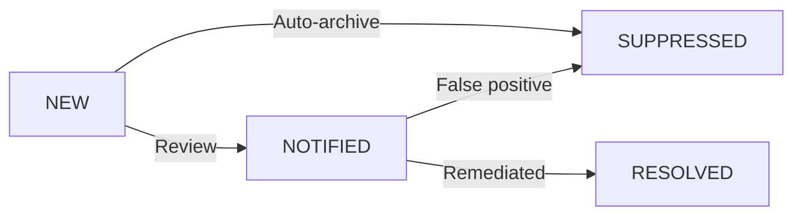

import Intro from '@site/src/components/Intro';
import KeyPoints from '@site/src/components/KeyPoints';
import Note from '@site/src/components/Note';
import Steps from '@site/src/components/Steps';
import Step from '@site/src/components/Step';
import StepNumber from '@site/src/components/StepNumber';

<Intro>
AWS Security Hub aggregates security findings from multiple AWS services and third-party tools into a centralized
dashboard. This tutorial shows you how to effectively review, investigate, and manage these findings.
</Intro>

## Overview

Security Hub receives findings from:

| Source | Finding Types |
|--------|---------------|
| **GuardDuty** | Threat detection, malicious activity |
| **Inspector** | Vulnerabilities in EC2, ECR, Lambda |
| **Macie** | Sensitive data exposure in S3 |
| **Config** | Configuration compliance violations |
| **Access Analyzer** | External access, unused permissions |
| **Firewall Manager** | Firewall policy compliance |

## Prerequisites

1. **Security Hub deployed**: Follow the [Security Hub setup guide](/layers/security-and-compliance/aws-security-hub/)
2. **Product subscriptions enabled**: All security services integrated
3. **Console access**: Access to the security account

## Finding Workflow



## Reviewing Findings

<Steps>
  <Step>
    ### <StepNumber/> Access Security Hub Dashboard

    1. Log into the AWS Console in the **security account**
    2. Navigate to **Security Hub**
    3. Select **Findings** from the left navigation

    The dashboard shows findings aggregated from all accounts and regions.
  </Step>

  <Step>
    ### <StepNumber/> Filter by Severity

    Focus on high-priority findings first:

    ```
    SeverityLabel = CRITICAL OR SeverityLabel = HIGH
    ```

    Or use the severity filter dropdown to select CRITICAL and HIGH findings.
  </Step>

  <Step>
    ### <StepNumber/> Group by Finding Type

    Organize findings by type to identify patterns:

    1. Click **Group by** dropdown
    2. Select **Type** or **Product name**
    3. Review counts for each category
  </Step>

  <Step>
    ### <StepNumber/> Investigate Individual Findings

    For each finding, review:

    - **Title**: Brief description of the issue
    - **Severity**: CRITICAL, HIGH, MEDIUM, LOW, INFORMATIONAL
    - **Account**: Which AWS account has the issue
    - **Resource**: Affected resource ARN
    - **Remediation**: Suggested fix (when available)

    Click on a finding to see full details including:
    - Resource configuration
    - Related findings
    - Remediation steps
  </Step>
</Steps>

## Using Insights

Security Hub Insights provide pre-built and custom views of your security posture.

### Built-in Insights

Navigate to **Insights** to view:

| Insight | Description |
|---------|-------------|
| **Critical findings** | All CRITICAL severity findings |
| **Failed security checks** | Compliance standard failures |
| **Top accounts by findings** | Accounts with most issues |
| **Top resources by findings** | Resources needing attention |

### Create Custom Insights

<Steps>
  <Step>
    ### <StepNumber/> Define Filter Criteria

    ```
    ProductName = "GuardDuty" AND SeverityLabel = "HIGH" AND RecordState = "ACTIVE"
    ```
  </Step>

  <Step>
    ### <StepNumber/> Create the Insight

    1. Click **Create insight**
    2. Enter a name (e.g., "High Severity GuardDuty Findings")
    3. Configure the grouping (e.g., by Resource Type)
    4. Save the insight
  </Step>
</Steps>

## Managing Finding Workflow

### Update Finding Status

Use the AWS CLI to update finding workflow status:

```bash
# Mark finding as resolved
aws securityhub batch-update-findings \
  --finding-identifiers '[{"Id":"arn:aws:securityhub:...","ProductArn":"arn:aws:securityhub:..."}]' \
  --workflow '{"Status":"RESOLVED"}' \
  --region us-east-1

# Mark finding as suppressed (false positive)
aws securityhub batch-update-findings \
  --finding-identifiers '[{"Id":"arn:aws:securityhub:...","ProductArn":"arn:aws:securityhub:..."}]' \
  --workflow '{"Status":"SUPPRESSED"}' \
  --note '{"Text":"False positive - approved exception","UpdatedBy":"security-team"}' \
  --region us-east-1
```

### Workflow Status Values

| Status | Description |
|--------|-------------|
| `NEW` | Finding has not been reviewed |
| `NOTIFIED` | Finding has been reviewed and assigned |
| `SUPPRESSED` | Finding is a false positive or accepted risk |
| `RESOLVED` | Finding has been remediated |

## Automating Finding Response

### EventBridge Integration

Create automated responses to findings:

```yaml
# Example: Alert on critical GuardDuty findings
components:
  terraform:
    security-hub-automation:
      vars:
        event_pattern:
          source:
            - aws.securityhub
          detail-type:
            - Security Hub Findings - Imported
          detail:
            findings:
              ProductName:
                - GuardDuty
              Severity:
                Label:
                  - CRITICAL
```

### SNS Notifications

Enable SNS notifications in Security Hub:

```yaml
components:
  terraform:
    security-hub/delegated-administrator/ue1:
      vars:
        create_sns_topic: true
        # SNS topic receives all new findings
```

## Compliance Standards

### Review Compliance Scores

1. Navigate to **Security standards**
2. Review compliance percentage for each standard:
   - CIS AWS Foundations Benchmark
   - AWS Foundational Security Best Practices
   - PCI DSS (if enabled)

3. Click on a standard to see failed controls

### Export Compliance Report

```bash
# Get compliance summary
aws securityhub get-enabled-standards --region us-east-1

# Get control status
aws securityhub describe-standards-controls \
  --standards-subscription-arn "arn:aws:securityhub:us-east-1::standards/cis-aws-foundations-benchmark/v/1.4.0" \
  --region us-east-1
```

## Best Practices

1. **Daily review**: Check CRITICAL and HIGH findings daily
2. **Weekly review**: Review MEDIUM findings weekly
3. **Document exceptions**: Use notes to document why findings are suppressed
4. **Automate responses**: Use EventBridge for automated alerting and remediation
5. **Track metrics**: Monitor finding counts over time to measure improvement

## Troubleshooting

### Findings Not Appearing

If findings aren't showing up:

1. Verify product subscriptions are enabled
2. Check cross-region aggregation settings
3. Allow 15-30 minutes for initial data sync
4. Verify IAM permissions for the security account

### Duplicate Findings

Duplicate findings may occur when:

- Multiple regions report the same global resource
- Finding aggregation is misconfigured

Enable finding aggregation to deduplicate:

```yaml
components:
  terraform:
    security-hub/delegated-administrator/ue1:
      vars:
        finding_aggregator_enabled: true
        finding_aggregator_linking_mode: ALL_REGIONS
```

## See Also

- [AWS Security Hub](/layers/security-and-compliance/aws-security-hub/) - Complete Security Hub documentation
- [AWS GuardDuty](/layers/security-and-compliance/aws-guardduty/) - Threat detection service
- [AWS Config](/layers/security-and-compliance/aws-config/) - Configuration compliance
- [Setup Guide](/layers/security-and-compliance/setup/) - Complete deployment instructions

## References

- [Security Hub Findings](https://docs.aws.amazon.com/securityhub/latest/userguide/securityhub-findings.html)
- [Security Hub Insights](https://docs.aws.amazon.com/securityhub/latest/userguide/securityhub-insights.html)
- [Security Hub Automation](https://docs.aws.amazon.com/securityhub/latest/userguide/securityhub-cloudwatch-events.html)
