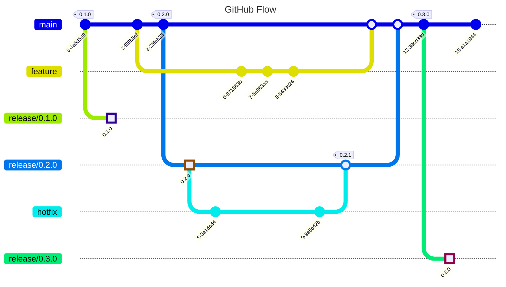

import Intro from '@site/src/components/Intro';
import KeyPoints from '@site/src/components/KeyPoints';

## Context and Problem Statement

## Problem Statement

A branching strategy is crucial in software development for facilitating team collaboration,
maintaining code stability, enabling Continuous Integration/Continuous Deployment (CI/CD),
ensuring code quality through reviews, simplifying change tracking and rollbacks,
supporting parallel development, and managing different product releases.
It provides individual workspaces for developers, segregates code based on development stages,
automates testing and deployment processes, allows for scrutinized merges into the main codebase,
and supports simultaneous development and maintenance of multiple product versions.
Essentially, an effective branching strategy underpins a stable, manageable, and efficient development environment.

## Options

## Gitflow

[Gitflow](https://nvie.com/posts/a-successful-git-branching-model/) has gained popularity as it provides an efficient
framework for collaborative development and scaling development teams. The Gitflow model offers robust control
mechanisms and facilitates collaborative development at a price of a slowdown development speed and higher numbers
of merge conflicts.

Teams working on projects with a massive codebase, low level of automation, and minimum test
code coverage and teams with a high percentage of junior devs all benefit from the Gitflow strategy.

However, Gitflow may not be suitable for startups where development speed is the priority.

## GitHub Flow (Trunk-based)

[Github Flow](https://docs.github.com/en/get-started/quickstart/github-flow) is a lightweight branching strategy where
developers introduce changes as Pull Requests from short-lived, ephemeral feature branches.
Finally, the PRs merged into the single "trunk" branch that is the source of truth.

GitHub Flow works particularly well with a team of experienced developers, facilitating the quick introduction
of improvements without unnecessary bureaucracy. It fits with high automation of release engineering processes,
microservices architecture, and mature engineering culture.

## Recommendation

We recommend using Github Flow as a basic branching strategy in conjunction with СI/CD workflows
and [branches rulesets](https://docs.github.com/en/repositories/configuring-branches-and-merges-in-your-repository/managing-rulesets/about-rulesets)
for better quality and control over changes.

We highly recommend avoiding long-living branches, especially for software that does not have to support multiple
versions of the software running in the wild.

The branching strategy does not have to be the same across the whole organization - different teams can
use different flows. However, that often leads to complexity in the CI/CD pipelines and reduces reusability.

For these reasons, we recommend a consistent branching strategy, at a minimum on a team level.

## References
* [A successful Git branching model](https://nvie.com/posts/a-successful-git-branching-model/)
* [Trunk-Based Development vs Git Flow: When to Use Which Development Style](https://blog.mergify.com/trunk-based-development-vs-git-flow-when-to-use-which-development-style/)
* [Long-lived branches with Gitflow](https://www.thoughtworks.com/radar/techniques/long-lived-branches-with-gitflow)
