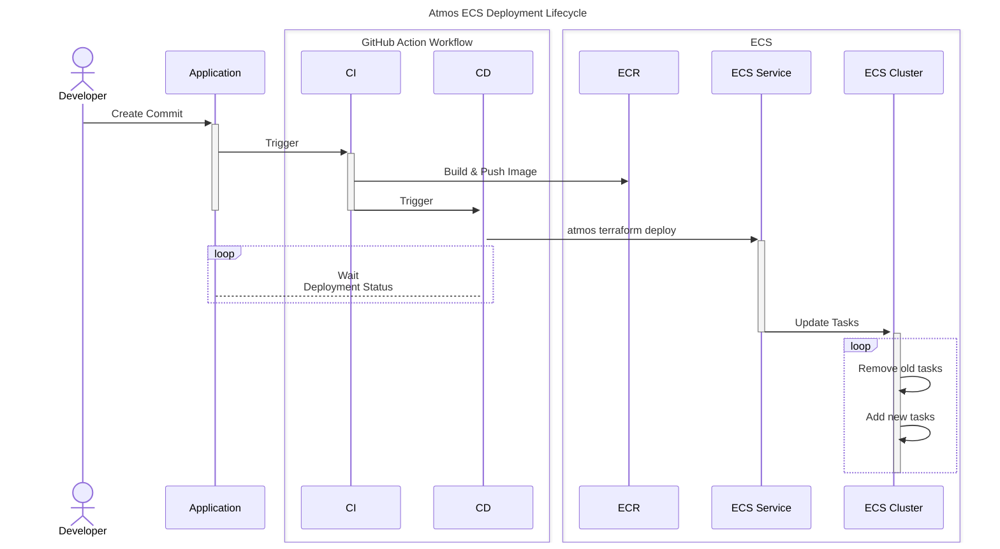

import Intro from '@site/src/components/Intro';
import KeyPoints from '@site/src/components/KeyPoints';
import Tabs from '@theme/Tabs';
import TabItem from '@theme/TabItem';
import CollapsibleText from '@site/src/components/CollapsibleText';

<Intro>
  Deploy containerized applications to AWS ECS Fargate using [Atmos](https://atmos.tools) for configuration orchestration and [OpenTofu](https://opentofu.org) for infrastructure-as-code. This approach provides a self-contained, elegant solution with automated CI/CD pipelines that leverage Atmos stack configurations for multi-environment deployments.
</Intro>

<KeyPoints>
- Deploy Docker containers to ECS Fargate with infrastructure defined in Terraform/OpenTofu
- Use Atmos stacks for environment-specific configurations (dev, staging, prod, preview)
- Automated CI/CD with GitHub Actions using Atmos for both authentication and deployment
- Preview environments for pull requests with automatic cleanup
- Release promotion workflow from dev through staging to production
</KeyPoints>



## Overview

This approach uses Atmos to orchestrate the deployment of ECS services through Terraform/OpenTofu components. Each environment (dev, staging, prod, preview) is defined as an Atmos stack, allowing consistent configuration management across all environments.

Key benefits:

- **Simplified configuration**: Atmos stacks provide a single source of truth for environment-specific settings
- **Native AWS authentication**: Use `atmos auth exec` for secure credential management
- **Infrastructure as Code**: ECS task definitions and services are managed through Terraform components
- **GitOps workflow**: Configuration changes flow through Git with automated deployments

:::tip Latest Examples

Check out our [example app-on-ecs-v2](https://github.com/cloudposse-examples/app-on-ecs-v2) for the latest example of how to deploy ECS applications with Atmos and GitHub Actions.

:::

## GitHub Action Workflows

The deployment process uses four main workflows that cover the complete development lifecycle.

<Tabs queryString="workflow">
  <TabItem value="feature" label="Feature Branch">
    The feature branch workflow builds a Docker image and deploys to a preview environment when the `deploy` label is added to a pull request.

    <CollapsibleText type="medium">
      ```yaml title=".github/workflows/feature-branch.yml"
      name: Feature Branch
      on:
        pull_request:
          branches: ["main"]
          types: [opened, synchronize, reopened, labeled]

      concurrency:
        group: ${{ github.workflow }}-${{ github.ref }}
        cancel-in-progress: false

      permissions:
        id-token: write
        contents: read

      jobs:
        build:
          runs-on: ["ubuntu-latest"]
          steps:
            - name: Install Atmos
              uses: cloudposse/github-action-setup-atmos@v2
              with:
                install-wrapper: false

            - name: Checkout
              uses: actions/checkout@v4

            - name: ECR password
              shell: bash
              run: |
                atmos auth exec --identity plat-dev/admin -- aws configure export-credentials --format env-no-export >> $GITHUB_ENV
              env:
                ATMOS_CLI_CONFIG_PATH: .github

            - name: Mask ECR credentials
              shell: bash
              run: |
                echo "::add-mask::${{ env.AWS_SECRET_ACCESS_KEY }}"
                echo "::add-mask::${{ env.AWS_ACCESS_KEY_ID }}"
                echo "::add-mask::${{ env.AWS_SESSION_TOKEN }}"

            - name: Login to ECR
              uses: docker/login-action@v3
              with:
                registry: ${{ vars.ECR_REGISTRY }}

            - name: Build
              id: build
              uses: cloudposse/github-action-docker-build-push@v2
              with:
                organization: cloudposse-examples
                repository: app-on-ecs-v2
                registry: ${{ vars.ECR_REGISTRY }}
                workdir: app

          outputs:
            image: ${{ steps.build.outputs.image }}
            tag: ${{ steps.build.outputs.tag }}

        deploy:
          needs: [build]
          runs-on: ["ubuntu-latest"]
          if: ${{ contains(github.event.pull_request.labels.*.name, 'deploy') }}
          environment:
            name: preview
            url: ${{ steps.deploy.outputs.url }}
          steps:
            - name: Install Atmos
              uses: cloudposse/github-action-setup-atmos@v2
              with:
                install-wrapper: false

            - name: Checkout
              uses: actions/checkout@v4

            - uses: opentofu/setup-opentofu@v1
              with:
                tofu_wrapper: false
                tofu_version_file: .opentofu-version

            - name: Deploy ECS Service
              shell: bash
              id: deploy
              env:
                APP_IMAGE: "${{ needs.build.outputs.image }}:${{ needs.build.outputs.tag }}"
                PR_NUMBER: ${{ github.event.pull_request.number }}
                ATMOS_CLI_CONFIG_PATH: .github
              run: |
                atmos terraform deploy app -s preview
                URL=$(atmos terraform output app -s preview --skip-init -- -raw url)
                echo "url=$URL" >> $GITHUB_OUTPUT
      ```
    </CollapsibleText>
  </TabItem>

  <TabItem value="cleanup" label="Preview Cleanup">
    The preview cleanup workflow destroys preview environments when pull requests are closed or when the `deploy` label is removed.

    <CollapsibleText type="medium">
      ```yaml title=".github/workflows/preview-cleanup.yml"
      name: Preview Cleanup
      on:
        pull_request:
          branches: ["main"]
          types: [closed, unlabeled]

      concurrency:
        group: ${{ github.workflow }}-${{ github.ref }}
        cancel-in-progress: false

      permissions:
        id-token: write
        contents: read

      jobs:
        cleanup:
          runs-on: ["ubuntu-latest"]
          if: ${{ github.event.pull_request.state == 'closed' || !contains(github.event.pull_request.labels.*.name, 'deploy') }}
          steps:
            - name: Install Atmos
              uses: cloudposse/github-action-setup-atmos@v2
              with:
                install-wrapper: false

            - name: Checkout
              uses: actions/checkout@v4

            - uses: opentofu/setup-opentofu@v1
              with:
                tofu_wrapper: false
                tofu_version_file: .opentofu-version

            - name: Destroy Preview Environment
              shell: bash
              env:
                PR_NUMBER: ${{ github.event.pull_request.number }}
                ATMOS_CLI_CONFIG_PATH: .github
              run: |
                atmos terraform destroy app -s preview -auto-approve
      ```
    </CollapsibleText>
  </TabItem>

  <TabItem value="main" label="Main Branch">
    The main branch workflow builds a Docker image, deploys to dev, and creates a draft release for promotion.

    <CollapsibleText type="medium">
      ```yaml title=".github/workflows/main-branch.yaml"
      name: Main Branch
      on:
        push:
          branches: [main]

      concurrency:
        group: ${{ github.workflow }}-${{ github.ref }}
        cancel-in-progress: false

      permissions:
        id-token: write
        contents: write

      jobs:
        build:
          runs-on: [ubuntu-latest]
          steps:
            - name: Install Atmos
              uses: cloudposse/github-action-setup-atmos@v2
              with:
                install-wrapper: false

            - name: Checkout
              uses: actions/checkout@v4

            - name: ECR password
              shell: bash
              run: |
                atmos auth exec --identity plat-dev/admin -- aws configure export-credentials --format env-no-export >> $GITHUB_ENV
              env:
                ATMOS_CLI_CONFIG_PATH: .github

            - name: Mask ECR credentials
              shell: bash
              run: |
                echo "::add-mask::${{ env.AWS_SECRET_ACCESS_KEY }}"
                echo "::add-mask::${{ env.AWS_ACCESS_KEY_ID }}"
                echo "::add-mask::${{ env.AWS_SESSION_TOKEN }}"

            - name: Login to Public ECR
              uses: docker/login-action@v3
              with:
                registry: ${{ vars.ECR_REGISTRY }}

            - name: Build
              id: build
              uses: cloudposse/github-action-docker-build-push@v2
              with:
                organization: cloudposse-examples
                repository: app-on-ecs-v2
                registry: ${{ vars.ECR_REGISTRY }}
                workdir: app

          outputs:
            image: ${{ steps.build.outputs.image }}
            tag: ${{ steps.build.outputs.tag }}

        deploy:
          needs: [build]
          runs-on: [ubuntu-latest]
          environment:
            name: dev
            url: ${{ steps.deploy.outputs.url }}
          steps:
            - name: Install Atmos
              uses: cloudposse/github-action-setup-atmos@v2
              with:
                install-wrapper: false

            - name: Checkout
              uses: actions/checkout@v4

            - uses: opentofu/setup-opentofu@v1
              with:
                tofu_wrapper: false
                tofu_version_file: .opentofu-version

            - name: Deploy ECS Service
              shell: bash
              id: deploy
              env:
                APP_IMAGE: "${{ needs.build.outputs.image }}:${{ needs.build.outputs.tag }}"
                ATMOS_CLI_CONFIG_PATH: .github
              run: |
                atmos terraform deploy app -s dev
                URL=$(atmos terraform output app -s dev --skip-init -- -raw url)
                echo "url=$URL" >> $GITHUB_OUTPUT

        release:
          runs-on: [ubuntu-latest]
          needs: [deploy]
          steps:
            - name: Create/Update Draft release
              uses: release-drafter/release-drafter@v6
              with:
                publish: false
                prerelease: false
                config-name: configs/draft-release.yml
                commitish: ${{ github.sha }}
              env:
                GITHUB_TOKEN: ${{ secrets.GITHUB_TOKEN }}
      ```
    </CollapsibleText>
  </TabItem>

  <TabItem value="release" label="Release">
    The release workflow promotes the Docker image tag and deploys to staging and then production with manual approval.

    <CollapsibleText type="medium">
      ```yaml title=".github/workflows/release.yaml"
      name: Release
      on:
        release:
          types: [published]

      concurrency:
        group: ${{ github.workflow }}-${{ github.ref }}
        cancel-in-progress: false

      permissions:
        id-token: write
        contents: read

      jobs:
        promote:
          runs-on: [ubuntu-latest]
          steps:
            - name: Install Atmos
              uses: cloudposse/github-action-setup-atmos@v2
              with:
                install-wrapper: false

            - name: Checkout
              uses: actions/checkout@v4

            - name: ECR password
              shell: bash
              run: |
                atmos auth exec --identity plat-dev/admin -- aws configure export-credentials --format env-no-export >> $GITHUB_ENV
              env:
                ATMOS_CLI_CONFIG_PATH: .github

            - name: Mask ECR credentials
              shell: bash
              run: |
                echo "::add-mask::${{ env.AWS_SECRET_ACCESS_KEY }}"
                echo "::add-mask::${{ env.AWS_ACCESS_KEY_ID }}"
                echo "::add-mask::${{ env.AWS_SESSION_TOKEN }}"

            - name: Login to Public ECR
              uses: docker/login-action@v3
              with:
                registry: ${{ vars.ECR_REGISTRY }}

            - uses: cloudposse/github-action-docker-promote@v0.5.0
              id: promote
              with:
                organization: cloudposse-examples
                repository: app-on-ecs-v2
                registry: ${{ vars.ECR_REGISTRY }}
                from: sha-${{ github.sha }}
                to: ${{ github.event.release.tag_name }}
                use_metadata: false

          outputs:
            image: ${{ steps.promote.outputs.image }}
            tag: ${{ steps.promote.outputs.tag }}

        deploy-staging:
          needs: [promote]
          runs-on: [ubuntu-latest]
          name: deploy / staging
          environment:
            name: staging
            url: ${{ steps.deploy.outputs.url }}
          steps:
            - name: Install Atmos
              uses: cloudposse/github-action-setup-atmos@v2
              with:
                install-wrapper: false

            - name: Checkout
              uses: actions/checkout@v4

            - uses: opentofu/setup-opentofu@v1
              with:
                tofu_wrapper: false
                tofu_version_file: .opentofu-version

            - name: Deploy ECS Service
              shell: bash
              id: deploy
              env:
                APP_IMAGE: "${{ needs.promote.outputs.image }}:${{ needs.promote.outputs.tag }}"
                ATMOS_CLI_CONFIG_PATH: .github
              run: |
                atmos terraform deploy app -s staging
                URL=$(atmos terraform output app -s staging --skip-init -- -raw url)
                echo "url=$URL" >> $GITHUB_OUTPUT

        deploy-production:
          needs: [deploy-staging, promote]
          runs-on: [ubuntu-latest]
          name: deploy / production
          environment:
            name: prod
            url: ${{ steps.deploy.outputs.url }}
          steps:
            - name: Install Atmos
              uses: cloudposse/github-action-setup-atmos@v2
              with:
                install-wrapper: false

            - name: Checkout
              uses: actions/checkout@v4

            - uses: opentofu/setup-opentofu@v1
              with:
                tofu_wrapper: false
                tofu_version_file: .opentofu-version

            - name: Deploy ECS Service
              shell: bash
              id: deploy
              env:
                APP_IMAGE: "${{ needs.promote.outputs.image }}:${{ needs.promote.outputs.tag }}"
                ATMOS_CLI_CONFIG_PATH: .github
              run: |
                atmos terraform deploy app -s prod
                URL=$(atmos terraform output app -s prod --skip-init -- -raw url)
                echo "url=$URL" >> $GITHUB_OUTPUT
      ```
    </CollapsibleText>
  </TabItem>
</Tabs>

## Repository Structure

The example repository follows this structure:

```
app-on-ecs-v2/
├── .github/
│   └── workflows/           # CI/CD workflow definitions
│       ├── feature-branch.yml
│       ├── preview-cleanup.yml
│       ├── main-branch.yaml
│       ├── release.yaml
│       ├── labeler.yaml
│       └── validate.yml
├── app/                     # Application source code
│   ├── main.go
│   └── Dockerfile
├── terraform/
│   ├── components/          # Terraform/OpenTofu components
│   │   └── ecs-task/        # ECS task definition component
│   └── stacks/              # Atmos stack configurations
│       ├── dev.yaml
│       ├── staging.yaml
│       ├── prod.yaml
│       └── preview.yaml
└── .opentofu-version        # OpenTofu version pinning
```

## Atmos Stack Configuration

Each environment is defined as an Atmos stack with environment-specific variables:

```yaml title="terraform/stacks/dev.yaml"
import:
  - catalog/defaults

vars:
  environment: dev

components:
  terraform:
    app:
      vars:
        desired_count: 1
        cpu: 256
        memory: 512
```

## Local Development

Run the application locally using Podman Compose:

```bash
# Build and run on http://localhost:8080
atmos up

# Stop the application
atmos down
```

Run deployments locally using Atmos:

```bash
# Deploy to dev environment
atmos terraform deploy app -s dev

# Deploy to staging
atmos terraform deploy app -s staging

# Deploy to production
atmos terraform deploy app -s prod

# View outputs
atmos terraform output app -s dev
```

## References

- [app-on-ecs-v2](https://github.com/cloudposse-examples/app-on-ecs-v2): Example application repository
- [Atmos](https://atmos.tools): Configuration orchestration tool
- [OpenTofu](https://opentofu.org): Infrastructure-as-code tool
- [github-action-docker-build-push](https://github.com/cloudposse/github-action-docker-build-push): Docker build action
- [github-action-docker-promote](https://github.com/cloudposse/github-action-docker-promote): Docker image promotion action
