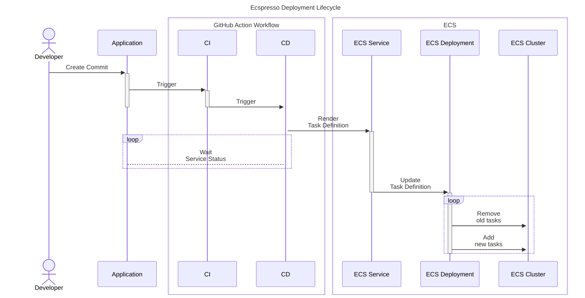

import Intro from '@site/src/components/Intro';
import KeyPoints from '@site/src/components/KeyPoints';
import Tabs from '@theme/Tabs';
import TabItem from '@theme/TabItem';
import CollapsibleText from '@site/src/components/CollapsibleText';

<Intro>
  We use the [`ecspresso`](https://github.com/kayac/ecspresso) deployment tool for Amazon ECS to manage ECS services using a code-driven approach, alongside reusable GitHub Action workflows. This setup allows tasks to be defined with Terraform within the infrastructure repository, and task definitions to reside alongside the application code. Ecspresso provides extensive configuration options via YAML, JSON, and Jsonnet, and includes plugins for enhanced functionality such as Terraform state lookups.
</Intro>




### Github Action Workflows

The basic deployment flow is for feature branches. You can use the following sample workflow to add pull request deploys to your application repository:

:::tip Latest Examples

Check out our [example app-on-ecs](https://github.com/cloudposse-examples/app-on-ecs) for the latest example of how to use `ecspresso` with GitHub Actions.

:::

<Tabs queryString="workflow">
  <TabItem value="feature" label="Feature">
    <CollapsibleText type="medium">
      ```yaml title=".github/workflows/feature-branch.yaml"
      name: 1 - Feature Branch
      on:
        pull_request:
          branches: [ main ]
          types: [opened, synchronize, reopened, closed, labeled, unlabeled]

      permissions:
        pull-requests: write
        deployments: write
        id-token: write
        contents: read

      concurrency:
        group: ${{ github.workflow }}-${{ github.ref }}
        cancel-in-progress: false

      jobs:
        monorepo:
          uses:  cloudposse/github-actions-workflows/.github/workflows/controller-monorepo.yml@main
          with:
            file: ./deploy/config.yaml

        ci:
          uses: cloudposse/github-actions-workflows/.github/workflows/ci-dockerized-app-build.yml@main
          needs: [ monorepo ]
          with:
            organization: "cloudposse"
            repository: ${{ github.event.repository.name }}
          secrets:
            ecr-region: ${{ secrets.ECR_REGION }}
            ecr-iam-role: ${{ secrets.ECR_IAM_ROLE }}
            registry: ${{ secrets.ECR_REGISTRY }}
            secret-outputs-passphrase: ${{ secrets.GHA_SECRET_OUTPUT_PASSPHRASE }}

        cd:
          uses: cloudposse/github-actions-workflows/.github/workflows/cd-preview-ecspresso.yml@main
          needs: [ ci, monorepo ]
          if: ${{ always() && needs.monorepo.outputs.apps != '[]' }}
          strategy:
            matrix:
              app: ${{ fromJson(needs.monorepo.outputs.apps) }}
          with:
            image: ${{ needs.ci.outputs.image }}
            tag: ${{ needs.ci.outputs.tag }}
            repository: ${{ github.event.repository.name }}
            app: ${{ matrix.app }}
            open: ${{ github.event.pull_request.state == 'open' }}
            labels: ${{ toJSON(github.event.pull_request.labels.*.name) }}
            ref: ${{ github.event.pull_request.head.ref }}
            exclusive: true
            enable-migration: ${{ contains(fromJSON(needs.monorepo.outputs.migrations), matrix.app) }}
            settings: ${{ needs.monorepo.outputs.settings }}
            env-label: |
              qa1: deploy/qa1
          secrets:
            secret-outputs-passphrase: ${{ secrets.GHA_SECRET_OUTPUT_PASSPHRASE }}
      ```
    </CollapsibleText>
  </TabItem>

  <TabItem value="main" label="Main">
    <CollapsibleText type="medium">
      ```yaml title=".github/workflows/main-branch.yaml"
      name: 2 - Main Branch
      on:
        push:
          branches: [ main ]

      permissions:
        contents: write
        id-token: write
        pull-requests: read

      concurrency:
        group: ${{ github.workflow }}-${{ github.ref }}
        cancel-in-progress: false

      jobs:
        monorepo:
          uses:  cloudposse/github-actions-workflows/.github/workflows/controller-monorepo.yml@main
          with:
            file: ./deploy/config.yaml

        ci:
          uses: cloudposse/github-actions-workflows/.github/workflows/ci-dockerized-app-build.yml@main
          needs: [ monorepo ]
          with:
            organization: "cloudposse"
            repository: ${{ github.event.repository.name }}
          secrets:
            ecr-region: ${{ secrets.ECR_REGION }}
            ecr-iam-role: ${{ secrets.ECR_IAM_ROLE }}
            registry: ${{ secrets.ECR_REGISTRY }}
            secret-outputs-passphrase: ${{ secrets.GHA_SECRET_OUTPUT_PASSPHRASE }}

        cd:
          uses: cloudposse/github-actions-workflows/.github/workflows/cd-ecspresso.yml@main
          needs: [ ci, monorepo ]
          strategy:
            matrix:
              app: ${{ fromJson(needs.monorepo.outputs.apps) }}
          with:
            image: ${{ needs.ci.outputs.image }}
            tag: ${{ needs.ci.outputs.tag }}
            repository: ${{ github.event.repository.name }}
            app: ${{ matrix.app }}
            environment: dev
            enable-migration: ${{ contains(fromJSON(needs.monorepo.outputs.migrations), matrix.app) }}
            settings: ${{ needs.monorepo.outputs.settings }}
          secrets:
            secret-outputs-passphrase: ${{ secrets.GHA_SECRET_OUTPUT_PASSPHRASE }}

        release:
          uses:  cloudposse/github-actions-workflows/.github/workflows/controller-draft-release.yml@main
          needs: [ cd ]
      ```
    </CollapsibleText>
  </TabItem>

  <TabItem value="release" label="Release">
    <CollapsibleText type="medium">
      ```yaml title=".github/workflows/release.yaml"
      name: 3 - Release
      on:
        release:
          types: [published]

      permissions:
        id-token: write
        contents: write

      concurrency:
        group: ${{ github.workflow }}
        cancel-in-progress: false

      jobs:
        monorepo:
          uses:  cloudposse/github-actions-workflows/.github/workflows/controller-monorepo.yml@main
          with:
            file: ./deploy/config.yaml

        ci:
          uses: cloudposse/github-actions-workflows/.github/workflows/ci-dockerized-app-promote.yml@main
          needs: [ monorepo ]
          with:
            organization: "cloudposse"
            repository: ${{ github.event.repository.name }}
            version: ${{ github.event.release.tag_name }}
          secrets:
            ecr-region: ${{ secrets.ECR_REGION }}
            ecr-iam-role: ${{ secrets.ECR_IAM_ROLE }}
            registry: ${{ secrets.ECR_REGISTRY }}
            secret-outputs-passphrase: ${{ secrets.GHA_SECRET_OUTPUT_PASSPHRASE }}

        cd:
          uses: cloudposse/github-actions-workflows/.github/workflows/cd-ecspresso.yml@main
          needs: [ ci, monorepo ]
          strategy:
            matrix:
              app: ${{ fromJson(needs.monorepo.outputs.apps) }}
          with:
            image: ${{ needs.ci.outputs.image }}
            tag: ${{ needs.ci.outputs.tag }}
            repository: ${{ github.event.repository.name }}
            app: ${{ matrix.app }}
            environment: "staging"
            enable-migration: ${{ contains(fromJSON(needs.monorepo.outputs.migrations), matrix.app) }}
            settings: ${{ needs.monorepo.outputs.settings }}
          secrets:
            secret-outputs-passphrase: ${{ secrets.GHA_SECRET_OUTPUT_PASSPHRASE }}
      ```
    </CollapsibleText>
  </TabItem>
</Tabs>

## References
- [Ecspresso](https://github.com/kayac/ecspresso) : Tool repo
- [example-app-on-ecs](https://github.com/cloudposse/example-app-on-ecs): Example app
- [github-action-deploy-ecspresso](https://github.com/cloudposse/github-action-deploy-ecspresso): Base action
- [`cd-ecspresso`](https://github.com/cloudposse/github-actions-workflows/blob/main/.github/workflows/cd-ecspresso.yml): Primary workflow
- [`cd-preview-ecspresso`](https://github.com/cloudposse/github-actions-workflows/blob/main/.github/workflows/cd-preview-ecspresso.yml): feature branch workflow
