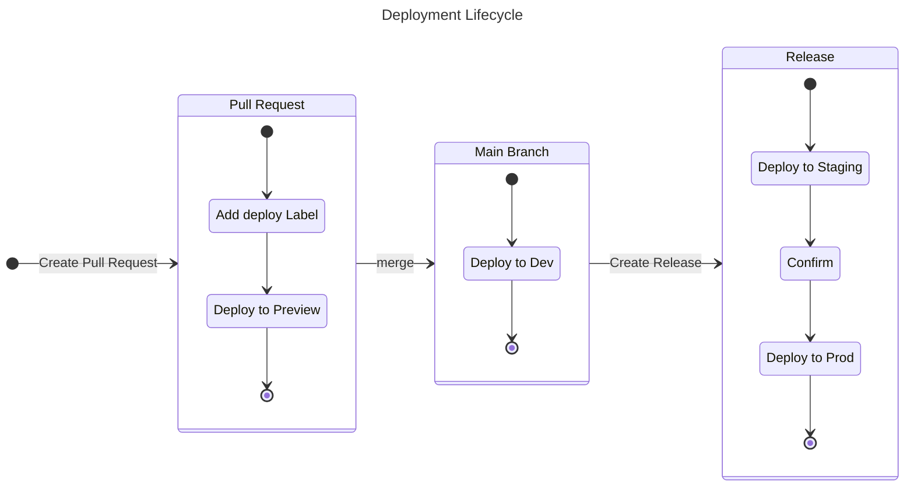

import Intro from '@site/src/components/Intro';
import KeyPoints from '@site/src/components/KeyPoints';
import Slides from '@site/src/components/Slides';
import Note from '@site/src/components/Note';

<Note title="Important">

This document assumes the reader understands the importance of CI/CD and DevOps as a concept.
For more, see [What is DevOps](https://aws.amazon.com/devops/what-is-devops/).

</Note>

<Slides
  title="CI/CD Fundamentals"
  videoUrl="https://docs.cloudposse.com/assets/refarch/handoffs/release-engineering.mp4"
/>

## The Problem

At this point, we have defined a complete Infrastructure as Code (IaC) environment, yet we still need some way to deliver our application
to users. Release Engineering is that process. Primarily, this includes Continuous Integration (CI) and Continuous Delivery (CD). CI/CD acts
as the glue between our IaC and the delivery of the software to customers and is how an app consumes its platform.

Historically, developers would define a CI/CD process for a given application, typically with Jenkins, and then duplicate that process for
each application. Quickly we would have many different pipelines for our library of apps, each with an individual purpose specific to that
given app. As pipelines grew in numbers and complexity, entire teams would be hired solely to manage these systems, and CI/CD became the
scapegoat system that everyone loves to hate.

For years CI/CD meant the same thing. Now CI is separate from CD. CI is process of building an artifacts, and CD is the process of taking
that artifact to delivery. There are many methods of CI and of CD. For example, Spacelift is CD for Terraform; ArgoCD is CD for Kubernetes.
Similarly there are many tools for CI. Jenkins, GitHub Actions, CircleCI, and countless others all offer solutions. Ultimately, any solution
must be codified and create a standard pattern of software delivery. It needs to support many languages and many frameworks. All Git
workflows need to be supported for these different languages and frameworks in a consistent way, such that we do not create snowflakes.
Yet one size will not fit all, so we need the ability to break glass without throwing out the whole solution.

Modern day Release Engineering is complex. Pipelines grow exponentially and often cannot be tested. Companies rely on CI/CD to ship software,
yet have no way to test CI/CD _itself_.

## Our Solution

### Concept

Release engineering process is critical for successful software development. On the one hand,
it is responsible for the continuous resilient delivery of the software at a consistent quality.
On the other hand, the process can be treated as
a part of the [organization's value stream](https://www.thoughtworks.com/radar/techniques/path-to-production-mapping),
can highlight specific organizational [structure](https://en.wikipedia.org/wiki/Conway%27s_law),
and demonstrate the maturity of the engineering culture. Release engineering pipelines are required
to measure [the organization's performance](https://dora.dev/).

At Cloud Posse, we consider CI/CD pipelines as [software](https://www.thoughtworks.com/radar/techniques/pipelines-as-code), and
an automated part of the release engineering process. Developing CI/CD pipelines we use practices and design principles
well-established in software engineering, including but not limited to
* [Separation of concern](https://en.wikipedia.org/wiki/Separation_of_concerns)
* [DRY](https://en.wikipedia.org/wiki/Don%27t_repeat_yourself)
* [Tests automation](https://en.wikipedia.org/wiki/Test_automation)
* [Versioning](https://en.wikipedia.org/wiki/Software_versioning)
* [Design by contract](https://en.wikipedia.org/wiki/Design_by_contract)
* [Convention over configuration](https://en.wikipedia.org/wiki/Convention_over_configuration) and [code](https://en.wikipedia.org/wiki/Convention_over_Code)

While there is value in flexibility by creating custom pipelines in each repo, we value the convention
across pipelines to improve maintainability and consistency across organizations.


This interface should be standardarized regardless of what
is being delivered. In order to minimize boilerplate in pipelines, we create shared workflows with Github Actions to define how to handle
specific aspects of the Release Engineering process. These workflows use a combination of Reusuable Workflows, Composite Actions, and regular
Actions (both public or private). These layers have multiple levels of abstraction and allow us to define configuration per environment and
create exceptions at any given point. Much of the common boilerplate patterns can be combined into reusable steps broken down into each level
of abstraction.

Composite Actions consolidate common steps into a single, modular action that can be documented, parameterized, and tested. Reusable Workflows
combine these tested Composite Actions and regular Actions to into common processes. Composite Actions can be anywhere, public or private, but
Reusable Workflows must be specific to an Organization. Moreover, a Reusable Workflow can have multiple jobs that can run together. Yet
Composite Actions cannot have multiple jobs but can have multiple steps. Reusable Workflows can call other Reusable Workflows and Composite
Actions can call other Composite Actions. Both Reusable Workflows and Composite Actions do not have a trigger. Both are functions that take
inputs and produce outputs and therefore can and and should be documented and tested.

Cloud Posse defines common patterns across customers and offers several solutions. We have many workflows for many purposes. For example
you could have a shared CI workflow to provide linting, testing, and validation. Or you could have several CD workflows: CD to deploy an app
to EKS with ArgoCD, CD to deploy code to a Lambda function, or a CD to deploy a Docker image to ECR. All these workflows are stored in YAML
files and follow a common convention. Finally, they are organized consistently so that we are able to introduce additional interfaces down
the road.

## Workflows



Create a Pull Request with changes to the application. Add the "deploy" label to the PR, which will trigger a deployment to the Preview
environment. Validate your changes and approve the PR. When the PR is merged into main, a deployment to Dev will be triggered next. When
ready to cut a release, create a Release with GitHub. This will trigger another workflow to first deploy to Staging and then will wait for
manual confirmation. Once manually approved, the workflow will continue and deploy to Production.

### Release Engineering Flavors

Refer to our stack specific implementations for more details:

- [**Dockerized App on EKS with ArgoCD**](/layers/software-delivery/eks-argocd/)
- [**Dockerized App on ECS with Ecspresso**](/layers/software-delivery/ecs-ecspresso/)
- [**Lambda App**](/layers/software-delivery/lambda)

## FAQ

### I cannot assume the AWS roles from GitHub Workflows

The following error commonly occurs when setting up GitHub OIDC roles and permission:

```
Error: Could not assume role with OIDC: Not authorized to perform sts:AssumeRoleWithWebIdentity
```

To resolve this error, make sure your workflow has appropriate permission to assume GitHub OIDC roles.

```yaml
permissions:
  id-token: write # This is required for requesting the JWT
  contents: read  # This is required for actions/checkout
```

### How does GitHub OIDC work with AWS?

Please see [How to use GitHub OIDC with AWS](/layers/github-actions/github-oidc-with-aws)
