import Intro from '@site/src/components/Intro';
import KeyPoints from '@site/src/components/KeyPoints';
import Tabs from '@theme/Tabs';
import TabItem from '@theme/TabItem';
import CollapsibleText from '@site/src/components/CollapsibleText';

<Intro>
  Deploy Lambda functions using GitHub Workflows with a code-driven approach. The build process updates S3 with assets and SSM with the new version, requiring a Terraform run for promotion. GitHub Workflows manage the entire lifecycle, from building and packaging Lambda functions to deploying them with reusable workflows.
</Intro>

### Overview

```mermaid
---
title: Lambdas with GitHub Workflows
---

flowchart LR

    subgraph core-auto
        publish["publish"]
        promote["promote"]
    end

    subgraph core-artifacts
        artifacts_bucket["@Bucket lambda artifacts"]
    end

    subgraph "SSM parameters"
        subgraph "plat-dev"
            dev_lambda_tag["@SystemsManager /lambda/hello/tag"]
        end
        subgraph "plat-staging"
            staging_lambda_tag["@SystemsManager /lambda/hello/tag"]
        end
        subgraph "plat-prod"
            prod_lambda_tag["@SystemsManager /lambda/hello/tag"]
        end
    end

    pr["@PullRequest PR #1234 "] --> publish --> artifacts_bucket
    publish --> dev_lambda_tag
    push["@GitBranch push → main"] --> publish --> artifacts_bucket
    publish --> staging_lambda_tag
    release["@GitHubRelease release"] --> promote
    promote --> artifacts_bucket
    promote --> prod_lambda_tag
    artifacts_bucket --> staging_lambda_tag
```



### Build and Deployment

Application repository updates S3 with build assets, then updates SSM with the new version.
Each SSM update is basically a promotion, and requires a Terraform run to realize the change.

<Tabs queryString="workflow">
  <TabItem value="feature" label="Build and Dev">
    <CollapsibleText type="medium">
      ```yaml title=".github/workflows/reusable-publish-lambda-zip.yaml"
      name: Publish Lambda Function
      on:
        workflow_call:
          inputs:
            function-name:
              required: true
              type: string
            source-folder:
              required: true
              type: string
            artifacts-bucket-and-prefix:
              required: true
              type: string
            aws-region:
              required: true
              type: string
          secrets:
            cicd-role-arn:
              required: true

      permissions:
        id-token: write
        contents: read

      jobs:
        publish:
          runs-on: self-hosted
          steps:
          - name: Configure AWS credentials
            uses: aws-actions/configure-aws-credentials@v4
            with:
              role-to-assume: ${{ inputs.cicd-role-arn }}
              aws-region: ${{ inputs.aws-region }}
          - name: Checkout
            uses: actions/checkout@v4
          - name: Package Lambda
            run: |
              cd ${{ inputs.source-folder }} && zip ${{ github.sha }}.zip *
          - name: Push Lambda
            run: |
              aws s3 cp ${{ inputs.source-folder }}/${{ github.sha }}.zip s3://${{ inputs.artifacts-bucket-and-prefix }}/${{ inputs.function-name }}/ --sse
          - name: Write tag to SSM
            run: |
              aws ssm put-parameter --name /lambda/${{ inputs.function-name}}/tag --type String --value ${{ github.sha }} --overwrite
      ```
    </CollapsibleText>
  </TabItem>
  <TabItem value="promote" label="Promote Release">
    <CollapsibleText type="medium">
      ```yaml title=".github/workflows/reusable-promote-lambda-zip.yaml"
      name: Publish Lambda Function
      on:
        workflow_call:
          inputs:
            function-name:
              required: true
              type: string
            artifacts-bucket-and-prefix:
              required: true
              type: string
            aws-region:
              required: true
              type: string
          secrets:
            cicd-role-arn:
              required: true
            staging-role-arn:
              required: true
            prod-role-arn:
              required: true

      permissions:
        id-token: write
        contents: read

      jobs:
        publish:
          runs-on: self-hosted
          steps:
          - name: Configure AWS credentials for 'cicd' role
            uses: aws-actions/configure-aws-credentials@v4
            with:
              role-to-assume: ${{ inputs.cicd-role-arn }}
              aws-region: ${{ inputs.aws-region }}
          - name: Configure AWS credentials for source stage
            uses: aws-actions/configure-aws-credentials@v4
            with:
              aws-access-key-id: ${{ env.AWS_ACCESS_KEY_ID }}
              aws-secret-access-key: ${{ env.AWS_SECRET_ACCESS_KEY }}
              aws-session-token: ${{ env.AWS_SESSION_TOKEN }}
              role-duration-seconds: 3000
              role-skip-session-tagging: true
              role-to-assume: ${{ inputs.staging-role-arn }}
              aws-region: ${{ inputs.aws-region }}
          - name: Checkout
            uses: actions/checkout@v4
          - name: Get tag from SSM
            id: get-tag-from-ssm
            run: |
              TAG=`aws ssm get-parameter --name /lambda/${{ inputs.function-name }}/tag | jq -r .Parameter.Value`
              echo "tag=$TAG" >> $GITHUB_OUTPUT
          - name: Copy Lambda to local
            run: |
              aws s3 cp s3://${{ inputs.artifacts-bucket-and-prefix }}/${{ inputs.function-name }}/${{ steps.get-tag-from-ssm.outputs.tag }}.zip .
          - name: Configure AWS credentials for 'cicd' role
            uses: aws-actions/configure-aws-credentials@v4
            with:
              role-to-assume: ${{ inputs.cicd-role-arn }}
              aws-region: ${{ inputs.aws-region }}
          - name: Configure AWS credentials for destination stage
            uses: aws-actions/configure-aws-credentials@v4
            with:
              aws-access-key-id: ${{ env.AWS_ACCESS_KEY_ID }}
              aws-secret-access-key: ${{ env.AWS_SECRET_ACCESS_KEY }}
              aws-session-token: ${{ env.AWS_SESSION_TOKEN }}
              role-duration-seconds: 3000
              role-skip-session-tagging: true
              role-to-assume: ${{ inputs.prod-role-arn }}
              aws-region: ${{ inputs.aws-region }}
          - name: Copy Lambda to destination bucket
            run: |
              aws s3 cp ${{ steps.get-tag-from-ssm.outputs.tag }}.zip \
                s3://${{ inputs.artifacts-bucket-and-prefix }}/${{ inputs.function-name }}/ --sse
          - name: Write tag to SSM
            run: |
              aws ssm put-parameter --name /lambda/${{ inputs.function-name}}/tag --type String --value ${{ steps.get-tag-from-ssm.outputs.tag }} --overwrite
      ```
    </CollapsibleText>
  </TabItem>

  <TabItem value="deploy" label="Optional: Deploy with Spacelift">
    <CollapsibleText type="medium">
      ```yaml title=".github/workflows/reusable-promote-lambda-zip.yaml"
      name: Deploy Lambda via Spacelift
      on:
        workflow_call:
          inputs:
            function-name:
              required: true
              type: string
            stack:
              required: true
              type: string
          secrets:
            spacelift-api-key-id:
              required: true
            spacelift-api-key-secret:
              required: true

      jobs:
        deploy:
          runs-on: self-hosted
          container: 123456789012.dkr.ecr.us-east-2.amazonaws.com/acme/infra:latest
          steps:
          - name: Trigger Spacelift Stack Execution
            env:
              SPACELIFT_API_ENDPOINT: https://acme.app.spacelift.io
              SPACELIFT_API_KEY_ID: ${{ secrets.spacelift-api-key-id }}
              SPACELIFT_API_KEY_SECRET: ${{ secrets.spacelift-api-key-secret }}
            run: |
              spacectl stack deploy --id ${{ inputs.stack }}-lambda-${{ inputs.function-name}} --tail
      ```
    </CollapsibleText>
  </TabItem>
</Tabs>

### Implementation

- [`lambda`](https://github.com/cloudposse-terraform-components/aws-lambda): This component is responsible for creating the Lambda function.
After promotion, the Lambda function is updated with the new version.

## References
- [Lambda Setup](/layers/software-delivery/lambda)
- [Foundation Release Engineering](/layers/software-delivery/lambda/)
- [Decide on Pipeline Strategy](/layers/software-delivery/design-decisions/decide-on-pipeline-strategy)


