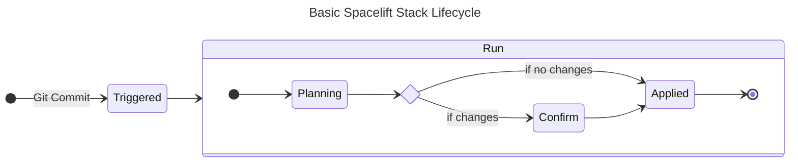

import Intro from '@site/src/components/Intro';
import KeyPoints from '@site/src/components/KeyPoints';
import Tabs from '@theme/Tabs';
import TabItem from '@theme/TabItem';
import PartialSpaceliftRootStack from '@site/examples/legacy/snippets/stacks/orgs/acme/spacelift.yaml';
import PartialSpaceliftTenantStack from '@site/examples/legacy/snippets/stacks/orgs/acme/plat/spacelift.yaml'
import CodeBlock from '@theme/CodeBlock';
import CategoryList from '@site/src/components/CategoryList';

GitOps is a cloud-native continuous deployment methodology that uses Git as
the single source of truth for declarative infrastructure and applications.
Changes to infrastructure or applications are made through Git commits, and
the actual state is automatically adjusted to match the desired state
expressed in the Git repository. This approach provides an audit trail for
changes, simplifies rollback, and enhances collaboration and visibility across teams.

## The Problem

Terraform itself focuses on managing the state of infrastructure. It does not
provide a way of indexing, CI/CD, or collaborating on state. In fact, Terraform
really wants to just be a CLI tool that you run locally. The problem is that
with all our infrastructure spanning hundreds of stacks we cannot easily see
the state of our infrastructure.

Moreover, there could be many different teams of engineers who are responsible
for different parts of the infrastructure. How do we enable them to collaborate
on the same infrastructure? You will likely need to set up permissions and roles
for that, and to future-proof those you'll need someone to govern those roles as
teams change and infrastructure evolves.

Lastly we want a way to automate our infrastructure as code. It does little good
if code changes are not immediately reflected in the infrastructure. If several
code changes happen before infrastructure updates, you could be left with difficult
to resolve conflicts.

## Our Solution

Spacelift is a hosted service that indexes the state of your infrastructure
and provides a way to collaborate on it. It also provides a way to automate
gitops and will continuously monitor your infrastructure for changes at a
schedule you can configure.

Spacelift breaks down access and gitops with policies that govern what can trigger
changes and who can either read or update infrastructure. The policies
use rego, an industry standard language for policy as code.

Infrastructure is indexed by resource, label, status, or other facets. Dependencies
can also be created between stacks, so that changes in one stack will lock other stacks
until changes are done and then ensure that the dependent stacks are updated.

Overall, Spacelift is a comprehensive way to make sure that your infrastructure is
easy to automate and manage. Because our solution keeps the state of your infrastructure
in S3, you also are not locked in and can use other tools to manage your infrastructure
in case either GitHub or Spacelift go down.

## Spacelift Stack Lifecycle

Spacelift has its own notion of a "Stack", which is a workspace for Terraform
with a slug identitifier. Stacks have a lifecycle that is triggered by events
like a git commit or a drift schedule. The lifecycle is as follows:



Runs are what Spacelift uses to scope changes to a given event like a commit SHA.
Within the run, Spacelift uses a plan policy to dictate what changes require confirmation
and what changes can be applied automatically. After a run is complete, Spacelift
will evaluate other trigger policies and dependencies to determine if other stacks
need to be updated.

## Implementation

We have three components that implement Spacelift. The first is the `spacelift/admin-stack` component
which creates admin stacks in Spacelift. The second is the `spacelift/spaces` component
which creates Spacelift Spaces and manages policies in those Spaces. The third is the
`spacelift/worker-pool` component which creates a worker pool for Spacelift to use self-hosted
workers.

### Global Configuration

In order to apply common Spacelift configuration to all stacks, we need to set a few global Spacelift settings.
The `pr-comment-triggered` label will be required to trigger stacks with GitHub comments but is not required
otherwise. More on triggering Spacelift stacks to follow.

Add the following to `stacks/orgs/NAMESPACE/_defaults.yaml`:

```yaml
  settings:
    spacelift:
      workspace_enabled: true # enable spacelift by default
      before_apply:
        - spacelift-configure-paths
      before_init:
        - spacelift-configure-paths
        - spacelift-write-vars
        - spacelift-tf-workspace
      before_plan:
        - spacelift-configure-paths
      labels:
        - pr-comment-triggered
```

Furthermore, specify additional tenant-specific Space configuration for both `core` and `plat` tenants.

For example, for `core` add the following to `stacks/orgs/NAMESPACE/core/_defaults.yaml`:

```yaml
terraform:
  settings:
    spacelift:
      space_name: core
```

And for `plat` add the following to `stacks/orgs/NAMESPACE/plat/_defaults.yaml`:

```yaml
terraform:
  settings:
    spacelift:
      space_name: plat
```


### Admin Stacks

Spacelift allows some stacks to manage other stacks (or even itself). This is useful
for making new component instances show up in the Spacelift UI. The `spacelift/admin-stack` component
takes the `atmos.yaml` and uses it to derive what stacks need to be created in Spacelift.
By updating your atmos stacks, you'll see the changes reflected in Spacelift.

Not all stacks are managed by Spacelift. If a management stack sees that a stack
does not have `workspace_enabled` set to true, it will be ignored by the admin stack.

<details>
<summary>Managed vs. Unmanaged Components</summary>

  <Tabs queryString="admin-stack">
    <TabItem value="managed" label="Managed">

      ```yaml
          components:
            terraform:
              vpc:
                settings:
                  spacelift:
                    workspace_enabled: true
                vars:
                  enabled: true
      ```

    </TabItem>
    <TabItem value="unmanaged" label="Unmanaged">

      ```yaml
          components:
            terraform:
              aws-sso:
                settings:
                  spacelift:
                    workspace_enabled: false
                vars:
                  enabled: true
      ```

    </TabItem>
  </Tabs>

</details>


### Spaces

The `spacelift/spaces` component maintains Spacelift spaces and configures all policies in those given Spaces. Policy labels can allow policies to be automatically enforced on a given group of stacks. A Spacelift Space is that group.

We deploy `spacelift/spaces` three times. First we deploy a `root` Space for all Spacelift administrative resources, and then we deploy two more Spaces for the `plat` and `core` tenants. Spacelift exists outside of the AWS ecosystem, so we define these components as outside our standard stack organization.

```diff
+ stacks/orgs/NAMESPACE/spacelift.yaml
+ stacks/orgs/NAMESPACE/core/spacelift.yaml
+ stacks/orgs/NAMESPACE/plat/spacelift.yaml
```

The `root` Space in Spacelift is responsible for deploying the root administrator stack, `admin-stack`, and the Spaces component, `spaces`. Since the root administrator stack is unique to tenants, we modify the stack context to create a unique stack slug, `root-gbl-spacelift`.

A tenant-specific Space in Spacelift, such as `core` or `plat`, includes the administrator stack for that specific Space and _all_ components in the given tenant. This administrator stack uses `var.context_filters` to select all components in the given tenant and create Spacelift stacks for each. Similar to the root administrator stack, we again create a unique stack slug for each tenant. For example `core-gbl-spacelift` or `plat-gbl-spacelift`.

<details>
<summary>Spacelift Spaces</summary>
  <Tabs queryString="space">
    <TabItem value="root" label="root">
      <CodeBlock language="yaml" title="stacks/orgs/NAMESPACE/spacelift.yaml">{PartialSpaceliftRootStack}</CodeBlock>
    </TabItem>
    <TabItem value="tenant-specific" label="Tenant-Specific">
      <CodeBlock language="yaml" title="stacks/orgs/NAMESPACE/plat/spacelift.yaml">{PartialSpaceliftTenantStack}</CodeBlock>
    </TabItem>
  </Tabs>
</details>

In the Spacelift UI, you should see the administrator stacks created. Typically these should look similar to the following:

```diff
+ root-gbl-spacelift-admin-stack
+ root-gbl-spacelift-spaces
+ core-gbl-spacelift-admin-stack
+ plat-gbl-spacelift-admin-stack
+ core-ue1-auto-spacelift-worker-pool
```

### Worker Pools

The `spacelift/worker-pool` component creates a worker pool for Spacelift to use. It
manages an ASG (Autoscaling Group) in AWS and the instances effectively run drift
detection and regular Spacelift stack runs. The component lives in the `auto` stage
since its considered automation infrastructure. Some common things to tweak while
working with this component include maximum instances (in-case runs are often blocked
by busy workers), and spot pricing (in-case runs are interrupted too frequently during
busy times). If you see a stack in a locked state with the run as `worker failed`, often
the instance was interrupted and the ASG events can be investigated for next steps.

:::caution

Spacelift Worker Pools can quickly become expensive. Spacelift bills per Worker total, and each
instance in the Auto Scaling Group can have a number of Spacelift Workers.

By default, we set the max instance count in the Auto Scaling Group to 2 and set the number
of Spacelift Workers per instance to 1. This means that the total number of Spacelift Workers
can scale to `2 x 1 = 2`. Once you become more familiar with Spacelift, scale the workers per
instance or scale the number of instances with the `spacelift/worker-pool` catalog.

```yaml
spacelift_agents_per_node: 1 # This is the number of Spacelift Workers for each instance
min_size: 1                  # This is the minimum number of instances in the Auto Scaling Group
max_size: 2                  # This is the maximum number of instances in the Auto Scaling Group
```

:::

## Triggering Spacelift Runs

Cloud Posse recommends two options to trigger Spacelift stacks.

### Triggering with Policy Attachments

Historically, all stacks were triggered with three `GIT_PUSH` policies:

  1. [GIT_PUSH Global Administrator](https://github.com/cloudposse/terraform-spacelift-cloud-infrastructure-automation/blob/main/catalog/policies/git_push.administrative.rego) triggers admin stacks
  2. [GIT_PUSH Proposed Run](https://github.com/cloudposse/terraform-spacelift-cloud-infrastructure-automation/blob/main/catalog/policies/git_push.proposed-run.rego) triggers Proposed runs (typically Terraform Plan) for all non-admin stacks on Pull Requests
  3. [GIT_PUSH Tracked Run](https://github.com/cloudposse/terraform-spacelift-cloud-infrastructure-automation/blob/main/catalog/policies/git_push.tracked-run.rego) triggers Tracked runs (typically Terraform Apply) for all non-admin stacks on merges into `main`

Attach these policies to stacks and Spacelift will trigger them on the respective git push.

### Triggering with GitHub Comments (Preferred)

Atmos support for `atmos describe affected` made it possible to greatly improve Spacelift's triggering workflow. Now we can add a GitHub Action to collect all affected components for a given Pull Request and add a GitHub comment to the given PR with a formatted list of the affected stacks. Then Spacelift can watch for a GitHub comment event and then trigger stacks based on that comment.

In order to set up GitHub Comment triggers, first add the following `GIT_PUSH Plan Affected` policy to the `spaces` component.

For example,

```yaml title="stacks/catalog/spacelift/spaces.yaml"
components:
  terraform:
    spaces:
      metadata:
        component: spacelift/spaces
      settings:
        spacelift:
          administrative: true
          space_name: root
      vars:
        spaces:
          root:
            policies:
...
              # This policy will automatically assign itself to stacks and is used to trigger stacks directly from the `cloudposse/github-action-atmos-affected-trigger-spacelift` GitHub action
              # This is only used if said GitHub action is set to trigger on "comments"
              "GIT_PUSH Plan Affected":
                type: GIT_PUSH
                labels:
                  - autoattach:pr-comment-triggered
                body_url: https://raw.githubusercontent.com/cloudposse/terraform-spacelift-cloud-infrastructure-automation/%s/catalog/policies/push.git_comment.rego
```

This policy will automatically attach itself to _all_ components that have the `pr-comment-triggered` label, already defined in `stacks/orgs/NAMESPACE/_defaults.yaml` under `settings.spacelift.labels`.

Next, create two new GitHub Action workflows:

```diff
+ .github/workflows/atmos-trigger-spacelift-feature-branch.yaml
+ .github/workflows/atmos-trigger-spacelift-main-branch.yaml
```

The feature branch workflow will create a comment event in Spacelift to run a Proposed run for a given stack. Whereas the main branch workflow will create a comment event in Spacelift to run a Deploy run for those same stacks.

#### Feature Branch

```yaml
name: "Plan Affected Spacelift Stacks"

on:
  pull_request:
    types:
      - opened
      - synchronize
      - reopened
    branches:
      - main

jobs:
  context:
    runs-on: ["self-hosted"]
    steps:
      - name: Atmos Affected Stacks Trigger Spacelift
        uses: cloudposse/github-action-atmos-affected-trigger-spacelift@v1
        with:
          atmos-config-path: ./rootfs/usr/local/etc/atmos
          github-token: ${{ secrets.GITHUB_TOKEN }}
```

This will add a GitHub comment such as:

```
/spacelift preview plat-ue1-sandbox-foobar
```

#### Main Branch

```yaml
name: "Deploy Affected Spacelift Stacks"

on:
  pull_request:
    types: [closed]
    branches:
      - main

jobs:
  run:
    if: github.event.pull_request.merged == true
    runs-on: ["self-hosted"]
    steps:
      - name: Atmos Affected Stacks Trigger Spacelift
        uses: cloudposse/github-action-atmos-affected-trigger-spacelift@v1
        with:
          atmos-config-path: ./rootfs/usr/local/etc/atmos
          deploy: true
          github-token: ${{ secrets.GITHUB_TOKEN }}
          head-ref: ${{ github.sha }}~1
```

This will add a GitHub comment such as:

```
/spacelift deploy plat-ue1-sandbox-foobar
```

### Component Documentation

- [`spacelift`](//components/library/aws/spacelift/)

## References

- [Spacelift Documentation](https://docs.spacelift.io/)
- [Use Spacelift for GitOps with Terraform](/resources/adrs/adopted/use-spacelift-for-gitops-with-terraform)
- [Proposed Spacelift admin stack architecture](/resources/adrs/proposed/proposed-spacelift-admin-stack-architecture)
<CategoryList path="/resources/deprecated/spacelift/design-decisions/"/>
<CategoryList path="/resources/deprecated/spacelift/tutorials/"/>
